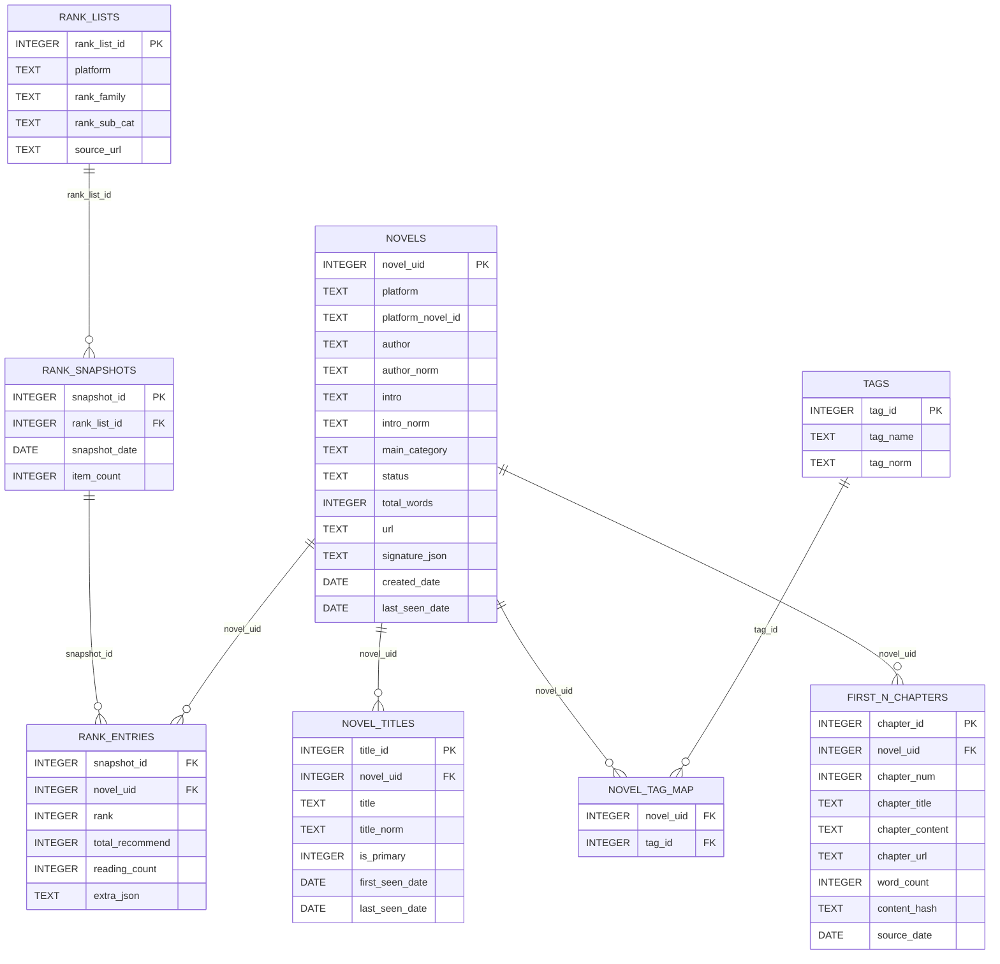
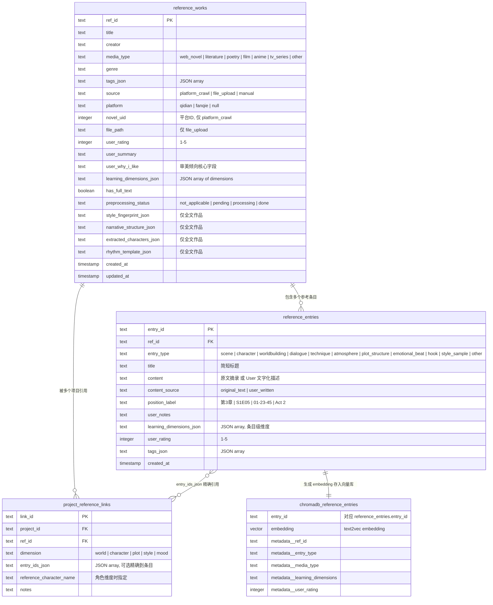

# InkOctoBot - AI小说创作工作流 v3.0
（非商业用途，仅供学习以及个人使用）
> 最后更新: 2026-05-25
>
> v3 refactor (in progress, branch `claude/repo-architecture-review-8L8E2`):
> 9 顶层包重命名 + reference_api 4425→2465 行 + `_rag_context.py` 1140→44 行 +
> services/ 抽取 + observability 包 + Truth File 系统 + per-module 测试布局
> (167→311 tests visible)。详见 `/root/.claude/plans/review-repo-app-quiet-orbit.md`
> 与各模块的 `WORKFLOW.md`。

---
## 1. 系统愿景

### 1.1 核心设计理念：纯文字版电影制作

User = **导演 + 编剧**, AI = **出版社编辑/制片人 + 剧组（演员 + 剪辑师 + 作家）**。

| 电影制作      | 本系统映射                             |
| --------- | --------------------------------- |
| 编剧参考其他作品  | User 为每个维度指定Reference                |
| 编剧写剧本     | User 输入世界书 + 人物卡 + 大纲 + 章节剧情      |
| 制片人/编辑给市场建议  | AI Marketing Agent 基于当前市场数据给出优化建议      |
| 正式立项  | User确定当前创作小说的宏观信息，如世界观，粗纲，人物设定等      |
| 导演做分镜表    | AI Scene Planner 拆解章节为分镜场景           |
| 选角 + 读剧本  | Character Architect 扩展人物卡         |
| 导演给演员说戏   | Scene Director 注入目标 + 约束 + 知识隔离   |
| 演员表演    | Actor Agents 生成原始素材 |
| 剪辑 + 后期   | Editor-Stylist 完成剪辑 + 文学风格化       |
| 导演审片 / 补拍 | User Review + 定向重新生成              |

---
## 2. 项目架构
### 2.1 总流程Pipeline
```
══ 离线预处理学习层 ══
User 输入[参考作品] | [小说网站上榜作品信息]
  ↓
Feature Extractor → 从[Reference数据库]中提取（世界观/人物/情绪曲线/名场面...）信息，生成结构化存储的参考作品数据库
  ↓
══ 进入创作流程 ══
User 输入[世界书 + 人物卡 + 大纲]，以上内容均可链接参考作品）
  ↓
Marketing Agent 根据市场信息给出[选题 + 书名 + 简介]建议                            → [User 决定采纳与否]
  ↓
Story Architect 与User 讨论[世界书 + 人物卡 + 大纲]并细化描述                       → [User 回答AI生成的细化问题]
  ↓
Calibration → 生成短样本片段，User 确认风格方向                                     → [User 满意后进入章节循环]
  ↓
══ 进入章节创作循环 ══
User 输入章节细纲
  ↓
Scene Director → 将章节细纲拆为分镜计划（时间，地点，人物）并生成                     → [User 可预览调整]
  - 导演指令：角色情绪状态、秘密目标、知识隔离指令、must/must_not
  ↓
Actor Agents (roleplay, 每角色独立 instance) → 多角色交互模拟，真实扮演场景          → [User 可预览调整]
   - 信息隔离：每个 actor 只能看到[此时此刻][这个角色应该知道]的信息，并遵循[此时此刻]的角色设定
   - 特殊设计："旁白" ，负责环境描写、氛围渲染、非角色视角的叙事内容
   - 输入: 分镜计划 + 角色卡 + RAG获取信息 + 参考作品片段 + 约束
   - 输出: 半结构化"表演记录"（动作+对话+内心+氛围）
  ↓
Editor-Writer → 剪辑 + 文学转化                                                   → [User 可比较不同模型输出结果]
   - 输入: 表演记录 + 叙事指令（POV/节拍展开压缩/情绪弧线）+ 风格 + 约束
   - 输出: 章节正文
  ↓
Evaluator → 约束/一致性/知识隔离/重复/四层记忆回溯（伏笔等） 检测               → [User 在文本 Editor 中审阅 + 编辑]
   - 不达标 → 带上Evaluator的诊断结果targeted rewrite（仅重写问题段落，不重跑全 pipeline），3次未通过标记为需要User人工介入
  ↓
EditAnalyzer 分析用户修改，总结修改类型，并记录以优化后续生成
  ↓
记忆系统更新（4层） → 版本快照
  ↓
进入下一章
```

### 2.2 各模块Agent设计
> 分布式多Agent系统，每个Agent专注一个核心功能，模块间通过明确的输入输出接口进行交互以提高本AI Workflow的创作能力
#### 2.2.1 Marketing Agent
- 目标：给用户（作者）提供网络小说市场趋势参考，以便用户（作者）选择最容易获得流量的题材
- 输入：当前市场数据（热点题材分布，成功作品的世界观/人物设定/情绪曲线等特征），用户提供的创作方向（如“想写科幻末世”）
- 输出：选题建议（如“末世生存”），书名建议，简介建议
- 技术实现：基于市场数据的分析报告 + LLM生成建议

#### 2.2.2 Story Architect
- 目标：帮助用户细化世界书/人物卡/大纲，确保创作设定的合理性和丰富性
- 输入：用户提供的世界书/人物卡/大纲，参考作品数据库
- 输出：细化后的故事设定
- 技术实现：基于参考作品的分析 + LLM生成建议, **交互式 Prompt 消歧系统**（针对用户输入的模糊或不完整设定，生成细化问题引导用户选择或补充）

#### 2.2.3 Scene Director
- 目标：将章节细纲拆解为具体的分镜场景，并注入导演指令（角色状态/目标/知识隔离）
- 输入：章节细纲，RAG获取信息，参考作品
- 输出：分镜计划（时间/地点/人物） + 场景描述 + 角色指令
- 技术实现：基于章节细纲的结构化解析 + LLM生成分镜计划和场景描述

#### 2.2.4 Actor Agents
- 目标：模拟角色在场景中的行为和对话，生成原始素材
- 输入：分镜计划，RAG获取信息，参考作品，约束
- 输出：半结构化的表演记录（动作+对话+内心独白+氛围描写）
```
表演记录示例
[节拍1]
张三(紧张): *抽出剑挡在身前* "你到底是谁？"
  内心: 这个人的气势太强了，完全不是一个级别
李四(玩味): *缓缓拔剑* "你猜？"
  内心: 有点意思，居然没跑
[氛围] 空气凝滞，杀意弥漫
```
- 技术实现：每个角色一个独立的Agent实例，信息隔离设计，基于角色卡和分镜计划生成表演记录

#### 2.2.5 Editor-Writer
- 目标：将Actor Agents生成的表演记录剪辑成章节正文，并进行文学风格化处理
- 输入：表演记录，叙事指令（POV/节拍展开压缩/情绪弧线），风格要求，约束
- 输出：章节正文
- 技术实现：基于表演记录的结构化内容，结合叙事指令和风格要求生成章节文本，可使用基于参考作品数据库训练成的LoRA模型来模仿特定风格

#### 2.2.6 Evaluator
- 目标：检测生成文本的约束满足度、一致性、知识隔离执行情况、重复度、**四重记忆系统**回溯、伏笔回收等，确保文本质量
- 输入：章节正文，导演指令，角色设定，记忆系统内容
- 输出：评估结果（是否达标 + 诊断信息）

#### 2.2.7 EditAnalyzer
- 目标：分析用户对生成文本的修改，识别修改类型（如情节调整、角色行为修改、语言风格调整等），并总结以优化后续生成
- 输入：AI 生成的原始文本 + 用户编辑后的最终文本
- 输出：修改分析报告 + 写入 user_style_preferences 表的结构化偏好记录
工作流程：
```
用户在 Editor 中编辑完成并保存
  ↓
Diff 引擎逐段对比原始文本与用户修改后文本
  ↓
LLM 对每处修改进行分类标注：
  - deletion:    用户删除了什么类型的内容（如"删除了过多的心理描写"）
  - rewrite:     用户改写了什么（如"把书面语改成了口语化对话"）
  - addition:    用户补充了什么（如"加入了环境细节描写"）
  - structural:  用户调整了段落顺序或节奏
  ↓
聚合为偏好信号（跨多次编辑累积统计）：
  - style_preferences:    "偏好短句""对话占比高""少用排比"
  - content_preferences:  "删除冗余心理独白""保留动作描写"
  - pacing_preferences:   "压缩过渡段落""展开打斗场景"
  ↓
写入 user_style_preferences 表（project 级别）
```
偏好信号的消费方式（闭环注入）：
| 消费者            | 注入方式                                                            |
| -------------- | --------------------------------------------------------------- |
| Editor-Writer  | 累积偏好作为 system prompt 附加段落注入：“根据用户历史编辑习惯，本项目偏好短句、高对话占比、少心理独白”    |
| Actor Agents   | 高频 deletion 模式转化为约束：“用户反复删除角色独白超过 3 句的段落 → 新增软约束：单次内心独白不超过 2 句” |
| Evaluator      | 将 deletion 模式注册为检测规则：如果生成文本中出现用户反复删除的模式，预先标记为“可能需要修改”           |
| Scene Director | pacing 偏好影响节拍分配：“用户倾向展开打斗、压缩过渡 → 打斗场景分配更多节拍”                    |


### 2.3 数据库设计
> 存储永久化市场信息以及User提供的带有个人审美取向的参考作品信息
#### 2.3.1 市场数据库
- 存储榜单热门小说数据（书名、作者、简介、分类、的开篇 N 章等）
- 分析提取的特征（世界观类型、人物设定类型、情绪曲线类型等）
- 用于支持Marketing Agent的分析和建议生成

#### 2.3.2 参考作品数据库
- 存储User保存的参考作品信息以及User 写下的个人感想以及喜爱程度
- 可包含类型：
  - 文学作品全文（网文/严肃文学/诗歌等）
  - 电影剧情描述，评论摘录，角色设定等
  - 动漫/电视剧分集剧情描述，评论摘录，角色设定等
- 支持Story Architect和Scene Director在创作过程中进行RAG检索，提供相关参考信息

### 2.4 记忆系统设计
#### 2.4.1 四层记忆系统
- 目标：在长篇小说创作过程中保持前后文信息的一致性和连贯性，支持伏笔设置与回收，并为每个 Agent 提供适当粒度的上下文
- 设计：

| 层级      | 名称                | 存储位置                              | 核心内容                  | 主要用途                             | 更新方式                     |
| ------- | ----------------- | --------------------------------- | --------------------- | -------------------------------- | ------------------------ |
| Layer 1 | Immediate Context | LLM context window 内（4-8K tokens） | 当前场景 + 前一场景完整文本       | 给 Actor / Editor-Writer 提供直接工作素材 | 每个场景自动替换                 |
| Layer 2 | Chapter Buffer    | LLM context window 内（2-4K tokens） | 最近 5-10 章结构化摘要        | 维持中期叙事连贯性（角色弧线进展、近期事件因果）                        | 每章结束时LLM生成本章摘要              |
| Layer 3 | Semantic Memory   | ChromaDB 向量检索                     | 全部设定/人物状态/事件/世界书条目/约束规则 | 按语义相关性检索，如Agent 提问"张远和李清漪的关系"时返回相关片段                         | 每章结束 + Layer 2 降级时写入 |
| Layer 4 | Episodic Timeline | SQLite 结构化查询                      | 关键事件的因果链 + 时间轴 + 伏笔状态追踪      | 结构化查询"第3章埋的伏笔到现在回收了吗？""角色A和B上次见面是哪章？"等问题                      | 每章结束时由LLM提取关键事件并写入           |

自动压缩降级机制： 当 Layer 2 的章节摘要超出窗口预算（如累积超过 10 章）时，最老的章节摘要通过 LLM 提取三类永久信息后丢弃过渡细节：
- permanent_facts：不可逆的事实（"张远在第5章觉醒了灵根"）
- active_foreshadowing：尚未回收的伏笔（"李清漪在第7章提到的'那个人'身份未揭示"）
- character_state_changes：角色状态变化（"张远对宗门的信任从中立变为怀疑"）

提取结果写入 Layer 3（语义记忆）和 Layer 4（事件时间线），原始摘要从 Layer 2 移除。
各 Agent 的记忆访问权限：

| Agent          | Layer 1  | Layer 2   | Layer 3   | Layer 4      |
| -------------- | -------- | --------- | --------- | ------------ |
| Scene Director | ✓ 读取前一场景 | ✓ 完整读取    | ✓ 检索相关设定  | ✓ 查询伏笔 / 事件线 |
| Actor Agent    | ✓ 当前场景   | ✗ 经知识隔离过滤 | ✗ 经知识隔离过滤 | ✗ 不直接访问      |
| Editor-Writer  | ✓ 完整读取   | ✓ 完整读取    | ✓ 检索风格参考  | ✗ 不需要        |
| Evaluator      | ✓ 完整读取   | ✓ 完整读取    | ✓ 完整检索    | ✓ 完整查询       |


#### 2.4.2 知识隔离设计
- 目标：确保 Actor Agent 在角色扮演时只能访问该角色"此时此刻应该知道"的信息，防止全知视角污染（context leaking），同时支持虚假信息和误解的显式建模
- 设计：**KnowledgeIsolationEngine**
  - 输入: 角色名 + 当前章节/场景 + Scene Director 的 knowledge_boundary 指令
  - 输出: 该角色的 filtered_world_view（用于注入 Actor Agent 的 prompt）
  - 工作流程:
    1. 从 Layer 3 (Semantic Memory) 检索与当前场景相关的所有信息片段
    2. 对每个片段查询 information_events 表：该角色是否已获知此信息？
    3. 分为三类：
        - known_true:    角色知道且信息为真 → 注入 prompt
        - known_false:   角色持有的错误信息 → 以角色相信的版本注入 prompt
        - unknown:       角色不知道的信息   → 不注入，并加入 explicitly_unknown 列表
    4. 将 explicitly_unknown 以否定指令注入 prompt:
      "你（张远）目前不知道以下信息，在表演中不得暗示或提及：..."

### 2.5 Prompt约束系统设计
- 目标：确保所有 Agent 的输出严格遵守世界观规则、知识隔离边界、用户自定义禁忌等约束条件。采用语义级检测而非 token ban，因为中文的多义性和 LLM tokenizer 的不一致性使得 token 级封禁不可靠（如禁"龙"会同时禁掉"龙卷风""龙套"等无关词）。

约束来源（四类）：

| 约束来源（四类） | 示例                               | 优先级            |
| -------- | -------------------------------- | -------------- |
| 世界观硬规则   | “本世界没有枪械” “筑基期无法飞行”              | 最高 — 违反即逻辑错误   |
| 知识隔离指令   | “张远不知道李清漪是卧底”                    | 高 — 违反即角色穿帮    |
| 情节约束     | Scene Director 的 must / must_not | 中 — 违反会偏离剧情走向  |
| 风格约束     | “不使用现代网络用语” “对话不超过三句连续”          | 低 — 违反影响质感但不致命 |

三层执行机制：

| 阶段                      | 机制             | 说明                                                                                       |
| ----------------------- | -------------- | ---------------------------------------------------------------------------------------- |
| 生成前 (Pre-Generation)    | 正向重述           | 将反向约束转化为正向指令注入 prompt，例如“不要写飞行场景” → “角色只能步行或骑乘，请在移动描写中体现”                                |
| 生成前 (Pre-Generation)    | 交互式消歧          | 模糊约束经 Disambiguator 生成候选解读，再由 User 确认                                                    |
| 生成前 (Pre-Generation)    | Good / Bad 示例对 | 每条约束附带一个符合示例和一个违反示例文本片段                                                                  |
| 生成时 (During Generation) | ChromaDB 语义检测  | 将约束规则 embedding 化存入向量库；生成过程中对输出片段做语义相似度检查，及时发现偏移                                         |
| 生成时 (During Generation) | 约束优先级组装        | 按“硬规则 > 隔离 > 情节 > 叙事风格 > 修辞风格”的顺序组装进 system prompt，确保高优先级约束位于注意力窗口前部                     |
| 生成后 (Post-Generation)   | Evaluator 违规检测 | 对完整章节做语义扫描；将每条 must_not 约束与正文段落做 embedding 余弦相似度匹配，超过阈值后标记具体段落与违规类型，并进入 targeted rewrite |
| 生成后 (Post-Generation)   | 知识隔离验证         | 对比 Actor 输出与 explicitly_unknown 列表，检测是否有角色泄露了不该知道的信息                                     |

> 约束规则随项目演进持续积累：User 每次添加世界观设定或 Scene Director 每次生成导演指令时，新约束自动入库并 embedding 化，供后续所有章节使用。

### 2.6 Agent事件监听系统及主动性设计
目标：让 Agent 从"被 pipeline 调用才工作"变为"监听项目状态变化，满足条件时主动向用户提供建议"，使系统表现出创作伙伴级别的智能感。

#### 2.6.1 架构：EventBus + AgentTrigger

在现有线性 pipeline 之上叠加一层事件驱动的主动介入机制：

```
系统内任何状态变化（章节完成、用户编辑、设定修改...）
  → 发布 Event 到 EventBus（内存级发布/订阅）
    → 每个 Agent 注册 AgentTrigger（监听事件 + 触发条件 + 冷却间隔）
      → 条件满足 → Agent 生成建议
        → 通过 WebSocket 推送到前端 Agent Chat Panel
```

核心事件类型：

| 事件 | 触发时机 |
|------|---------|
| `CHAPTER_COMPLETED` | 一章生成完成或用户确认定稿 |
| `USER_EDIT_SAVED` | 用户在 Editor 中保存修改 |
| `WORLDBOOK_UPDATED` | 世界书新增/修改条目 |
| `CHARACTER_UPDATED` | 角色卡变更 |
| `CHAPTER_PLAN_SUBMITTED` | 用户提交新章节细纲 |
| `GENERATION_STEP_COMPLETED` | Pipeline 单步完成（用于思考过程展示） |

#### 2.6.2 各 Agent 的主动介入规则

| Agent | 监听事件 | 触发条件 | 主动行为 |
|-------|---------|---------|---------|
| Marketing Agent | `CHAPTER_COMPLETED` | 每 5 章 / 每卷结束 | 对比市场指标，提示节奏/hook密度偏差 |
| Story Architect | `WORLDBOOK_UPDATED` / `CHARACTER_UPDATED` | 每次修改 | 新条目与已有设定的一致性矛盾检测 |
| Scene Director | `CHAPTER_PLAN_SUBMITTED` | 每次提交 | 检索角色关系状态（信任值/冲突临界点），提示剧情机会 |
| Evaluator | `CHAPTER_COMPLETED` | 伏笔超期 / 节奏重复 / 角色漂移 | 悬挂伏笔提醒、节奏单调化警告、角色行为偏移告警 |
| EditAnalyzer | `USER_EDIT_SAVED` | 偏好信号 confidence 首次达到阈值 | 通知用户系统学到的新偏好，请求确认 |

每个 Trigger 设有 `cooldown`（同类建议最少间隔章数，防止骚扰），用户可在 Settings 中按 Agent 粒度开关主动通知。
---

## 3. RAG设计
> 为 Scene Director 和 Actor Agents 提供相关的参考信息，支持基于内容的检索

### 3.1 角色卡系统
- 目标：为每个角色构建一个动态更新的角色卡，包含基本设定、关系网络、canonical scenario-response 范例、成长轨迹等信息，支持 Scene Director 在生成分镜计划和指导 Actor 表演时进行 RAG 检索，确保角色行为的合理性和一致性
#### 3.1.1 特别设计
- Layer A（LLM prompt 用）: 自然语言描述人格、说话风格、关系网络、canonical scenario-response 范例、成长轨迹
- Layer B（Python 决策引擎用）：量化决策模型，包含效用函数权重、前景理论参数、随机行为分布、贝叶斯信任追踪

| 模块     | 内容                                                                     |
| ------ | ---------------------------------------------------------------------- |
| 效用函数   | 价值维度权重（survival / power / love / loyalty / justice 等），时间折扣因子           |
| 前景理论   | loss_aversion（经历创伤后上升），risk_aversion_gain / loss                       |
| 随机行为   | Poisson（社恐搭话频率 λ = 0.3 vs 社牛 λ = 5.0），Bernoulli（冲动动手 p = 0.8），支持情境修正因子 |
| 贝叶斯信任  | Beta(α, β) 分布，观察行为后更新，α / (α + β) = 信任度期望                              |
| 决策引擎串联 | 效用 → 前景理论 → 随机波动 → 信任加权 → 归一化 → 自然语言引导注入 LLM                           |

#### 3.2 世界书系统
- 结构化存储世界观设定（如宗门体系、修炼体系、政治格局等），支持 Scene Director 在生成分镜计划时进行 RAG 检索，确保世界观的一致性和细节丰富性
#### 3.2.1 特别设计
- AI 一致性检查（"这条规则和第3条是否矛盾？"）

#### 3.3 参考作品数据库
- 存储用户保存的参考作品信息以及用户写下的个人感想以及喜爱程度，支持 Story Architect 和 Scene Director 在创作过程中进行 RAG 检索，提供相关参考信息
- 设计：reference_works 和 reference_entries 数据表 + ChromaDB 向量检索接口 

## 4. UI 功能清单（已实现）

> 以下按界面模块列出前端已实现的全部功能。格式参照 UI 设计需求规范。

### 4.1 全局功能
#### 4.1.1 AI 交互通用规范
- **Chat 式交互**：所有 AI 功能板块均采用 social-media 风格对话界面，展示当前工作 Agent 的 ID 与头像（如 Marketing Agent、Story Architect 等），Agent 头像按角色着色（Marketing: 金色, Story Architect: 靛蓝, Editor-Writer: 翡翠, Evaluator: 强调色）
- **Follow-up 选择题**：AI 回复后自动解析 `[FOLLOW_UP]...[/FOLLOW_UP][OPTIONS]A|B|C[/OPTIONS]` 标记，以按钮形式呈现 3 个选项供 User 选择，也可自由输入
- **Chat 持久化**：所有 Chat 历史以项目为单位持久化（SessionStorage + 后端 `/api/data/chat_history`，2s 防抖保存），切换项目自动加载对应历史；User 可清空 Chat 历史
- **切换界面不中断生成**：Editor Pipeline 使用 Session ID 机制（sessionStorage），User 离开页面再返回时自动恢复生成进度
- **输入草稿保留**：切换 Tab 时保留未发送的输入内容
- **终止 / 重新生成**：所有 AI Chat 支持 AbortController 终止当前生成；支持 regenerate 任意一条 AI message；支持删除单条消息
- **自然语言输出**：AI 回复以自然语言展示；角色助手检测到 JSON 时弹出确认框让 User 选择性填入字段，而非直接展示 JSON

#### 4.1.2 布局
- **可拖拽 Resize**：所有多 column 页面（编辑器、角色卡、世界书、参考作品库）的分栏均支持鼠标拖拽调整宽度，每栏设有 min/max 约束
- **全局搜索**：Ctrl+K 快捷键唤出全局搜索覆盖面板（GlobalSearch 组件），支持跨项目 / 章节 / 角色 / 世界书 / 参考作品搜索并跳转

#### 4.1.3 用户输入
- **标签自动补全**：世界书条目、参考作品条目等标签输入均使用 TagAutocomplete 组件，基于已有标签提供下拉建议列表

#### 4.1.4 错误处理 & 通知
- **ErrorBoundary**：每个页面路由独立包裹 ErrorBoundary 组件
- **Toast 通知**：全局 Toast 系统（useToast hook），支持 success / error / info / warning 类型，自动消失

#### 4.1.5 键盘快捷键
- Ctrl+K：全局搜索
- Enter：发送消息
- Shift+Enter：消息框内换行
- Escape：关闭弹窗 / 搜索

---

### 4.2 开书界面（ProjectListPage）
#### 4.2.1 项目管理
- **是否使用 AI**：否
- **功能**：展示所有项目；支持新建 / 修改 / 删除项目；设置书名、分类（genre）、平台（platform）、男频/女频（gender_target）、连载/完结（serial_status）、简介（synopsis）
- **位置**：左侧 column
- **显示方式**：支持 Grid / List 两种视图模式切换
- **快速跳转**：点击项目设为活跃项目后可直接进入编辑器

#### 4.2.2 AI 开书助手（Studio）
- **是否使用 AI**：是
- **功能**：集成式创作助手，帮助 User 完成选题→细化设定→风格校准全流程
- **位置**：右侧 column
- **展示方式**：Chatbot 式，3 个 subtab

##### 4.2.2.1 开书助手 subtab：热点题材
- **使用 Agent/Skill**：Marketing Agent
- **功能**：讨论题材市场热度、新人友好度、竞争情况；展示爬虫数据库中的热门标签
- **位置**：第一个 subtab
- **Quick Prompts**：
  - "分析一下目前最热门的网文题材"
  - "玄幻题材目前市场竞争大吗？新人友好吗？"
  - "都市异能和系统流哪个更适合新人起步？"

##### 4.2.2.2 开书助手 subtab：头脑风暴
- **使用 Agent/Skill**：Story Architect
- **功能**：讨论世界观 / 人物 / 故事梗概；支持 `[QUICK_FILL]field:content[/QUICK_FILL]` 标记快速填入项目字段（User 可在填入前修改）
- **位置**：第二个 subtab
- **Quick Prompts**：
  - "帮我思考整体故事梗概"
  - "构思一个玄幻小说的核心设定和卖点"
  - "帮我设计三个有辨识度的配角"

##### 4.2.2.3 开书助手 subtab：风格校准
- **使用 Agent/Skill**：Editor-Writer
- **功能**：生成样本段落，User 打分 + 评论后迭代改进，满意后锁定为目标风格
- **位置**：第三个 subtab
- **可调整参数**：
  - A）文风（tone）：Slider 0-100，左=轻松幽默，右=沉稳严肃
  - B）剧情节奏（pacing）：Slider 0-100，左=快节奏，右=慢热
  - C）修辞力度（rhetoric）：Slider 0-100，左=白描直接，右=华丽修辞
  - D）叙事视角（perspective）：选项，第一人称 / 第三人称
  - E）网站风格（websiteStyle）：选项，起点 / 番茄 / 出版文学
  - F）目标受众（audience）：选项，男频 / 女频 / 大众
- **样本类型**：开篇（opening）、动作打斗（action）、角色内心戏（inner）、场景描写（scenery）
- **评估流程**：打分 0-5 + 文字评论 → "提交反馈 & 生成改进样本" 或 "确认为目标风格"（锁定）
- **历史记录**：保存所有校准样本 + 反馈 + 分析结果

---

### 4.3 角色卡界面（CharacterManagerPage）
#### 4.3.1 角色管理 Navigator
- **是否使用 AI**：否
- **位置**：左侧 column（可 Resize，220-420px）
- **功能**：
  - 展示当前项目名称
  - 展示所有角色列表，按角色定位着色头像
  - 搜索角色（按名称 / 角色定位过滤）
  - 新建角色（一键生成默认值）
  - 批量模式：全选 / 反选 / 批量导出 JSON / 批量删除
  - 点击角色进入详情编辑
  - 切换按钮：角色详情 ↔ 全局关系图谱

#### 4.3.2 角色详情页面
- **位置**：右侧 column

##### 4.3.2.1 AI 角色助手
- **是否使用 AI**：是
- **位置**：详情页面内嵌 Chat（可展开/收起）
- **功能**：讨论角色设定（性格、背景、口癖等）；AI 生成 JSON 格式建议时弹出确认对话框，User 可勾选需要填入的字段后一键应用
- **Quick Prompts**：针对角色 profile 生成的快捷提问
- **持久化**：Chat 历史按项目持久化（SessionStorage + 后端，CHAR_CHAT_KEY）

##### 4.3.2.2 角色固定属性
- **是否使用 AI**：否
- **可调整参数**：
  - A）姓名（必填）
  - B）角色定位：主角 / 配角 / 反派 / 路人（下拉选择，必填）
  - C）性别：下拉选择（必填）
  - D）标签（Tags，自动补全）
  - E）性格描述（personality，文本域）
  - F）背景故事（background，文本域）
  - G）口癖/说话风格（speech_style，文本域）

##### 4.3.2.3 角色动态属性（Dynamic Snapshots）
- **是否使用 AI**：否
- **展现方式**：左右滑动的 Flashcard，每张代表一个时间/章节节点；支持上一张/下一张导航和编辑
- **Overview**：展示该角色好感度从高到低排序 + 优先级从高到低排序
- **可调整参数**：
  - A）性格：自然语言描述 + 量化决策参数（Layer B）
    - Layer B 滑块：loss_aversion, risk_aversion_gain, risk_aversion_loss, impulse_probability, social_frequency, time_discount, value_weights
  - B）角色间关系（数组）：
    - 关系目标角色（下拉选择）
    - 好感度 Slider（0-100）
    - 优先级（数字输入）
    - 时间/章节标注
    - 关系备注
    - 添加 / 删除关系
  - C）继承机制：新 Snapshot 自动继承上一个 Snapshot 的关系和 Layer B 参数

##### 4.3.2.4 单角色关系图谱
- **是否使用 AI**：否
- **功能**：由 RelationshipGraph 组件渲染，以当前角色为中心节点，展示所有有关系的角色节点，边为关系标签
- **展示方式**：网络图

#### 4.3.3 全局角色关系图谱
- **是否使用 AI**：否
- **功能**：展示项目内所有角色的关系网络，角色为节点，边为关系标签
- **展示方式**：网络图（RelationshipGraph 组件，可按章节/时间过滤关系）
- **切换**：通过 Navigator 中的"全局图谱"按钮切换显示

---

### 4.4 世界书界面（WorldBookPage）
#### 4.4.1 世界书 Navigator
- **是否使用 AI**：否
- **位置**：左侧 column（可 Resize，240-450px）
- **功能**：
  - 展示当前项目名称
  - 展示所有条目（标题 + 分类图标 + 内容预览 40 字）
  - 搜索条目
  - Category Filter（按分类筛选，显示各分类条目数）
  - 新建条目
  - 添加自定义分类（localStorage 持久化）
  - 批量模式：导出 JSON / 批量删除
  - 点击条目进入详情
- **默认分类**：力量体系（power_system）、势力（factions）、地理（geography）、社会规则（social_rules）、历史（history）、硬性规则（hard_rules）、其他（other）
- **自定义分类**：User 可添加自定义分类名

##### 4.4.1.1 一致性检查按钮
- **是否使用 AI**：是
- **功能**：调用 `/api/worldbook/consistency-check`，一键检查所有条目间的潜在冲突
- **展示方式**：Table（条目 A、条目 B、冲突描述、修改建议）；无冲突时显示成功消息
- **位置**：Navigator 中的按钮

#### 4.4.2 条目详情界面
- **位置**：右侧 column

##### 4.4.2.1 AI 设定助手
- **是否使用 AI**：是
- **位置**：点击右上角按钮出现置顶对话框，可收起
- **功能**：与 AI 讨论设定细节；3 个快速操作按钮："扩展设定"、"检查矛盾"、"生成子条目"；3 个快捷建议："帮我完善这个设定"、"补充更多细节"、"检查逻辑一致性"
- **系统 Prompt**：自动注入当前条目的标题、分类、内容作为上下文

##### 4.4.2.2 世界书条目详情
- **是否使用 AI**：否
- **可调整参数**：
  - A）标题（文本输入，大号衬线字体）
  - B）分类（Radio-style pill 按钮选择，含内置 + 自定义分类）
  - C）标签（TagAutocomplete 自动补全，多选）
  - D）内容（文本域，16 行，衬线字体，宽松行距）
- **保存**：Dirty flag 追踪变更，仅变更时启用保存按钮

---

### 4.5 编辑器界面（EditorPage）
#### 4.5.1 编辑器 Navigator
- **是否使用 AI**：否
- **位置**：左侧 column（可 Resize，160-350px）
- **功能**：
  - 展示当前项目名称
  - 分卷/章节树形目录（Volume → Chapter 层级）
  - 每章显示字数
  - 新建卷 / 新建章节
  - 搜索章节（按标题 / 内容 / 大纲过滤）
  - 章节标题内联重命名
  - 导出功能：下载卷/章内容为 .txt

##### 4.5.1.1 章节大纲 Overview
- **是否使用 AI**：否
- **功能**：章节树展示所有章节及大纲概要，点击进入编辑

#### 4.5.2 文字编辑器
- **是否使用 AI**：否
- **位置**：中间 column
- **功能**：
  - 展示当前章节名、所属卷
  - 实时字数统计（CJK 字符 + 英文单词）
  - 写作时长显示
  - **自动保存**：1.5s 防抖自动保存，状态指示器（"已保存" / "保存中..." / "未保存更改"）
  - **离开警告**：有未保存更改时 beforeunload 提示
  - **Diff 合并**：AI 生成内容导入时显示增删行对比，参考 GitHub Solve Conflict 设计

##### 4.5.2.1 章节版本历史
- **是否使用 AI**：否
- **位置**：中间 column
- **功能**：每 60s 自动备份（内容变化时）；记录来源（auto_saved / 手动保存）、时间戳；支持"恢复为此版本"；可在设置页面配置最大备份数（默认 10，最大 20）
- **版本区分**：自动保存版本 vs 手动保存版本
- **持久化**：后端 `/api/data/versions` 存储 + 按章节裁剪

#### 4.5.3 AI 写作助手
- **是否使用 AI**：是
- **位置**：右侧 column（可 Resize，200-500px，可折叠）
- **展示方式**：4 个 subtab

##### 4.5.3.1 AI 写作助手 subtab：大纲（Outline）
- **位置**：第一个 subtab
- **功能**：输入/编辑章节大纲（synopsis），保存后可启动生成 Pipeline

##### 4.5.3.2 AI 写作助手 subtab：灵感（Inspire / Generation）
- **位置**：第二个 subtab
- **功能**：基于章节大纲 + 全部上下文（书名、类型、梗概、关联角色、世界书、前文记忆等）执行 4 步 Creative Writing Pipeline，生成 2000+ 字章节正文
- **展示方式**：Group Chat 式对话，各 Agent 以角色头像 + 颜色发言
- **Pipeline 步骤**：
  1. Scene Director → 拆分场景、生成导演指令
  2. Actor Agents → 角色扮演生成原始对话与内心（各角色独立显示，含特殊 Actor "旁白"）
  3. Editor-Writer → 剪辑 + 文学风格化，~600 字/段输出
  4. Evaluator → 一致性检查 & 质量评估
- **实时流式输出**：Polling `/api/generation/events`，支持 token 级流式显示（pipeline_start, step_start, token, handoff, step_done, complete, need_confirm, agent_warning, follow_up 事件）
- **系统消息**：提示当前进程；报错时指出错误
- **确认机制**：Agent 在合适时机发出 follow-up 选择题，User 确认后执行下一步
- **Pipeline 完成后**：User 可一键将生成内容写入编辑器（Merge）
- **批量生成**：支持多章节批量生成（指定起止章节），进度条展示完成/错误状态

##### 4.5.3.3 AI 写作助手 subtab：重写（Rewrite）
- **位置**：第三个 subtab
- **功能**：User 在文字编辑器中选中一段文字后，可选择重写模型、输入重写提示，AI 对选中段落进行定向重写

##### 4.5.3.4 AI 写作助手 subtab：评估（Evaluation）
- **位置**：第四个 subtab
- **功能**：展示 Evaluator 的评估分析报告
- **包含内容**：
  - 总体评分（0-100）
  - 问题列表（类型、严重度、描述、修改建议）
  - 亮点列表
  - 各维度得分（一致性、情感等）
  - 评估过程日志

---

### 4.6 参考作品库界面（ReferenceLibraryPage）
#### 4.6.1 作品列表 Navigator
- **是否使用 AI**：否
- **位置**：左侧 column（可 Resize，260-560px）
- **功能**：
  - 搜索作品（按标题 / 创作者）
  - 媒体类型过滤下拉（网文 / 文学 / 诗歌 / 电影 / 动漫 / 电视剧 / 其他）
  - 批量模式（导出 / 删除）
  - 新建作品（Modal 表单）
  - 上传正文文本（.txt 文件上传）
  - 每个作品显示：标题、类型标签、创作者、题材、日期、星级评分、预处理状态徽章（已分析/待处理/处理中/出错/手动）

#### 4.6.2 作品详情
- **位置**：右侧 column
- **功能**：
  - 作品元信息展示（标题、类型、创作者、题材、日期、全文状态）
  - 操作按钮："上传正文文本"、"提取特征"/"重新提取"、"删除"
  - **用户审美备注**：星级评分（1-5，可点击）+ "为什么喜欢？" 文本域
  - **分析结果**（预处理完成后）：可折叠展示风格指纹、叙事结构、提取角色、节奏模板（JSON 格式，支持内联编辑）

#### 4.6.3 参考条目管理
- **是否使用 AI**：否
- **功能**：在作品下添加 / 查看 / 删除参考条目
- **条目类型**：场景 / 角色 / 世界观 / 对话 / 技巧 / 氛围 / 情节结构 / 情感节拍 / 钩子 / 风格样本 / 其他
- **可调整参数**：类型、标题、位置标注（如"第3章"）、内容（原文摘录或描述）、个人笔记

#### 4.6.4 LoRA 训练面板
- **是否使用 AI**：是（本地模型训练）
- **位置**：详情页底部可折叠区域
- **功能**：基于已预处理的参考作品训练 LoRA 风格模型
- **可调整参数**：
  - 基础模型选择：Qwen2-1.5B / Qwen2-7B / Llama-3-8B
  - Rank：4-128
  - Alpha：4-256
  - Learning Rate（默认 0.0002）
  - Epochs：1-20（默认 3）
- **训练状态**：2s 轮询进度，显示完成状态 / 错误信息 / 使用样本数

---

### 4.7 设置界面（SettingsPage）
#### 4.7.1 Pipeline 模型配置
- **功能**：为每个 Agent 角色分配 Provider + Model
- **角色分组**：
  - 开书（头脑风暴 & 校准）
  - Creative Writing Pipeline（scene_planner, scene_director, actor_default, actor_protagonist, editor_stylist, editor_agent, evaluator）
  - 角色 & 世界书（character_profile_gen, worldbook_consistency）
  - 分析 Skills（analyzer）
- **每个角色**：Provider 下拉 + Model 下拉 + 状态指示灯（绿色=已配置）

#### 4.7.2 模型提供商管理
- **功能**：配置各 LLM Provider 的 API Key、Base URL、可用模型列表
- **支持 Provider**：
  - 国际：OpenAI, Anthropic, Google Gemini, DeepSeek, Grok
  - 国内：火山方舟（豆包）, 百度千帆（文心）, 阿里云百炼（通义）
  - 本地：Ollama
- **每个 Provider**：启用/禁用开关、API Key 输入（密码框）、Base URL 输入（自托管）、模型列表编辑、"测试连接"按钮 + 结果指示
- **Ollama 自动检测**：一键扫描本地 Ollama 实例，自动填充可用模型

#### 4.7.3 系统设置
- **爬虫数据库路径**：设置 InkOctoBot_Crawler.db 路径
- **本地 GGUF 模型**：扫描 models/ 目录，列出检测到的模型及文件大小
- **自动保存**：开关 + 间隔滑块（5-300s）+ 最大备份数滑块（1-20）
- **费用确认**：商业 API 操作前弹出成本确认对话框开关
- **导出格式**：.txt / .docx / .epub 三选一
- **API 用量统计**：按 Provider / Model / Agent Role 分类的调用次数、输入 Tokens、输出 Tokens、总 Tokens；支持重置；10s 自动刷新
- **数据存储**：展示存储路径 + "清除缓存"按钮

---

### 4.8 其他已实现页面
- **DashboardPage**：项目概览 + 快速统计
- **RankingsPage**：市场排行榜数据展示（爬虫数据可视化）
- **AnalysisDashboardPage**：市场趋势分析 + 图表
- **StorylinePage**：情节时间线 + 角色弧线
- **SkillsPage**：Agent/Skill 管理
- **ProjectSetupPage**：项目初始配置（世界书 / 人物卡 / 大纲 / 约束）
- **ConfigPage**：爬虫配置生成 / 保存
- **DatabasePage**：市场数据库浏览 / 诊断
- **RunnerPage**：爬虫任务启动 / 日志查看
- **ReportsPage**：分析报告预览

---

### 4.9 UI 设计需求 vs 已实现差异（Gap Analysis）

> 以下列出 UI 设计需求中规划但**尚未实现或实现不完整**的功能。

#### 4.9.1 全局
| 需求 | 现状 | 说明 |
|------|------|------|
| AI response 中不应出现 JSON 格式 | ⚠️ 部分实现 | 角色助手有 JSON 检测+确认对话框机制，但其他 Agent（世界书助手、Studio）可能仍返回 JSON 片段 |

#### 4.9.2 开书界面
| 需求 | 现状 | 说明 |
|------|------|------|
| 偏好记忆 subtab（EditAnalyzer） | ❌ 未实现 | 设计需求中的第四个 subtab "偏好记忆"（展示 User 历史 edit 总结出的偏好、允许增删改）尚未在 Studio 中实现 |

#### 4.9.3 角色卡界面
| 需求 | 现状 | 说明 |
|------|------|------|
| 年龄字段（Not Null） | ❌ 缺失 | 设计需求要求年龄为必填固定属性，当前角色模型无 `age` 字段 |
| 外貌核心记忆点 | ❌ 缺失 | 设计需求要求独立的外貌描述字段，当前无此字段 |
| 性格核心记忆点 | ⚠️ 合并 | 当前 `personality` 字段覆盖此需求，但未作为独立"核心记忆点"突出 |
| 动态属性中的外貌/身体状态 | ❌ 缺失 | 设计需求要求每个 Snapshot 包含外貌/身体状态变化，当前 Snapshot 无此字段 |
| 关系好感度允许负数 | ⚠️ 不完全 | 设计需求好感度应支持负数（厌恶），当前 Slider 范围为 0-100 |
| 单角色关系图谱的 heatmap 着色 | ⚠️ 不确定 | 设计需求要求 edge 颜色以 heatmap 反映好感度，需确认 RelationshipGraph 组件是否已实现 |
| 点击关系图中角色节点跳转详情 | ⚠️ 不确定 | 设计需求要求可点击节点跳转，需确认组件是否已实现交互导航 |

#### 4.9.4 世界书界面
| 需求 | 现状 | 说明 |
|------|------|------|
| 默认分类缺失"硬性规则" | ⚠️ 命名差异 | 设计需求列出5个默认分类（力量体系/势力/地理/社会规则/历史），实际实现7个（多了 hard_rules 和 other），功能超出但命名和数量不一致 |

#### 4.9.5 编辑器界面
| 需求 | 现状 | 说明 |
|------|------|------|
| 大纲 subtab 完整功能 | ⚠️ 部分实现 | 设计需求要求选择关联角色、参考作品、输入时间/地点、隐藏身份角色等功能；当前仅实现大纲文本输入+保存 |
| 关联角色"隐藏身份"设计 | ❌ 未实现 | 角色以"神秘人"出现在其他角色和正文中的机制未实现 |
| AI 章节助手（大纲 subtab 内） | ❌ 未实现 | 设计需求要求大纲 subtab 内有独立的 AI 章节助手对话框（讨论情节设计），当前未实现 |
| 灵感 subtab Actor 以角色名显示 | ⚠️ 部分实现 | 有 agent_display_name 机制，但需确认实际生成时是否以"陈明"而非"Actor Agents"显示 |
| 评估 subtab 的 AI 率检测 | ❌ 未实现 | 设计需求要求展示"疑似AI生成内容的AI率"，当前 Evaluator 无此维度 |
| 评估 subtab 的 slop AI味检测分数 | ⚠️ 部分实现 | 后端有 slop_detector.py，但前端评估报告中是否独立展示 slop 分数需确认 |
| 版本历史弹窗展示 | ⚠️ 实现方式不同 | 设计需求要求弹窗展示，当前实现为内嵌组件 |

#### 4.9.6 尚未涉及的设计需求
| 功能 | 说明 |
|------|------|
| Layer 4 Episodic Timeline 可视化页面 | 组件 `EpisodicTimeline.tsx` 已存在，但未确认是否集成到可访问的页面路由 |
| 离线学习层数据可视化 | 参考作品特征提取结果的可视化展示（风格雷达图 `StyleRadar.tsx`、叙事时间线 `NarrativeTimeline.tsx` 等组件存在但集成程度待确认） |

## 5. Project 技术细节
### 5.1 项目结构

> Reflects the current refactor (commits f4620e6..5fe7dd8). Compared
> to v2: `models/` → `llm/`, `rag/` → `knowledge/`, `core/` → `framework/`,
> `database/` → `storage/`, `preprocessing/` → `reference_ingest/`,
> `analysis/` 拆 → `market_analysis/` + `reference_pipeline/`,
> `agents/constraints/` → `agents/guardrails/`, `agents/analysis/` +
> `agents/feature_extraction/` 合并 → `agents/reference_extractors/`.
> 9 顶层包名都直接表达职责，不再用泛词。

```text
InkOctoBot/
│
├── config.py                            # 薄 YAML 加载层（向后兼容 v2 入口）
├── InkOctoBot.spec                      # PyInstaller 打包配置
├── launcher.py                          # GUI 桌面入口（PyWebView + Uvicorn）
├── cli.py                               # Typer CLI: ink agent/skill/extract/model/config/db
├── QUICKSTART.md / DOCUMENT.md          # 快速启动与数据存储路径文档
├── README.md / LICENSE                  # 项目说明 / 许可
├── requirements.txt
│
├── agents/                              # 多 Agent 创作层
│   ├── base_agent.py                    # Agent 基类 (prompt + invoke + 失败日志带 exc_info)
│   ├── base_skill.py                    # Skill 基类 (SKILL.md + skill.py 双文件)
│   ├── planner/                         # 规划层 Agent
│   │   ├── calibration.py / chapter_planner.py / marketing_agent.py
│   │   ├── story_architect.py / volume_planner.py
│   │   └── skills/                      # 该层下的 SKILL.md+skill.py
│   ├── production/                      # ★ Film Pipeline 执行层（有 WORKFLOW.md）
│   │   ├── scene_director.py / actor_agent.py / narrator_agent.py
│   │   ├── editor_writer.py / scene_simulator.py
│   │   └── skills/
│   ├── evaluation/                      # ★ 评估层（有 WORKFLOW.md）
│   │   ├── evaluator.py                 # 综合评估（带完整 JSON 日志，关闭 GAP 3）
│   │   ├── consistency_checker.py / cross_chapter_checker.py
│   │   ├── repetition_detector.py / slop_detector.py
│   │   ├── style_drift_detector.py / quality_scorer.py
│   │   ├── edit_analyzer.py
│   │   └── skills/
│   ├── reference_extractors/            # 参考作品特征 Skill 集合（原 agents/analysis/ + agents/feature_extraction/ 合并）
│   │   └── skills/                      # character_profile / narrative_extract /
│   │                                    # rhetoric_classify / shuangdian_extract /
│   │                                    # style_extract / chronicle_outline_extract /
│   │                                    # hook_extract / payoff_judge /
│   │                                    # opening_pattern_judge / info_density_judge /
│   │                                    # chronicle_event_extract
│   ├── guardrails/                      # 约束系统（原 agents/constraints/）
│   │   ├── assembler.py / disambiguator.py / violation_detector.py
│   └── learned_skills/                  # SkillLearner 热加载目录（watchdog 监控）
│
├── framework/                           # 基础设施层（原 core/）
│   ├── config.py / config_loader.py     # 配置加载
│   ├── log_setup.py                     # 跨平台日志 + JSON 模式 + buffer 集成
│   ├── event_bus.py / event_types.py    # 内存级事件 pub/sub
│   ├── skill_registry.py                # SKILL.md 发现 + watchdog 热重载
│   ├── skill_learner.py                 # ★ LLM 生成新 skill + AST 沙箱（带完整日志）
│   ├── triggers.py                      # TriggerRegistry
│   ├── observability/                   # ★ 透明化层（有 WORKFLOW.md）
│   │   ├── trace_context.py             # trace_id/session_id contextvars
│   │   ├── log_buffer.py                # 内存环形 buffer (500 条)
│   │   ├── decorators.py                # @traced 自动 log 入参/出参/耗时
│   │   ├── json_formatter.py            # INKOCTO_LOG_JSON=1 时启用
│   │   └── request_middleware.py        # FastAPI X-Request-ID middleware
│   └── skills/WORKFLOW.md               # skill 发现/热重载/learner 工作流文档
│
├── llm/                                 # LLM 抽象层（原 models/）
│   ├── base.py                          # BaseLLMProvider 接口
│   ├── router.py                        # ModelRouter（按 agent_role 分发，
│   │                                    #              带 provider/model INFO 日志）
│   ├── ab_compare.py / cost_estimator.py / embedding_provider.py
│   ├── web_search_capabilities.py
│   └── {openai,anthropic,deepseek,gemini,ollama,vllm,lora,mock}_provider.py
│
├── knowledge/                           # 检索 + 记忆 + 真相（原 rag/）
│   ├── character_cards.py / world_book.py
│   ├── reference_db.py / work_index.py
│   ├── vector_store.py / constraint_store.py
│   ├── decision_engine.py               # 角色卡 Layer B 量化决策
│   ├── memory/                          # ★ 4 层记忆（有 WORKFLOW.md）
│   │   ├── manager.py                   # 4 层协调器
│   │   ├── immediate.py                 # L1 即时（in-memory）
│   │   ├── chapter_buffer.py            # L2 章节缓冲（SQLite）
│   │   ├── semantic_store.py            # L3 ChromaDB（带 query 日志，关 GAP 9）
│   │   ├── episodic_timeline.py         # L4 情节图（SQLite）
│   │   ├── consolidator.py              # L2→L3+L4（带萃取日志，关 GAP 4）
│   │   └── knowledge_isolation.py       # 角色视角过滤（带日志，关 GAP 8）
│   └── truth/                           # ★ Truth File 系统（state authority；
│       │                                #    docs/truth_file_system.md 完整架构）
│       ├── schemas.py                   # 7 truth files + TruthDeltas pydantic
│       ├── sql.py / store.py            # DDL + 原子 apply_deltas
│       ├── validators.py                # 12 跨文件校验规则
│       ├── markdown_renderer.py         # SQLite → on-demand Markdown 视图
│       └── migrate.py                   # 旧存储面 → truth 表迁移
│
├── storage/                             # 持久化层（原 database/）
│   ├── DATABASE.md
│   ├── market_db.py                     # 市场数据 handler（原 db_handler.py）
│   ├── market_schema.py                 # 市场 DDL（原 db_schema.py）
│   ├── project_schema.py                # 创作系 DDL（原 creation_schema.py）
│   ├── extraction_schema.py / reference_schema.py
│   └── truth_schema.py                  # Truth File DDL
│
├── market_analysis/                     # 市场分析（原 analysis/）
│   ├── ANALYSIS.md / data_access.py / heat.py / metrics.py
│   ├── trend_analyzer.py / visualization.py / report.py / run_analysis.py
│   └── formula_engine/                  # 题材公式聚合
│
├── reference_pipeline/                  # ★ 参考作品特征提取（有 WORKFLOW.md，
│   │                                    #    原 analysis/feature_extraction/）
│   ├── pipeline.py / chapter_parser.py / ai_extractor.py
│   ├── narrative_extractor.py / rhetoric_classifier.py
│   ├── shuangdian_templates.py / volume_detector.py
│   ├── preprocess_jobs.py / prompts.py
│   ├── nlp_stats.py / embedding_cluster.py / platform_profiles.py
│
├── reference_ingest/                    # ★ 参考作品摄入（有 WORKFLOW.md，
│   │                                    #    原 preprocessing/）
│   ├── novel_ingester.py                # 单文件 + 批量 ingest
│   ├── chapter_splitter.py / style_extractor.py
│   ├── skill_extraction/                # 跨小说 skill 挖掘 pipeline
│   │   ├── orchestrator.py / chapter_extractor.py
│   │   ├── novel_aggregator.py / pattern_miner.py / skill_emitter.py
│   └── lora/                            # LoRA 训练
│       ├── data_constructor.py / quality_filter.py / trainer.py
│
├── security/                            # 安全与隔离
│   ├── api_key_manager.py               # Fernet 加密 keystore（待接入 router）
│   └── test_mode_isolation.py           # 原 data_isolation.py
│
├── config/                              # 配置文件
│   ├── app_config.yaml                  # 全局配置
│   ├── models.yaml / model_providers.json / model_presets/
│   ├── paths.yaml / websites.yaml
│   ├── character_templates/ / constraint_presets/ / style_profiles/
│   ├── prompts/                         # Agent prompt 模板（actor/editor/eval/...）
│   ├── skill_permissions.yaml / slop_patterns.json
│   └── truth_files.yaml                 # Truth File 系统调参
│
├── data/                                # 运行时数据（gitignore）
│   ├── novels.db                        # 主 SQLite（项目/章节/记忆/truth）
│   ├── InkOctoBot_Crawler.db            # 市场数据（只读，由独立爬虫仓库同步）
│   ├── references.db                    # 参考作品库
│   ├── chromadb/                        # ChromaDB 向量库
│   ├── projects/ / characters/ / worldbook/ / editor/ / storyline/
│   ├── settings.json                    # UI 可写配置（pipeline/providers/...）
│   ├── usage.json                       # LLM token 使用统计（防抖写盘）
│   └── lora_output/
│
├── data_test/                           # `python launcher.py --test` 隔离数据
│
├── docs/                                # 架构文档
│   ├── truth_file_system.md             # Truth File 系统完整架构 (586 行)
│   ├── ARCHITECTURE.md / AGENT_LEARNING.md
│   ├── CLI_REFERENCE.md / FEATURES.md / SKILL_AUTHORING.md
│
├── scripts/                             # 运维脚本
│   ├── check_project_health.py
│   ├── migrate_to_truth_files.py        # 旧存储面 → truth 表
│   └── ollama_modelfiles/DeepSeek_R1_Qwen_32B/Modelfile
│
├── outputs/                             # 运行时输出（logs/reports/visualizations）
│
├── tests/                               # ★ Per-module 测试（镜像源码包）
│   ├── conftest.py / pytest.ini / README.md
│   ├── agents/                          # mirrors agents/
│   │   ├── guardrails/test_assembler.py
│   │   └── evaluation/test_*.py
│   ├── framework/                       # mirrors framework/
│   │   ├── test_observability.py        # 单元
│   │   ├── test_observability_integration.py  # 端到端
│   │   └── test_{config,event_bus,event_system,skill_*}.py
│   ├── knowledge/                       # mirrors knowledge/
│   │   ├── memory/test_memory_system.py
│   │   ├── truth/                       # 6 个 truth 测试文件 + integration
│   │   └── test_{character_worldbook,decision_engine}.py
│   ├── llm/test_base.py
│   ├── market_analysis/test_formula_engine.py
│   ├── reference_ingest/test_lora_pipeline.py
│   ├── reference_pipeline/test_advanced.py
│   ├── storage/test_project_schema.py
│   └── integration/test_agents_pipeline.py
│
└── ui/                                  # 用户界面
    ├── backend/                         # FastAPI 后端
    │   ├── app/
    │   │   ├── main.py                  # FastAPI 入口 + CORS + TraceIDMiddleware
    │   │   ├── settings.py / utils.py
    │   │   ├── services/                # ★ 领域服务层
    │   │   │   ├── project_paths.py     # get_db_path()
    │   │   │   ├── style_preferences.py # 用户偏好加载
    │   │   │   ├── model_router_factory.py  # build_router + SimpleRouter
    │   │   │   ├── usage_tracker.py     # LLM token 防抖写盘
    │   │   │   └── prompt_context/      # ★ 拆自 _rag_context.py（1140→44 行 shim）
    │   │   │       ├── builder.py       # build_generation_context 等 4 入口
    │   │   │       ├── budgets.py / utils.py / chapter_fields.py
    │   │   │       ├── references.py / skills_block.py
    │   │   │       └── loaders/         # 10 个 per-block loader
    │   │   ├── routers/                 # API 路由
    │   │   │   ├── reference/           # ★ 11 个 sub-router (原 reference_api.py 4425 行)
    │   │   │   │   ├── _common.py       # db() / 共享常量 / strip_json_blob
    │   │   │   │   ├── works.py / entries.py / links.py / stats.py
    │   │   │   │   ├── inspirations.py / lora.py / index.py / patterns.py
    │   │   │   │   ├── web_search.py / prompts.py / analysis_writer.py
    │   │   │   ├── reference_api.py     # 残余 ~2465 行（preprocess + segments 待拆）
    │   │   │   ├── generation_api.py    # 创作流水线（已抽 services，剩 2503 行）
    │   │   │   ├── _rag_context.py      # 44 行 backward-compat shim
    │   │   │   ├── json_storage_api.py  # 原 data_api（data/<col>/*.json CRUD）
    │   │   │   ├── market_db_api.py     # 原 db_api（爬虫 DB 只读查询）
    │   │   │   ├── evaluation_api.py / debug_api.py / dev_actions_api.py
    │   │   │   └── *_api.py             # planner/eval/editor/version/model/settings/
    │   │   │                            #    characters/worldbook/security/project/
    │   │   │                            #    skill/marketing/reports/extraction/
    │   │   │                            #    analysis/events/prompt/formula
    │   │   └── store.py                 # TaskStore (jsonl 持久化)
    │   └── requirements.txt
    │
    └── frontend/                        # React + Vite + TanStack Query
        ├── package.json / vite.config.ts / tsconfig.json
        ├── public/
        └── src/
            ├── App.tsx / main.tsx / global.css / theme.ts
            ├── api/                     # API client 封装
            ├── components/              # 业务组件（reference/editor/characters/...）
            ├── hooks/ / utils/
            └── pages/                   # 14 个页面（其中 4 个 god 组件待拆）
                ├── DashboardPage / RankingsPage
                ├── AnalysisDashboardPage / ReferenceLibraryPage / ReferenceOverviewPage
                ├── ReferenceSearchPage / ProjectListPage / ProjectSetupPage
                ├── EditorPage / CharacterManagerPage / WorldBookPage
                ├── StorylinePage / SettingsPage / SkillsPage
```

**关于 god files**: 本次重构已把多个 god file 拆到单一职责小文件
（`_rag_context.py` 1140→44, `reference_api.py` 4425→2465）。剩余
god file（`generation_api.py` 2503, `chapter_parser.py` 1741,
`reference_pipeline/pipeline.py` 1324, `ai_extractor.py` 1109,
`storage/market_db.py` 999）按 plan v3 增量拆分中。
### 5.2 数据库ER Diagram
#### 5.2.1 市场数据库


#### 5.2.2 参考作品数据库


### 5.3 Logger 命名规范 + Observability

所有 logger 走根 `inkoctobot.*` 命名空间，按包路径分层：

```text
inkoctobot                              # root
inkoctobot.launcher                     # 桌面入口 (PyWebView + Uvicorn)

inkoctobot.framework.*                  # 基础设施
inkoctobot.framework.skill_registry
inkoctobot.framework.skill_learner      # propose/install 完整日志
inkoctobot.framework.observability.*    # trace_context / log_buffer / decorators

inkoctobot.llm.router                   # 路由每次调用 INFO 记 provider/model
inkoctobot.llm.{openai,anthropic,...}_provider

inkoctobot.agents.{planner,production,evaluation,guardrails}.*
inkoctobot.agents.evaluation.evaluator   # 评估完整 JSON 日志

inkoctobot.knowledge.memory.consolidator    # L2→L3+L4 萃取 INFO
inkoctobot.knowledge.memory.semantic_store  # RAG 查询 DEBUG
inkoctobot.knowledge.memory.knowledge_isolation  # 过滤计数 + 激进警告
inkoctobot.knowledge.truth.store         # apply_deltas 事务

inkoctobot.storage.market_db
inkoctobot.market_analysis.*
inkoctobot.reference_pipeline.*
inkoctobot.reference_ingest.*

inkoctobot.ui.backend.*                  # FastAPI 路由
inkoctobot.services.*                    # ui/backend/app/services 领域服务
```

**结构化日志**：默认人类可读；环境变量 `INKOCTO_LOG_JSON=1` 切换为 JSON
line 格式（machine parseable）。

**Trace ID**：每个 HTTP 请求由 `TraceIDMiddleware` 绑定一个 12 字符
trace_id，回写 `X-Request-ID` 响应头；生成流水线背景任务由
`trace_scope(...)` 同时绑定 session_id。两者通过 contextvars 自动传播到
所有子模块的 logger 调用——开发者可以用
`/api/debug/trace/{trace_id}` 拉到整条调用链的日志。

**In-memory log buffer**：最近 500 条 log records 常驻内存，供
`/api/debug/recent-logs` 实时查询，无需 tail 文件。

**Debug 端点**（仅 `WN_TEST_MODE=1` 或 `INKOCTO_DEBUG=1` 启用）：

| Endpoint | 用途 |
|---|---|
| `/api/debug/status` | 探活 + flag |
| `/api/debug/recent-logs` | 按 level / logger_prefix / trace_id / session_id 查最近日志 |
| `/api/debug/trace/{id}` | 一条 trace 的全部日志 |
| `/api/debug/session/{id}` | 一个生成 session 的全部日志 |
| `/api/debug/event-bus` | EventBus 历史 |
| `/api/debug/usage` | usage tracker 快照 |
| `/api/debug/diagnostics` | DB 大小 + ChromaDB 集合 + active sessions |

详见 `framework/observability/WORKFLOW.md`。
---

## 6. 额外信息
### 6.1 起点榜单信息
```text
新书榜说明
新书榜有四个，分别为：签约作者新书榜、公众作者新书榜、新人签约新书榜、新人作者新书榜。 以上榜单不会同时收录同一部作品。
1） 签约作者新书榜收录标准：阅文自有原创作品，作者在阅文已有一部以及以上签约作品（不包含当前作品），总字数低于20万字、签约完成30天内、近三天内更新过一次，作品未入V。
2） 公众作者新书榜收录标准：作者在成为阅文作家后发表两部或两部以上的非签约作品（起点、创世、云起平台签约均包括），总字数低于20万字、加入起点书库30天内、每三天内更新过一次的作品。
3） 新人签约新书榜收录标准：阅文自有原创作品，作者在阅文的第一部签约作品，总字数低于20万字，签约完成30天以内，近三天内更新过一次；作品未入V。
4） 新人作者新书榜收录标准：作者成为阅文作家后发表的第一部作品，而且是非签约作品（起点、创世、云起平台签约均包括），总字数低于20万字 、加入起点书库30天内、每三天内更新过一次的作品。

以上榜单的根据作品阅读指数排序，阅读指数是一个综合了用户阅读、互动、订阅、打赏、投票等多种行为等综合指数，能够全面等反映作品等受欢迎程度。
```
Source: https://www.qidian.com/help/index/6

### 6.2 番茄榜单信息
```text
榜单说明
作品按照其在番茄小说中的分类进行划分排榜，排榜顺序按照在读数据排序，仅排1000在读以上的作品
阅读榜：30万字以上、已签约未下架、已经开始推荐的番茄原创作品
新书榜：30万字以下、已签约未下架、已经开始推荐的且未断更，完结未超过90天的番茄原创作品

排行榜每天下午3点前更新截止到上一日的排名数据
```

---

## 附录

### A: 论文参考

| 简称 | 论文全称 | 作者 | 发表/来源 | 与本系统的关联 |
|------|---------|------|----------|--------------|
| PROSE | Aligning LLMs by Predicting Preferences from User Writing Samples | Aroca-Ouellette et al. | arXiv:2505.23815, 2025 | 迭代式风格偏好推断，指导 EditAnalyzer 的偏好收敛机制 |
| ZeroStylus | Implementing Long Text Style Transfer with LLMs through Dual-Layered Sentence and Paragraph Structure Extraction and Mapping | — | arXiv:2505.07888, 2025 | 句级 + 段级双层模板提取，用于参考作品风格片段库构建 |
| Weaver | Weaver: Foundation Models for Creative Writing | Wang, Tiannan et al. | arXiv:2401.17268, 2024 | Constitutional DPO 对齐方法，指导 LoRA 风格微调训练策略 |
| CoSER | CoSER: Coordinating LLM-Based Persona Simulation of Established Roles | Wang, Xintao et al. | ICML 2025, arXiv:2502.09082 | Given-Circumstance Acting 方法论，指导 Actor Agent 的角色扮演设计 |
| StoryWriter | StoryWriter: A Multi-Agent Framework for Long Story Generation | — | arXiv:2506.16445, 2025 | Non-Linear Narration (NLN) + ReIO 输入输出重写，指导 Editor-Writer 的章节组装策略 |
| Agents' Room | Agents' Room: Narrative Generation through Multi-step Collaboration | Huot, Fantine et al. (Google DeepMind) | ICLR 2025, arXiv:2410.02603 | 多 Agent 分工协作叙事框架 (Planning Agents + Writing Agents + Scratchpad)，指导整体 pipeline 架构 |
| BookWorld | BookWorld: From Novels to Interactive Agent Societies for Creative Story Generation | Ran, Yiting et al. (Fudan University) | arXiv:2504.14538, 2025 | 动态世界观建模 + 地理约束 + 角色记忆更新机制，指导世界书和记忆系统设计 |
| LiteraryTaste | LiteraryTaste: A Preference Dataset for Creative Writing Personalization | Chung et al. | 2025 | Stated vs Revealed 偏好差异研究，指导参考作品数据库中 user_why_i_like 等主观字段设计 |
| OSST | LLM One-Shot Style Transfer for Authorship Attribution and Verification | Miralles, Pablo et al. | arXiv:2510.13302, 2025 | 基于 LLM log-prob 的风格可迁移性度量，可用于风格一致性评估 |
| Contrastive Prompting | Large Language Models are Contrastive Reasoners | Yao et al. | arXiv:2403.08211, 2024 | 正反例对比推理策略，指导约束系统中 good/bad 示例生成机制 |
| Slop Detection | Measuring AI "Slop" in Text | Shaib, Chantal et al. | arXiv:2509.19163, 2025 | AI 味检测分类体系 + 可解释维度框架，指导 Evaluator 的 slop 检测模块 |

### B: 技术栈

```
前端:  React 18 + TypeScript + Tailwind + TipTap(编辑器) + Recharts/D3 + shadcn/ui
后端:  FastAPI + WebSocket (生成流式输出)
存储:  SQLite + ChromaDB + YAML/JSON
AI:    Ollama/vLLM (本地) + OpenAI/Anthropic/DeepSeek API (可选)
ML:    PEFT + bitsandbytes (LoRA) + text2vec-large-chinese (embedding)
NLP:   jieba + SnowNLP
安全:  keyring / Fernet (API key 加密)
```
