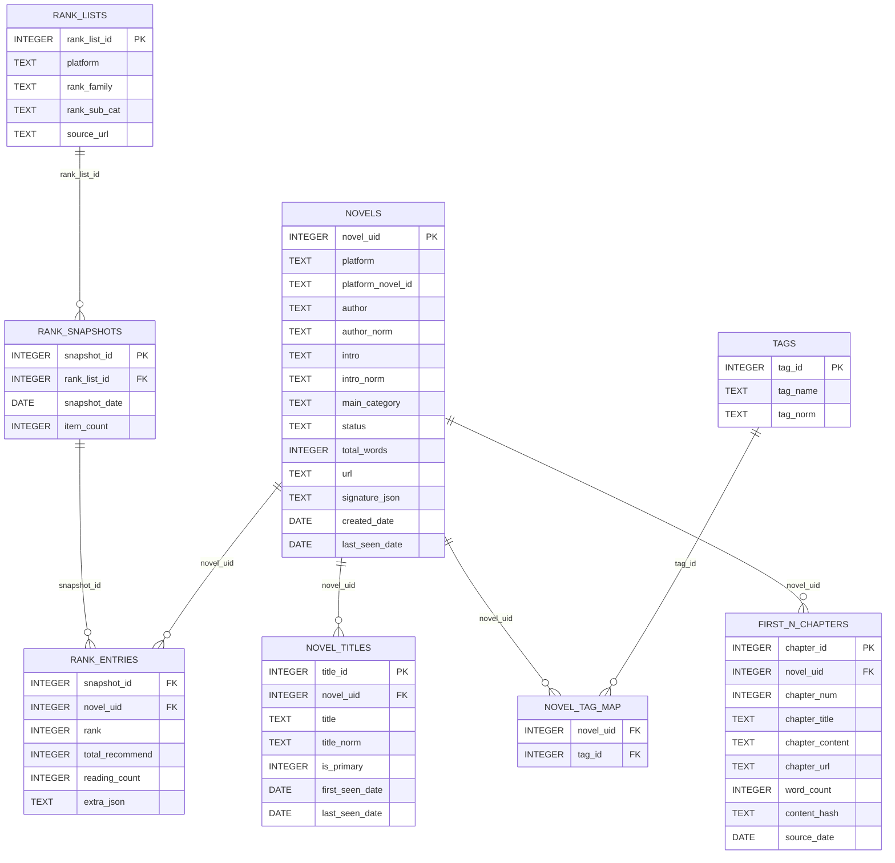
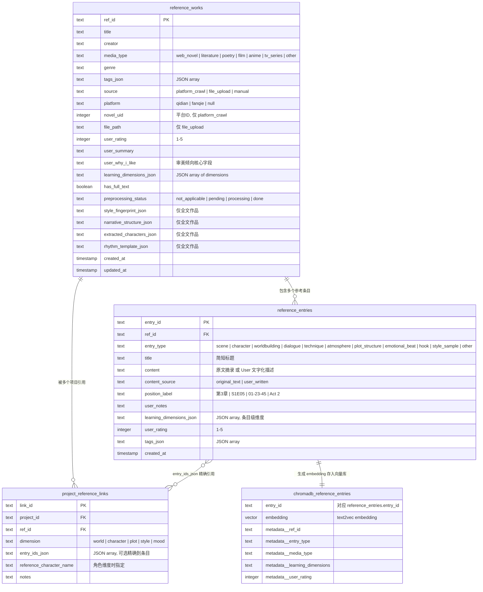

# InkOctoBot - AI小说创作工作流 v2.1
（非商业用途，仅供学习以及个人使用）
> 最后更新: 2026-03-07

---
## 1. 系统愿景

### 1.1 核心设计理念：纯文字版电影制作

User = **导演 + 编剧**, AI = **出版社编辑/制片人 + 剧组（演员 + 剪辑师 + 作家）**。

| 电影制作      | 本系统映射                             |
| --------- | --------------------------------- |
| 编剧参考其他作品  | User 为每个维度指定Reference                |
| 编剧写剧本     | User 输入世界书 + 人物卡 + 大纲 + 章节剧情      |
| 制片人/编辑给市场建议  | AI Marketing Agent 基于当前市场数据给出优化建议      |
| 正式立项  | User确定当前创作小说的宏观信息，如世界观，粗纲，人物设定等      |
| 导演做分镜表    | AI Scene Planner 拆解章节为分镜场景           |
| 选角 + 读剧本  | Character Architect 扩展人物卡         |
| 导演给演员说戏   | Scene Director 注入目标 + 约束 + 知识隔离   |
| 演员表演    | Actor Agents 生成原始素材 |
| 剪辑 + 后期   | Editor-Stylist 完成剪辑 + 文学风格化       |
| 导演审片 / 补拍 | User Review + 定向重新生成              |

---
## 2. 项目架构
### 2.1 总流程Pipeline
```
══ 离线预处理学习层 ══
User 输入[参考作品] | [小说网站上榜作品信息]
  ↓
Feature Extractor → 从[Reference数据库]中提取（世界观/人物/情绪曲线/名场面...）信息，生成结构化存储的参考作品数据库
  ↓
══ 进入创作流程 ══
User 输入[世界书 + 人物卡 + 大纲]，以上内容均可链接参考作品）
  ↓
Marketing Agent 根据市场信息给出[选题 + 书名 + 简介]建议                            → [User 决定采纳与否]
  ↓
Story Architect 与User 讨论[世界书 + 人物卡 + 大纲]并细化描述                       → [User 回答AI生成的细化问题]
  ↓
Calibration → 生成短样本片段，User 确认风格方向                                     → [User 满意后进入章节循环]
  ↓
══ 进入章节创作循环 ══
User 输入章节细纲
  ↓
Scene Director → 将章节细纲拆为分镜计划（时间，地点，人物）并生成                     → [User 可预览调整]
  - 导演指令：角色情绪状态、秘密目标、知识隔离指令、must/must_not
  ↓
Actor Agents (roleplay, 每角色独立 instance) → 多角色交互模拟，真实扮演场景          → [User 可预览调整]
   - 信息隔离：每个 actor 只能看到[此时此刻][这个角色应该知道]的信息，并遵循[此时此刻]的角色设定
   - 特殊设计："旁白" ，负责环境描写、氛围渲染、非角色视角的叙事内容
   - 输入: 分镜计划 + 角色卡 + RAG获取信息 + 参考作品片段 + 约束
   - 输出: 半结构化"表演记录"（动作+对话+内心+氛围）
  ↓
Editor-Writer → 剪辑 + 文学转化                                                   → [User 可比较不同模型输出结果]
   - 输入: 表演记录 + 叙事指令（POV/节拍展开压缩/情绪弧线）+ 风格 + 约束
   - 输出: 章节正文
  ↓
Evaluator → 约束/一致性/知识隔离/重复/四层记忆回溯（伏笔等） 检测               → [User 在文本 Editor 中审阅 + 编辑]
   - 不达标 → 带上Evaluator的诊断结果targeted rewrite（仅重写问题段落，不重跑全 pipeline），3次未通过标记为需要User人工介入
  ↓
EditAnalyzer 分析用户修改，总结修改类型，并记录以优化后续生成
  ↓
记忆系统更新（4层） → 版本快照
  ↓
进入下一章
```

### 2.2 各模块Agent设计
> 分布式多Agent系统，每个Agent专注一个核心功能，模块间通过明确的输入输出接口进行交互以提高本AI Workflow的创作能力
#### 2.2.1 Marketing Agent
- 目标：给用户（作者）提供网络小说市场趋势参考，以便用户（作者）选择最容易获得流量的题材
- 输入：当前市场数据（热点题材分布，成功作品的世界观/人物设定/情绪曲线等特征），用户提供的创作方向（如“想写科幻末世”）
- 输出：选题建议（如“末世生存”），书名建议，简介建议
- 技术实现：基于市场数据的分析报告 + LLM生成建议

#### 2.2.2 Story Architect
- 目标：帮助用户细化世界书/人物卡/大纲，确保创作设定的合理性和丰富性
- 输入：用户提供的世界书/人物卡/大纲，参考作品数据库
- 输出：细化后的故事设定
- 技术实现：基于参考作品的分析 + LLM生成建议, **交互式 Prompt 消歧系统**（针对用户输入的模糊或不完整设定，生成细化问题引导用户选择或补充）

#### 2.2.3 Scene Director
- 目标：将章节细纲拆解为具体的分镜场景，并注入导演指令（角色状态/目标/知识隔离）
- 输入：章节细纲，RAG获取信息，参考作品
- 输出：分镜计划（时间/地点/人物） + 场景描述 + 角色指令
- 技术实现：基于章节细纲的结构化解析 + LLM生成分镜计划和场景描述

#### 2.2.4 Actor Agents
- 目标：模拟角色在场景中的行为和对话，生成原始素材
- 输入：分镜计划，RAG获取信息，参考作品，约束
- 输出：半结构化的表演记录（动作+对话+内心独白+氛围描写）
```
表演记录示例
[节拍1]
张三(紧张): *抽出剑挡在身前* "你到底是谁？"
  内心: 这个人的气势太强了，完全不是一个级别
李四(玩味): *缓缓拔剑* "你猜？"
  内心: 有点意思，居然没跑
[氛围] 空气凝滞，杀意弥漫
```
- 技术实现：每个角色一个独立的Agent实例，信息隔离设计，基于角色卡和分镜计划生成表演记录

#### 2.2.5 Editor-Writer
- 目标：将Actor Agents生成的表演记录剪辑成章节正文，并进行文学风格化处理
- 输入：表演记录，叙事指令（POV/节拍展开压缩/情绪弧线），风格要求，约束
- 输出：章节正文
- 技术实现：基于表演记录的结构化内容，结合叙事指令和风格要求生成章节文本，可使用基于参考作品数据库训练成的LoRA模型来模仿特定风格

#### 2.2.6 Evaluator
- 目标：检测生成文本的约束满足度、一致性、知识隔离执行情况、重复度、**四重记忆系统**回溯、伏笔回收等，确保文本质量
- 输入：章节正文，导演指令，角色设定，记忆系统内容
- 输出：评估结果（是否达标 + 诊断信息）

#### 2.2.7 EditAnalyzer
- 目标：分析用户对生成文本的修改，识别修改类型（如情节调整、角色行为修改、语言风格调整等），并总结以优化后续生成
- 输入：原始生成文本，用户修改后的文本
- 输出：修改分析报告（修改类型分布，常见修改模式等）
- 技术实现：基于文本差异分析 + LLM生成修改类型标签和总结报告

### 2.3 数据库设计
> 存储永久化市场信息以及User提供的带有个人审美取向的参考作品信息
#### 2.3.1 市场数据库
- 存储榜单热门小说数据（书名、作者、简介、分类、的开篇 N 章等）
- 分析提取的特征（世界观类型、人物设定类型、情绪曲线类型等）
- 用于支持Marketing Agent的分析和建议生成

#### 2.3.2 参考作品数据库
- 存储User保存的参考作品信息以及User 写下的个人感想以及喜爱程度
- 可包含类型：
  - 文学作品全文（网文/严肃文学/诗歌等）
  - 电影剧情描述，评论摘录，角色设定等
  - 动漫/电视剧分集剧情描述，评论摘录，角色设定等
- 支持Story Architect和Scene Director在创作过程中进行RAG检索，提供相关参考信息

### 2.4 记忆系统设计
#### 2.4.1 四层记忆系统
- 目标：在长篇小说创作过程中保持前后文信息的一致性和连贯性，支持伏笔设置与回收，并为每个 Agent 提供适当粒度的上下文
- 设计：

| 层级      | 名称                | 存储位置                              | 核心内容                  | 主要用途                             | 更新方式                     |
| ------- | ----------------- | --------------------------------- | --------------------- | -------------------------------- | ------------------------ |
| Layer 1 | Immediate Context | LLM context window 内（4-8K tokens） | 当前场景 + 前一场景完整文本       | 给 Actor / Editor-Writer 提供直接工作素材 | 每个场景自动替换                 |
| Layer 2 | Chapter Buffer    | LLM context window 内（2-4K tokens） | 最近 5-10 章结构化摘要        | 维持中期叙事连贯性（角色弧线进展、近期事件因果）                        | 每章结束时LLM生成本章摘要              |
| Layer 3 | Semantic Memory   | ChromaDB 向量检索                     | 全部设定/人物状态/事件/世界书条目/约束规则 | 按语义相关性检索，如Agent 提问"张远和李清漪的关系"时返回相关片段                         | 每章结束 + Layer 2 降级时写入 |
| Layer 4 | Episodic Timeline | SQLite 结构化查询                      | 关键事件的因果链 + 时间轴 + 伏笔状态追踪      | 结构化查询"第3章埋的伏笔到现在回收了吗？""角色A和B上次见面是哪章？"等问题                      | 每章结束时由LLM提取关键事件并写入           |

自动压缩降级机制： 当 Layer 2 的章节摘要超出窗口预算（如累积超过 10 章）时，最老的章节摘要通过 LLM 提取三类永久信息后丢弃过渡细节：
- permanent_facts：不可逆的事实（"张远在第5章觉醒了灵根"）
- active_foreshadowing：尚未回收的伏笔（"李清漪在第7章提到的'那个人'身份未揭示"）
- character_state_changes：角色状态变化（"张远对宗门的信任从中立变为怀疑"）

提取结果写入 Layer 3（语义记忆）和 Layer 4（事件时间线），原始摘要从 Layer 2 移除。
各 Agent 的记忆访问权限：

| Agent          | Layer 1  | Layer 2   | Layer 3   | Layer 4      |
| -------------- | -------- | --------- | --------- | ------------ |
| Scene Director | ✓ 读取前一场景 | ✓ 完整读取    | ✓ 检索相关设定  | ✓ 查询伏笔 / 事件线 |
| Actor Agent    | ✓ 当前场景   | ✗ 经知识隔离过滤 | ✗ 经知识隔离过滤 | ✗ 不直接访问      |
| Editor-Writer  | ✓ 完整读取   | ✓ 完整读取    | ✓ 检索风格参考  | ✗ 不需要        |
| Evaluator      | ✓ 完整读取   | ✓ 完整读取    | ✓ 完整检索    | ✓ 完整查询       |


#### 2.4.2 知识隔离设计
- 目标：确保 Actor Agent 在角色扮演时只能访问该角色"此时此刻应该知道"的信息，防止全知视角污染（context leaking），同时支持虚假信息和误解的显式建模
- 设计：**KnowledgeIsolationEngine**
  - 输入: 角色名 + 当前章节/场景 + Scene Director 的 knowledge_boundary 指令
  - 输出: 该角色的 filtered_world_view（用于注入 Actor Agent 的 prompt）
  - 工作流程:
    1. 从 Layer 3 (Semantic Memory) 检索与当前场景相关的所有信息片段
    2. 对每个片段查询 information_events 表：该角色是否已获知此信息？
    3. 分为三类：
        - known_true:    角色知道且信息为真 → 注入 prompt
        - known_false:   角色持有的错误信息 → 以角色相信的版本注入 prompt
        - unknown:       角色不知道的信息   → 不注入，并加入 explicitly_unknown 列表
    4. 将 explicitly_unknown 以否定指令注入 prompt:
      "你（张远）目前不知道以下信息，在表演中不得暗示或提及：..."

#### 2.5 Prompt设计
1. 约束优先级：硬约束 (世界观/逻辑) > 2. 知识隔离 > 3. 情绪弧线 > 4. 叙事风格 > 5. 修辞风格

---

## 3. RAG设计
> 为 Scene Director 和 Actor Agents 提供相关的参考信息，支持基于内容的检索

### 3.1 角色卡系统
- 目标：为每个角色构建一个动态更新的角色卡，包含基本设定、关系网络、canonical scenario-response 范例、成长轨迹等信息，支持 Scene Director 在生成分镜计划和指导 Actor 表演时进行 RAG 检索，确保角色行为的合理性和一致性
#### 3.1.1 特别设计
- Layer A（LLM prompt 用）: 自然语言描述人格、说话风格、关系网络、canonical scenario-response 范例、成长轨迹
- Layer B（Python 决策引擎用）：量化决策模型，包含效用函数权重、前景理论参数、随机行为分布、贝叶斯信任追踪

| 模块     | 内容                                                                     |
| ------ | ---------------------------------------------------------------------- |
| 效用函数   | 价值维度权重（survival / power / love / loyalty / justice 等），时间折扣因子           |
| 前景理论   | loss_aversion（经历创伤后上升），risk_aversion_gain / loss                       |
| 随机行为   | Poisson（社恐搭话频率 λ = 0.3 vs 社牛 λ = 5.0），Bernoulli（冲动动手 p = 0.8），支持情境修正因子 |
| 贝叶斯信任  | Beta(α, β) 分布，观察行为后更新，α / (α + β) = 信任度期望                              |
| 决策引擎串联 | 效用 → 前景理论 → 随机波动 → 信任加权 → 归一化 → 自然语言引导注入 LLM                           |

#### 3.2 世界书系统
- 结构化存储世界观设定（如宗门体系、修炼体系、政治格局等），支持 Scene Director 在生成分镜计划时进行 RAG 检索，确保世界观的一致性和细节丰富性
#### 3.2.1 特别设计
- AI 一致性检查（"这条规则和第3条是否矛盾？"）

#### 3.3 参考作品数据库
- 存储用户保存的参考作品信息以及用户写下的个人感想以及喜爱程度，支持 Story Architect 和 Scene Director 在创作过程中进行 RAG 检索，提供相关参考信息
- 设计：reference_works 和 reference_entries 数据表 + ChromaDB 向量检索接口 

## 4. UIUX设计
### 4.1 离线学习层数据可视化
- 目标：以可视化、可交互的形式展示从市场数据和用户提供的参考作品中提取的特征信息，帮助用户更直观地理解当前市场趋势和个人审美倾向

### 4.2 LLM多模型可选择模块化
每个 agent 角色（Scene Director / Actor / Editor-Stylist / Editor Agent 等）
都允许 User 自由选择模型，User 可以为每个角色独立指定模型，也可以使用预设方案
- 商用LLM usage费用控制
  - 本地加密存储API
- 多模型输出对比机制
- 本地模型部署
  - 支持本地部署的开源模型（如基于LLaMA的模型）以降低成本并提高隐私性
  - 使用local小模型fine tune的LoRA进行更具有针对性的风格模仿输出

### 4.3 交互式 Prompt 消歧系统
- 目标：针对用户输入的模糊或不完整设定，生成细化问题引导用户选择或补充，确保 Story Architect 和 Scene Director 能够获得足够明确的信息进行创作
- 设计：当 Story Architect 或 Scene Director 接收到用户输入的设定信息后，首先进行模糊性分析，识别出不明确或可能有多种解释的部分，然后基于这些部分生成针对性的细化选择题，呈现给用户进行选择或补充

### 4.4 Layer 4 Memory Episodic Timeline 可视化
- 目标：以时间轴的形式可视化展示关键事件的因果链和伏笔状态，帮助用户理解故事发展脉络和伏笔布局

### 4.5 生成文本版本链保存
- 目标：保存每次生成的文本版本以及用户修改后的版本，支持版本回溯和对比，帮助用户理解生成文本与最终文本之间的差异，并优化后续生成

### 4.6 生成文本质量评估与Human-In-The-Loop反馈记录
- 目标：记录 Evaluator 的评估结果以及用户对生成文本的修改，分析修改类型和频率，帮助优化后续生成的质量

## 5. Project 技术细节
### 5.1 项目结构
```text
InkOctoBot/
│
├── main.py                              # CLI 主入口 (爬虫 + 分析 + 创作子命令)
├── launcher.py                          # GUI 桌面入口
├── config.py                            # 配置薄读取层 (读取 config/ 目录)
├── log_setup.py                         # 全局日志配置
├── requirements.txt                     # Python 依赖
├── README.md                            # 项目说明
├── QUICKSTART.md                        # 快速启动指南
│
├── config/                              # 配置文件目录
│   ├── app_config.yaml                  # 全局应用配置
│   ├── analysis.yaml                    # 分析模块配置
│   ├── antibot.yaml                     # 反爬策略配置
│   ├── crawler.yaml                     # 爬虫通用配置
│   ├── paths.yaml                       # 路径配置
│   ├── scheduler.yaml                   # 定时任务配置
│   ├── selenium.yaml                    # Selenium 驱动配置
│   ├── websites.yaml                    # 平台站点配置 (起点/番茄 URL + 选择器)
│   ├── models.yaml                      # 模型路由 + 预设方案
│   ├── model_providers.json             # LLM 提供商注册 + 定价表
│   ├── slop_patterns.json               # AI 味检测模式库
│   ├── model_presets/                   # 模型预设方案
│   │   ├── cost_optimal.json            # 全本地方案
│   │   ├── balanced.json                # 混合方案
│   │   └── quality_first.json           # 商业 API 优先方案
│   ├── constraint_presets/              # 约束预设模板
│   ├── style_profiles/                  # 风格配置档案
│   ├── character_templates/             # 角色卡模板
│   └── prompts/                         # Agent prompt 模板
│       ├── marketing_agent.yaml
│       ├── story_architect.yaml
│       ├── scene_director.yaml
│       ├── actor_agent.yaml
│       ├── narrator_agent.yaml          # 旁白 Actor 专用
│       ├── editor_writer.yaml
│       ├── evaluator.yaml
│       └── edit_analyzer.yaml
│
├── spiders/                             # 网站爬虫模块(后续拆封成另外一个project)
│   ├── base_spider.py                   # 爬虫基类 (Selenium/requests 封装)
│   ├── qidian_spider.py                 # 起点中文网爬虫
│   ├── fanqie_spider.py                 # 番茄小说爬虫
│   ├── fanqie_font_decoder.py           # 番茄字体解密模块
│   └── antibot.py                       # 反爬检测与规避控制
│
├── database/                            # 数据库核心
│   ├── DATABASE.md                      # 数据库文档
│   ├── db_schema.py                     # DDL 定义 (市场表 + 创作表 + 记忆表)
│   └── db_handler.py                    # 数据库 CRUD 操作封装
│
├── tasks/                               # 任务调度
│   ├── scheduler.py                     # 定时任务调度器
│   └── run_spiders_once.py              # 单次全平台爬取任务
│
├── analysis/                            # 市场数据分析
│   ├── ANALYSIS.md                      # 分析模块文档
│   ├── run_analysis.py                  # 分析 CLI 入口
│   ├── trend_analyzer.py                # 分析主编排器
│   ├── data_access.py                   # SQL / DataFrame 数据读取
│   ├── heat.py                          # 热度指标计算
│   ├── metrics.py                       # 综合指标计算
│   ├── visualization.py                 # 可视化图表生成
│   ├── report.py                        # Markdown 报告生成
│   ├── feature_extraction/              # 作品特征提取
│   │   ├── pipeline.py                  # 特征提取主编排
│   │   ├── nlp_stats.py                 # jieba + SnowNLP 文本统计
│   │   ├── embedding_cluster.py         # text2vec + KMeans 聚类
│   │   ├── narrative_extractor.py       # 叙事结构标注
│   │   ├── rhetoric_classifier.py       # 修辞手法分类
│   │   └── shuangdian_templates.py      # 爽点模板提取
│   └── formula_engine/                  # 公式化特征聚合
│       ├── aggregator.py                # 多维特征聚合
│       ├── constraint_converter.py      # 特征→约束转换
│       └── presets.py                   # 题材预设公式
│
├── preprocessing/                       # 参考作品预处理 Pipeline
│   ├── pipeline.py                      # 5步预处理主入口
│   ├── chapter_splitter.py              # 章节分割
│   ├── style_extractor.py               # PROSE 迭代风格收敛提取
│   ├── character_profiler.py            # 角色画像自动提取
│   ├── rhythm_analyzer.py               # 节奏/张力曲线分析
│   ├── fragment_selector.py             # ZeroStylus 句级/段级模板选取
│   └── lora/                            # LoRA 风格微调
│       ├── data_constructor.py          # 训练数据构造
│       ├── quality_filter.py            # 训练样本质量过滤
│       └── trainer.py                   # SFT + Constitutional DPO 训练
│
├── rag/                                 # RAG 知识库层
│   ├── world_book.py                    # 世界书管理 + 一致性检查
│   ├── character_cards.py               # 角色卡 Layer A (自然语言描述) 管理
│   ├── decision_engine.py               # 角色卡 Layer B (量化决策引擎)
│   ├── constraint_store.py              # 约束规则存储与检索
│   ├── reference_db.py                  # 参考作品数据库管理
│   ├── vector_store.py                  # ChromaDB 统一封装
│   └── memory/                          # 四层记忆系统
│       ├── manager.py                   # 记忆总控 (协调四层读写)
│       ├── immediate.py                 # Layer 1: Immediate Context
│       ├── chapter_buffer.py            # Layer 2: Chapter Buffer
│       ├── semantic_store.py            # Layer 3: Semantic Memory (ChromaDB)
│       ├── episodic_timeline.py         # Layer 4: Episodic Timeline (SQLite)
│       ├── knowledge_isolation.py       # KnowledgeIsolationEngine
│       └── consolidator.py              # Layer 2 → Layer 3/4 压缩降级
│
├── agents/                              # 多 Agent 创作层
│   ├── base_agent.py                    # Agent 基类 (prompt 模板 + 输出解析)
│   ├── model_router.py                  # 统一模型路由 (按 agent role 分发)
│   ├── cost_estimator.py                # 商业 API 成本预估 + 确认流程
│   ├── ab_compare.py                    # 多模型 A/B 对比引擎
│   ├── model_providers/                 # LLM 提供商适配层
│   │   ├── base.py                      # Provider 抽象接口
│   │   ├── openai_provider.py           # OpenAI API
│   │   ├── anthropic_provider.py        # Anthropic API
│   │   ├── deepseek_provider.py         # DeepSeek API
│   │   ├── ollama_provider.py           # Ollama 本地模型
│   │   ├── vllm_provider.py             # vLLM 本地推理
│   │   └── lora_provider.py             # LoRA 模型加载
│   │
│   ├── planner/                         # 规划层 Agent
│   │   ├── marketing_agent.py           # 市场顾问 (选题/书名/简介建议)
│   │   ├── story_architect.py           # 故事架构师 (细化世界书/人物卡/大纲)
│   │   ├── volume_planner.py            # 分卷规划
│   │   ├── chapter_planner.py           # 章节细纲规划
│   │   └── calibration.py              # 风格校准 (短样本试笔)
│   │
│   ├── production/                      # Film Pipeline 执行层
│   │   ├── scene_director.py            # 导演 (分镜 + 导演指令生成)
│   │   ├── actor_agent.py               # 角色扮演 (单角色 instance)
│   │   ├── narrator_agent.py            # 旁白 (环境描写/氛围渲染)
│   │   ├── scene_simulator.py           # 多角色交互编排 (turn-based / parallel)
│   │   └── editor_writer.py             # 剪辑 + 文学转化
│   │
│   ├── constraints/                     # 约束系统
│   │   ├── disambiguator.py             # 交互式 Prompt 消歧
│   │   ├── assembler.py                 # 约束优先级组装 (5级)
│   │   └── violation_detector.py        # ChromaDB 语义违规检测
│   │
│   └── evaluation/                      # 评估与反馈层
│       ├── evaluator.py                 # 综合评估 (约束/一致性/隔离/重复/slop)
│       ├── cross_chapter_checker.py     # 跨章连续性检测 (伏笔审计/角色漂移)
│       ├── quality_scorer.py            # 质量评分
│       ├── repetition_detector.py       # 重复检测
│       ├── consistency_checker.py       # 设定一致性校验
│       ├── slop_detector.py             # AI 味检测
│       ├── edit_analyzer.py             # User 编辑偏好分析
│       └── style_drift_detector.py      # 风格漂移检测
│
├── security/                            # 安全与隐私
│   ├── api_key_manager.py               # API key 加密存储 (OS keyring + Fernet)
│   └── data_isolation.py                # 项目级数据隔离 + 一键清理
│
├── data/                                # 数据存储根目录
│   ├── webnovel.db                      # SQLite 主库 (市场 + 创作 + 记忆)
│   ├── chromadb/                        # ChromaDB 向量数据库
│   ├── references/                      # 参考作品上传文件
│   └── projects/                        # 项目数据 (每项目独立目录)
│       └── {project_id}/
│           ├── world_book.yaml          # 世界书
│           ├── characters/              # 角色卡 YAML 文件
│           ├── volumes/                 # 分卷大纲
│           ├── chapters/                # 章节细纲 + 生成内容
│           ├── lora/                    # 项目专属 LoRA 权重
│           └── exports/                 # 导出文件 (TXT/DOCX/EPUB)
│
├── tests/                               # 测试套件
│   ├── TEST.md                          # 测试文档
│   ├── base_test.py                     # 测试基类 + 通用工具
│   ├── qidian_test.py                   # 起点爬虫测试
│   └── fanqie_test.py                   # 番茄爬虫测试
│
├── outputs/                             # 运行时输出
│   ├── logs/                            # 运行日志
│   ├── data/                            # 中间数据
│   ├── ui_tasks/                        # UI 任务记录
│   ├── config_runs/                     # 配置运行快照
│   └── reports/                         # 分析报告 (Markdown + 图表)
│
└── ui/                                  # 用户界面
    ├── backend/                         # FastAPI 后端
    │   ├── requirements.txt             # 后端依赖
    │   └── app/
    │       ├── __init__.py
    │       ├── main.py                  # FastAPI 入口 + CORS + WebSocket
    │       ├── settings.py              # 路径 / 环境配置
    │       ├── store.py                 # UI TaskStore (jsonl 持久化)
    │       ├── runner.py                # subprocess 启动爬虫 + 写日志
    │       ├── utils.py                 # 读取 repo config / paths / rank_keys
    │       └── routers/
    │           ├── config_api.py        # /api/config (爬虫配置 schema + 保存)
    │           ├── tasks_api.py         # /api/tasks (启动爬虫任务 + 读日志)
    │           ├── reports_api.py       # /api/reports (分析报告索引 + 预览)
    │           ├── db_api.py            # /api/db (市场数据库只读查询 + 诊断)
    │           ├── analysis_api.py      # /api/analysis (特征提取 + 趋势分析)
    │           ├── formula_api.py       # /api/formula (公式引擎查询)
    │           ├── prompt_api.py        # /api/prompt (交互式消歧接口)
    │           ├── project_api.py       # /api/project (项目 CRUD + 导出)
    │           ├── worldbook_api.py     # /api/worldbook (世界书管理)
    │           ├── characters_api.py    # /api/characters (角色卡 + 决策模型)
    │           ├── planner_api.py       # /api/planner (大纲 + 分卷 + 章节规划)
    │           ├── reference_api.py     # /api/reference (参考作品库管理)
    │           ├── generation_api.py    # /api/generation (Film Pipeline 执行)
    │           ├── editor_api.py        # /api/editor (Editor-Writer 接口)
    │           ├── eval_api.py          # /api/eval (评估 + EditAnalyzer)
    │           ├── version_api.py       # /api/version (版本管理 + diff)
    │           ├── model_api.py         # /api/model (模型管理 + 成本追踪)
    │           └── security_api.py      # /api/security (API key 加密管理)
    │
    └── frontend/                        # React 前端
        ├── package.json
        ├── vite.config.ts
        ├── tsconfig.json
        └── src/
            ├── main.tsx                 # React 入口
            ├── App.tsx                  # 全局 Layout + 路由 + 暗色主题
            ├── pages/
            │   ├── ConfigPage.tsx       # 爬虫配置生成 / 保存
            │   ├── RunnerPage.tsx       # 爬虫任务启动 / 日志查看
            │   ├── ReportsPage.tsx      # 分析报告预览
            │   ├── DatabasePage.tsx     # 市场数据库浏览 / 诊断
            │   ├── EditorPage.tsx       # 三栏编辑器 (目录树 / TipTap / AI面板)
            │   ├── ProjectListPage.tsx  # 项目列表 + 创建 / 删除
            │   ├── ProjectSetupPage.tsx # 项目设置 (世界书/人物卡/大纲/约束)
            │   ├── CharacterManager.tsx # 人物卡管理 (含决策模型面板)
            │   ├── WorldBook.tsx        # 世界书编辑 + 一致性检查
            │   ├── AnalysisDashboard.tsx# 市场分析可视化面板
            │   ├── ReferenceLibrary.tsx # 参考作品库 (多媒体类型)
            │   └── SettingsPage.tsx     # 设置 (模型配置/约束管理/系统)
            ├── components/
            │   ├── LogViewer.tsx        # 增量日志查看器
            │   ├── editor/
            │   │   ├── ChapterTree.tsx  # 左栏: 分卷/章节目录树
            │   │   ├── TextEditor.tsx   # 中栏: TipTap 富文本编辑器
            │   │   ├── AIPanel.tsx      # 右栏: AI 生成控制 + pipeline 状态
            │   │   ├── VersionHistory.tsx   # 版本历史列表 + diff 对比
            │   │   ├── ModelCompare.tsx     # 多模型输出并排对比
            │   │   └── EditorAdvice.tsx     # Marketing Agent 建议卡片
            │   ├── shared/
            │   │   ├── CostConfirmDialog.tsx # 商业 API 成本确认弹窗
            │   │   ├── ModelSelector.tsx     # 模型选择器 (单选/多选)
            │   │   ├── DisambiguationCard.tsx# 消歧选择卡片
            │   │   └── StyleSliders.tsx      # 风格参数滑块
            │   ├── characters/
            │   │   ├── CharacterCard.tsx     # 角色卡展示/编辑
            │   │   ├── DecisionModelPanel.tsx# 量化决策模型参数面板
            │   │   └── RelationshipGraph.tsx # 角色关系网络图
            │   ├── reference/
            │   │   ├── ReferenceCard.tsx     # 参考作品卡片
            │   │   ├── EntryEditor.tsx       # 参考条目编辑器
            │   │   ├── StyleRadar.tsx        # 风格雷达图
            │   │   └── NarrativeTimeline.tsx # 叙事结构时间线图
            │   ├── memory/
            │   │   └── EpisodicTimeline.tsx  # Layer 4 事件时间线可视化
            │   └── analysis/
            │       ├── TrendChart.tsx        # 市场趋势图表
            │       └── ShuangdianRank.tsx    # 爽点排行可视化
            └── lib/
                ├── api.ts               # API client 封装
                ├── types.ts             # TypeScript 类型定义
                └── theme.ts             # 暗色/亮色主题配置
```

### 5.2 数据库ER Diagram
#### 5.2.1 市场数据库


#### 5.2.2 参考作品数据库


### 5.3 Logger命名规范
```text
inkoctobot                    # root
inkoctobot.main               # CLI 入口
inkoctobot.launcher           # GUI 入口
inkoctobot.spider.起点中文网    # 起点爬虫（用 site name）
inkoctobot.spider.番茄小说     # 番茄爬虫
inkoctobot.db                 # DatabaseHandler
inkoctobot.tasks.run_once     # 单次爬取任务
inkoctobot.scheduler          # 定时调度
inkoctobot.analysis.metrics   # 分析模块
inkoctobot.analysis.heat
inkoctobot.analysis.report
inkoctobot.antibot            # 反爬检测
inkoctobot.ui.backend         # FastAPI 后端
```
---

## 6. 额外信息
### 6.1 起点榜单信息
```text
新书榜说明
新书榜有四个，分别为：签约作者新书榜、公众作者新书榜、新人签约新书榜、新人作者新书榜。 以上榜单不会同时收录同一部作品。
1） 签约作者新书榜收录标准：阅文自有原创作品，作者在阅文已有一部以及以上签约作品（不包含当前作品），总字数低于20万字、签约完成30天内、近三天内更新过一次，作品未入V。
2） 公众作者新书榜收录标准：作者在成为阅文作家后发表两部或两部以上的非签约作品（起点、创世、云起平台签约均包括），总字数低于20万字、加入起点书库30天内、每三天内更新过一次的作品。
3） 新人签约新书榜收录标准：阅文自有原创作品，作者在阅文的第一部签约作品，总字数低于20万字，签约完成30天以内，近三天内更新过一次；作品未入V。
4） 新人作者新书榜收录标准：作者成为阅文作家后发表的第一部作品，而且是非签约作品（起点、创世、云起平台签约均包括），总字数低于20万字 、加入起点书库30天内、每三天内更新过一次的作品。

以上榜单的根据作品阅读指数排序，阅读指数是一个综合了用户阅读、互动、订阅、打赏、投票等多种行为等综合指数，能够全面等反映作品等受欢迎程度。
```
Source: https://www.qidian.com/help/index/6

### 6.2 番茄榜单信息
```text
榜单说明
作品按照其在番茄小说中的分类进行划分排榜，排榜顺序按照在读数据排序，仅排1000在读以上的作品
阅读榜：30万字以上、已签约未下架、已经开始推荐的番茄原创作品
新书榜：30万字以下、已签约未下架、已经开始推荐的且未断更，完结未超过90天的番茄原创作品

排行榜每天下午3点前更新截止到上一日的排名数据
```

---

## 附录

### A: 论文参考

| 简称 | 论文全称 | 作者 | 发表/来源 | 与本系统的关联 |
|------|---------|------|----------|--------------|
| PROSE | Aligning LLMs by Predicting Preferences from User Writing Samples | Aroca-Ouellette et al. | arXiv:2505.23815, 2025 | 迭代式风格偏好推断，指导 EditAnalyzer 的偏好收敛机制 |
| ZeroStylus | Implementing Long Text Style Transfer with LLMs through Dual-Layered Sentence and Paragraph Structure Extraction and Mapping | — | arXiv:2505.07888, 2025 | 句级 + 段级双层模板提取，用于参考作品风格片段库构建 |
| Weaver | Weaver: Foundation Models for Creative Writing | Wang, Tiannan et al. | arXiv:2401.17268, 2024 | Constitutional DPO 对齐方法，指导 LoRA 风格微调训练策略 |
| CoSER | CoSER: Coordinating LLM-Based Persona Simulation of Established Roles | Wang, Xintao et al. | ICML 2025, arXiv:2502.09082 | Given-Circumstance Acting 方法论，指导 Actor Agent 的角色扮演设计 |
| StoryWriter | StoryWriter: A Multi-Agent Framework for Long Story Generation | — | arXiv:2506.16445, 2025 | Non-Linear Narration (NLN) + ReIO 输入输出重写，指导 Editor-Writer 的章节组装策略 |
| Agents' Room | Agents' Room: Narrative Generation through Multi-step Collaboration | Huot, Fantine et al. (Google DeepMind) | ICLR 2025, arXiv:2410.02603 | 多 Agent 分工协作叙事框架 (Planning Agents + Writing Agents + Scratchpad)，指导整体 pipeline 架构 |
| BookWorld | BookWorld: From Novels to Interactive Agent Societies for Creative Story Generation | Ran, Yiting et al. (Fudan University) | arXiv:2504.14538, 2025 | 动态世界观建模 + 地理约束 + 角色记忆更新机制，指导世界书和记忆系统设计 |
| LiteraryTaste | LiteraryTaste: A Preference Dataset for Creative Writing Personalization | Chung et al. | 2025 | Stated vs Revealed 偏好差异研究，指导参考作品数据库中 user_why_i_like 等主观字段设计 |
| OSST | LLM One-Shot Style Transfer for Authorship Attribution and Verification | Miralles, Pablo et al. | arXiv:2510.13302, 2025 | 基于 LLM log-prob 的风格可迁移性度量，可用于风格一致性评估 |
| Contrastive Prompting | Large Language Models are Contrastive Reasoners | Yao et al. | arXiv:2403.08211, 2024 | 正反例对比推理策略，指导约束系统中 good/bad 示例生成机制 |
| Slop Detection | Measuring AI "Slop" in Text | Shaib, Chantal et al. | arXiv:2509.19163, 2025 | AI 味检测分类体系 + 可解释维度框架，指导 Evaluator 的 slop 检测模块 |

### B: 技术栈

```
前端:  React 18 + TypeScript + Tailwind + TipTap(编辑器) + Recharts/D3 + shadcn/ui
后端:  FastAPI + WebSocket (生成流式输出)
存储:  SQLite + ChromaDB + YAML/JSON
AI:    Ollama/vLLM (本地) + OpenAI/Anthropic/DeepSeek API (可选)
ML:    PEFT + bitsandbytes (LoRA) + text2vec-large-chinese (embedding)
NLP:   jieba + SnowNLP
安全:  keyring / Fernet (API key 加密)
```