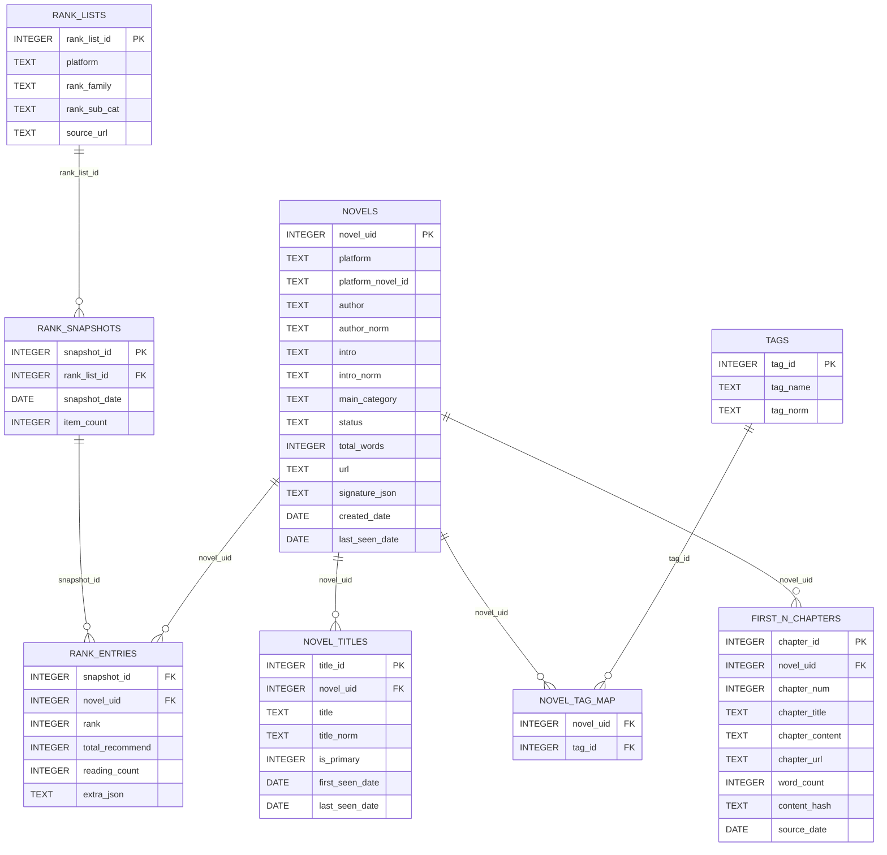
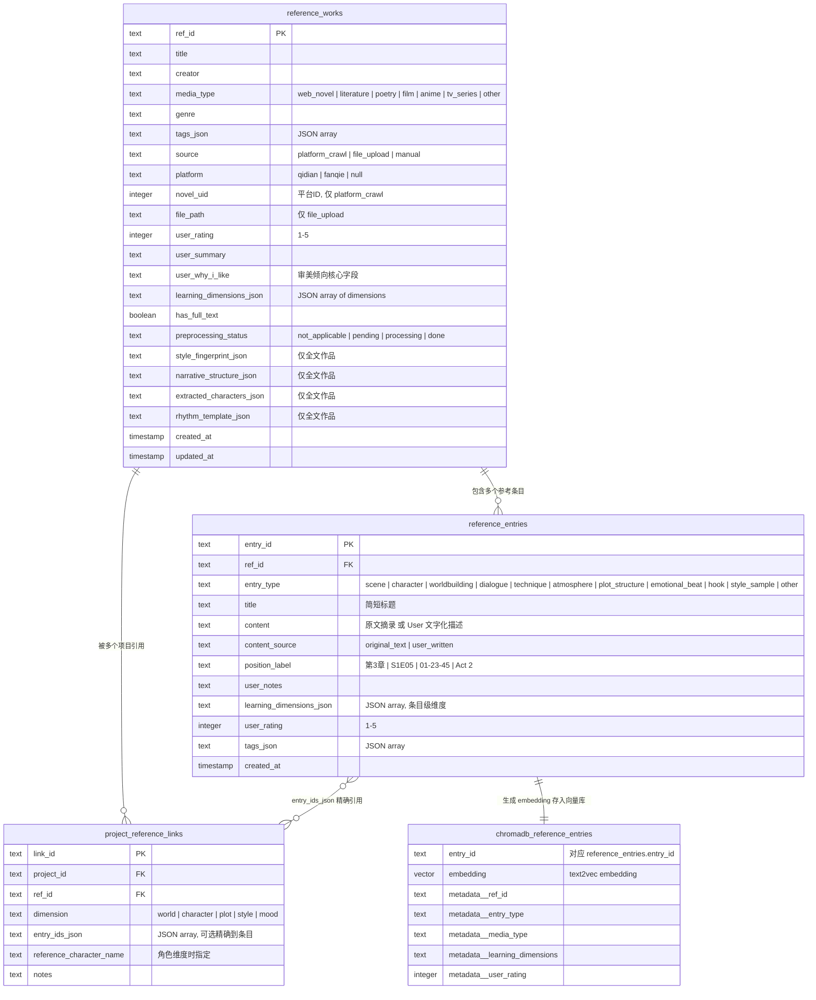

# InkOctoBot - AI小说创作工作流 v3.2
（非商业用途，仅供学习以及个人使用）
> 最后更新: 2026-08-25
>
> 本次更新：全量复核仓库内**所有 AI 机制**，重写第 1–3 章与 5.1。
> 相对 v3.0 的实质变化：
> - `knowledge/memory/` → `knowledge/reader_memory/`（读者视角记忆），
>   `knowledge/truth/` → `knowledge/storyland_state/`（小说世界客观状态）
> - 新增 **LLMCallSite 统一调用层**（tokenizer + 手动粘贴模式 + `llm_outputs` 审计）
> - 新增 **14 Loader + 动态预算分配** 的 prompt 装配层（替代旧 `_rag_context`）
> - 新增 **Post-commit 流水线**（7 个 sub-task + 重试 + 通知 + 三层校验）
> - 新增 **自学习闭环**（用户偏好 Part A / 领域知识 Part B / 多作品共通点 / 弃稿反例）
> - 新增 **Embedding 模型注册表 + 硬件自适应 + 重建索引**
> - 新增 **市场特征提取 5 Phase 流水线 + LTP 人名库**
> - 多智能体「导演模式」代码保留但**前端 tab 已下线**，当前主路径是单 Agent Writer
>
> 配套细则文档：`docs/LOADER_SPEC.md`（2667 行）、`docs/storyland_state_system.md`、
> `docs/READER_MEMORY_VS_STORYLAND_STATE.md`、`docs/EMBEDDING_SPEC.md`、
> `docs/AGENT_LEARNING.md`、`docs/SKILL_AUTHORING.md`、`docs/TESTING_AND_LOGS.md`。

---
## 1. 系统愿景

### 1.1 核心设计理念：纯文字版电影制作

User = **导演 + 编剧**, AI = **出版社编辑/制片人 + 剧组（演员 + 剪辑师 + 作家）**。

| 电影制作      | 本系统映射                             |
| --------- | --------------------------------- |
| 编剧参考其他作品  | User 为每个维度指定 Reference               |
| 编剧写剧本     | User 输入世界书 + 人物卡 + 大纲 + 章节剧情      |
| 制片人/编辑给市场建议  | Marketing Agent 基于市场特征提取结果给出优化建议      |
| 正式立项  | User 确定世界观 / 粗纲 / 人物设定，并跑一次 Storyland 创世      |
| 导演做分镜表    | Scene Director 拆解章节为分镜场景（导演模式）           |
| 选角 + 读剧本  | Character Architect 扩展人物卡         |
| 导演给演员说戏   | Scene Director 注入目标 + 约束 + 知识隔离   |
| 演员表演    | Actor Agents 生成原始素材（导演模式） |
| 剪辑 + 后期   | Writer 完成剪辑 + 文学风格化       |
| 导演审片 / 补拍 | User Review + 定向重新生成 + 结算入库              |

### 1.2 两条并行的信息流

1. **离线学习层**：市场榜单数据 + 用户参考作品 → 特征提取 → 结构化特征库 / 向量库 / Skill 库。
2. **在线创作层**：用户输入（世界书 / 人物卡 / 大纲 / 本章要求）+ 离线学习层的召回结果
   → prompt 装配 → LLM 生成 → 用户编辑 → 提交入库 → 状态结算 + 记忆更新 + 偏好学习
   → 反哺下一章的召回。

**一句话总结全系统**：所有 AI 机制都在做同一件事 —— 决定「这一次 LLM 调用的 prompt 里到底放什么」，
并在生成之后把结果拆回结构化状态，让下一次装配更准。

---
## 2. AI 机制全景

### 2.0 分层总览

```text
┌──────────────────────────────────────────────────────────────────┐
│ 学习层   偏好学习 / 领域知识 / 共通点学习 / 弃稿反例 / SkillLearner    │
│          (agents/learning/, services/{knowledge_research,          │
│           common_pattern_learning,failure_analyzer}, skill_learner)│
├──────────────────────────────────────────────────────────────────┤
│ 状态层   ReaderMemory L1-L4  ×  StorylandState 7 表  ×  实体注册表  │
│          (knowledge/reader_memory/, knowledge/storyland_state/)    │
├──────────────────────────────────────────────────────────────────┤
│ Agent层  planner / production / evaluation / guardrails            │
│          + Skill 系统（22 内置 + learned + self_learned + knowledge）│
├──────────────────────────────────────────────────────────────────┤
│ 装配层   14 Loader + 动态预算分配 + per-agent profile + 遥测        │
│          (services/prompt_context/)                                │
├──────────────────────────────────────────────────────────────────┤
│ 调用层   ModelRouter → FallbackRouter → LLMCallSite                │
│          (7 provider / tokenizer / 手动粘贴 / llm_outputs 审计)      │
└──────────────────────────────────────────────────────────────────┘
```

### 2.1 章节生成主路径（当前实际行为）

> ⚠️ **重要现状**：多智能体「导演模式」（Scene Director → Actor/Narrator → Writer 组装 → Evaluator）
> 代码完整保留在 `agents/production/`，但前端 tab 已暂时下线
> （`ui/frontend/src/pages/EditorPage.tsx` 注释处）。当前用户可用的主路径是**单 Agent Writer**。

```text
User 在编辑器右栏填：本章大纲 / 时间 / 地点 / 出场角色 / 用户特别要求
  ↓
ChapterContext.build(mode = fresh | continue | rewrite_from | modify_section)
  ↓
prompt_context.build_generation_context(agent="writer")
  → 14 个 Loader 各自 plan() → 动态预算分配 → render() → 拼装 System/Context/User 三段
  → 用户可在 RAG tab 预览 / 逐块取消注入 / 一键复制（web LLM 用）
  ↓
Writer.write_chapter()  ── LLMCallSite ──►  自动模式：ModelRouter → FallbackRouter
                                            手动模式：出 prompt → 用户粘回结果
  ↓
StorylandState Phase 1 注入：7 表 markdown bundle + 受压伏笔提醒（pressured hooks）
  ↓
生成正文 → 用户在编辑器审阅 / 编辑 → 保存版本（commit）
  ↓
StorylandState Phase 2 结算：LLM 抽 StorylandStateDeltas → 校验 → 原子 apply
  → 写 chapters.audit_status（audit gate：未过审不允许 finalize）
  ↓
Post-commit 流水线（后台 fire-and-forget，7 个 sub-task 并行）
  ↓
ReaderMemory 更新 + 偏好观测入库 + ChromaDB 索引 + 通知
  ↓
进入下一章（下一次装配自动带上本章沉淀）
```

**生成会话控制面**（`ui/backend/app/routers/generation_api.py`，3362 行）：

| 端点 | 作用 |
|---|---|
| `POST /api/generation/single-writer` | 单 Agent 生成；支持 `prompt_only`（只出 prompt 不调模型） |
| `POST /api/generation/quick-generate` | 快速生成（同一套 RAG bundle） |
| `POST /api/generation/start` + `/status` `/events` `/ws` | 多步 pipeline 会话（导演模式，后端仍在） |
| `/confirm` `/pause` `/resume` `/stop` | 人在环：确认点、暂停/恢复检查点、中止 |
| `POST /api/generation/rewrite` | 选中段落定向重写 |
| `POST /api/generation/scene-plan` | 单独出分镜计划 |
| `POST /api/generation/evaluate` | 单独跑评估 |
| `POST /api/generation/ab/compare` | 多模型 A/B 同 prompt 对比 |
| `POST /api/generation/auto-outline` / `outline-chat` | 大纲自动生成 / 大纲对话 |
| `POST /api/generation/batch/start` | 多章批量生成 |
| `GET /api/generation/audit/{n}` + `/override` + `/can-finalize` | 审计闸门读写 |
| `GET /api/generation/context-manifest` | RAG 清单（供前端逐块取消注入） |
| `GET /api/generation/cost-estimate` | 调用前成本预估 |

会话状态由 `services/pipeline_session_store.py` 落库，重启不丢。

### 2.2 Agent 清单

| 包 | 模块 | 角色 | 状态 |
|---|---|---|---|
| `agents/planner/` | `marketing_agent.py` | 市场选题 / 书名 / 简介建议 | ✅ |
| | `story_architect.py` | 世界书/人物卡/大纲细化 + 交互式消歧 | ✅ |
| | `chapter_planner.py` / `volume_planner.py` | 章纲 / 卷纲规划 | ✅ |
| | `calibration.py` | 风格校准样本片段 | ✅ |
| `agents/production/` | `scene_director.py` | 章纲 → 分镜计划 + 导演指令 + 知识边界 | 后端在，前端下线 |
| | `actor_agent.py` | 单角色扮演，信息隔离 | 后端在，前端下线 |
| | `narrator_agent.py` | 「旁白」特殊 actor：环境 / 氛围 / 转场 | 后端在，前端下线 |
| | `scene_simulator.py` | 多 actor 轮转 / 并行调度 | 后端在，前端下线 |
| | `writer.py` | **主力**：`write_chapter`（单 Agent）+ `assemble_chapter`（组装）+ `targeted_rewrite` | ✅ |
| | `prompt_composer.py` | BlockProvider 协议 + 有序块装配（Writer 的 prompt 抽象） | ✅ |
| | `storyland_state_integration.py` | Writer × 状态系统三个插点（注入 / 受压伏笔 / 结算） | ✅ |
| | `editor_writer.py` | 向后兼容 shim → `writer.Writer` | 兼容层 |
| `agents/evaluation/` | `evaluator.py` | 综合评估（约束 / 一致性 / 知识隔离 / 重复 / 记忆回溯） | ✅ |
| | `consistency_checker.py` | 角色行为 + 世界规则一致性 | ✅ |
| | `cross_chapter_checker.py` | 跨章连续性、伏笔审计、角色漂移 | ✅ |
| | `repetition_detector.py` | 词 / 短语 / 结构级重复 | ✅ 规则 |
| | `slop_detector.py` | AI 味检测（`config/slop_patterns.json`，arXiv:2509.19163） | ✅ 规则 |
| | `style_drift_detector.py` | 与目标风格画像的统计偏离 | ✅ 规则 |
| | `quality_scorer.py` | 多维打分聚合 | ✅ |
| | `edit_analyzer.py` | AI 原稿 vs 用户定稿 diff 归类 | ✅ |
| `agents/guardrails/` | `assembler.py` | 五级约束按优先级装配进 system prompt | ✅ |
| | `disambiguator.py` | 模糊设定 → 候选解释供用户选择 | ✅ |
| | `violation_detector.py` | ChromaDB 向量相似度做语义级违规检测 | ✅ |
| `agents/learning/` | `edit_observations.py` | 每次提交零 LLM 采集编辑观测 | ✅ |
| | `edit_batch_extractor.py` | 攒够阈值后单次 LLM 批量抽偏好 | ✅ |
| | `knowledge_acquisition.py` | 领域知识编译（API 联网 / 手动两种） | ✅ |
| | `knowledge_skill_writer.py` | 通过 gate2 后落地成文件系统 skill | ✅ |

所有 Agent 继承 `agents/base_agent.py`：prompt 模板加载（`config/prompts/*.yaml`，可被
设置页的提示词注册表覆盖）、统一 LLM 调用、结构化输出解析（JSON / YAML 块）、
token 预算追踪、EventBus 接入、SkillRegistry 接入（`call_skill` / `discover_skills`）。

### 2.3 Skill 系统

**Skill = 一次独立的 LLM 交互原子单元**：`input schema → build_prompt → LLM → parse_output → output schema`。
采用 Claude 风格的 `SKILL.md`（声明式清单，name/description 的权威来源）
+ `skill.py`（`SkillMeta` dataclass 承载运行参数与 JSON Schema）双文件形态。

**内置 22 个 Skill**：

| 目录 | 数量 | 清单 |
|---|---|---|
| `agents/planner/skills/` | 3 | `calibration` / `constraint_disambiguate` / `marketing_advice` |
| `agents/production/skills/` | 3 | `scene_direct` / `actor_perform` / `editor_write` |
| `agents/evaluation/skills/` | 5 | `consistency_check` / `quality_score` / `repetition_detect` / `slop_detect` / `style_drift_detect` |
| `agents/reference_extractors/skills/` | 11 | `character_profile` / `narrative_extract` / `rhetoric_classify` / `shuangdian_extract` / `style_extract` / `chronicle_outline_extract` / `chronicle_event_extract` / `hook_extract` / `payoff_judge` / `opening_pattern_judge` / `info_density_judge` |

**四种 Skill 来源**：

| kind | 产生方式 | 落地位置 |
|---|---|---|
| `builtin` | 仓库内置 | `agents/*/skills/` |
| `learned` | `SkillLearner` 让 LLM 现写一个 skill | `agents/learned_skills/`（watchdog 热加载，当前为空目录） |
| `self_learned` | 多作品共通点学习 | DB-native（`skill_index`） |
| `knowledge` | 领域知识自学习通过 gate2 | `agents/knowledge_skills/<slug>/`（按需创建） |

**发现与热重载**（`framework/skill_registry.py`）：启动时 `rglob("SKILL.md")` 扫描
`agents/*/skills/`，运行时 watchdog 监控 `agents/learned_skills/` 热重载，统一注册表按 name/tag 查询。

**自学习沙箱**（`framework/skill_learner.py`）：Agent 发现能力缺口 → LLM 生成代码 →
**AST 静态分析** → 通过才写盘。硬边界：
- 只允许写 `agents/learned_skills/`；只允许读 `data/`、`config/prompts/`、`knowledge/`
- 禁止 import：`os` `subprocess` `socket` `requests` `urllib` `shutil` `http` `ftplib` `smtplib` `telnetlib`
- 禁止属性调用：`os.system` `os.popen` `os.exec*` `subprocess.run/call/Popen`

**召回与注入**（`services/skill_index.py` + `prompt_context/loaders/skills.py`）：
`skill_index` 是文件系统 registry 的 DB 镜像，存 `display_name + description + body_snippet` +
**per-skill embedding** + **per-project pin 集合**。装配时按章节 embedding 余弦相似度排序召回，
Loader 14 预算 2400 字符。`sync_from_registry()` 在 registry 变化时重建镜像，
文本未变的行保留 embedding，变了就清空等待惰性重算。

**原生挂载 vs 注入压缩**（`llm/skill_capabilities.py`）：
- `anthropic` + `claude-*` → **原生 skill 机制**，prompt 只带轻量清单，skill 正文不吃字符预算
- 其余 provider → **注入模式**，召回的 skill 压成可执行规则，计入 Loader 14 预算

### 2.4 LLM 调用层

**7 个 Provider**（`llm/`）：`openai` / `anthropic` / `deepseek` / `gemini` / `ollama` / `vllm` / `mock`，
统一 `BaseLLMProvider` 接口（`llm/base.py`），`mock_provider.py`（30KB）供无网测试。

**三级调用栈**：

```text
LLMCallSite (llm/call_site.py)  ← 所有新代码的唯一入口
   │  1. 经 ModelRouter/settings 解析 provider + model
   │  2. tokenizer_registry 选对分词器并计 prompt token
   │  3. 读 settings.llm_manual_mode 全局开关
   ├─ 自动模式 → FallbackRouter (llm/fallback_router.py)
   │                primary_role → <role>_fallback → LLMFallbackExhausted
   │                └─ ModelRouter (llm/router.py)
   │                     config/models.yaml  ⊕  data/settings.json
   │                     （UI 的 pipeline 逐角色绑定覆盖 YAML 默认值）
   └─ 手动模式 → manual_paste (llm/manual_paste.py)
                    register_pending_paste → EventBus 铃铛
                    → 用户复制去 web ChatGPT/Claude → 粘回
                    → POST /api/llm-paste/{token} → future.resolve
                    → 30 分钟超时 LLMPasteTimeout / 用户取消 LLMPasteCancelled
   ↓
   写一行 llm_outputs（审计 + 手动模式锚点）→ 返回原始字符串
```

已有自己 router 的老调用点（`BaseAgent.invoke`、`ai_extractor._invoke`）用
`with_audit_and_manual_mode()` 包一层，同样拿到 tokenizer + 手动模式 + 审计，不改原路由代码。

**分词器**（`llm/tokenizer_registry.py`）：
`openai`/`deepseek` → tiktoken cl100k_base；`anthropic` → cl100k × 1.15 校准；
`gemini` → cl100k × 1.10；`ollama`/`vllm` → HF AutoTokenizer 按包装模型名惰性加载；
全部失败 → CJK 启发式（中文 1.6 token/字，其他 0.25）。全部 LRU 缓存，永不因分词器不可用而中断调用。

**其他调用层机制**：
- `llm/cost_estimator.py` — 调用前 token/成本预估 + `SessionCostTracker` 预算看板
- `services/usage_tracker.py` — token 用量防抖写盘 `data/usage.json`
- `llm/ab_compare.py` — 同 prompt 多模型并发对比
- `llm/web_search_capabilities.py` — 联网搜索能力白名单（Anthropic claude-3-7/4 系、OpenAI gpt-4o/4-turbo）
- `/api/llm-audit` — 统一审计视图（按 call_site / source 过滤、确认已阅、标记已修正、统计）
- `/api/llm-paste` — 手动粘贴收件箱

**提示词注册表**（`reference_pipeline/prompts.py`）：**37 个 prompt key** 收口了几乎所有 LLM 入口，
覆盖 `reference.*`（参考作品抽取 11 个）、`assistant.*`（开书/角色/世界书/大纲助手 9 个）、
`generation.*`（单 Agent / 重写 / 评估 / writer system / 章节摘要 6 个）、
`pipeline.*`（分镜 / 演员 / 旁白 / 编辑 / 记忆归并 / 状态结算 6 个）、
`market_extractor.advanced_extraction` 等。用户可在**设置 → 提示词**预览渲染结果、
单次覆盖或持久化新默认值（写入 `settings.prompt_overrides`，无需重启）。

### 2.5 Prompt 装配层 — 14 Loader + 动态预算

装配层是本项目最核心的机制。`services/prompt_context/` 提供 4 个只读、零 LLM 的入口：

| 入口 | 用途 |
|---|---|
| `build_generation_context` | 按 block 名返回全部 RAG 块 |
| `build_rag_digest` | 单段拼接的 grounding 文本（评估器用） |
| `creation_context_manifest` | 给 UI 的 RAG 分类 + 条目清单（逐块取消注入） |
| `single_agent_vars` | `generation.single_agent` 模板的完整变量字典 |

四者共用同一条 loader 链 —— **预览的、复制的、真正发出去的 prompt 逐字节一致**。

**14 个 Loader**（`loaders/`，block-id 与 spec 名的映射：`platform_directive` = platform_style，
`subplots` = plotline）：

| # | Loader | 数据源 | target 预算 | tier | 段位 |
|---|---|---|---|---|---|
| 1 | `market_overview` | 市场特征提取缓存 + 市场库聚合 | 1500 | 4 | 独立端点（仅开书助手） |
| 2 | `platform_directive` | 平台风格画像（基础+高级特征兜底） | 1900 | 3 | System |
| 3 | `reference` | 参考作品 5 个子提取器（角色/剧情/世界观/文本特征/范例） | 2400 | 3 | System |
| 4 | `inspiration` | 灵感库 | 600 | 3 | Context |
| 5 | `character_cards` | 角色卡 + 快照解析器（4 种过渡态） | 1800 | 1 | Context |
| 6 | `worldbook` | 世界书条目 | 1600 | 2 | Context |
| 7 | `chapter_outline` | 本章大纲 / 时间 / 地点 / 出场 | 1200 | 1 | User |
| 8 | `reader_memory` | ReaderMemory L1–L4 | 4500 | 2 | Context |
| 9 | `current_chapter_draft` | 当前草稿 + 弃稿反例（FailureAnalyzer） | 4000 | 1 | User |
| 10 | `storyland_state` | StorylandState 7 表 + 实体注册表 | 2000 | 1 | Context |
| 11 | `foreshadowing` | 未回收伏笔 | 800 | 2 | Context |
| 12 | `subplots` | 主线 / 支线状态 | 1200 | 2 | Context |
| 13 | `user_preferences` | 已确认的用户偏好 | 500 | 3 | System |
| 14 | `skills` | skill_index embedding 召回 | 2400 | 2 | Context |
| + | `user_special_requirements` | 本章「用户特别要求」输入框 | 600 | 1 | User |

**Per-agent profile**（`AGENT_LOADER_PROFILES`）：不在 profile 内的 loader **完全不执行、
也不参与预算分配**。
- `writer` — 14 个（不含 market_overview），target 合计 ≈ **25,500 字符**
- `scene_director` — 10 个
- `actor` — 仅 `character_cards`（分镜与行为指令由 pipeline 直接传入）
- `book_opening` — `market_overview` + `platform_directive` + `reference`

**动态预算分配**（`budget_allocator.py`）：每个 loader 声明 `(min, target, max, tier)`，
分配器先看每个活跃 loader **不设上限时的自然长度**，再三选一：

- **Case A** `Σ自然长度 ≤ 总预算` → 每个 loader 拿自然长度（不超过自身 max）
- **Case B** `总预算 < Σ自然长度 ≤ Σmax` → 按 `target/Σtarget` 比例缩放，封顶 max；
  余量在还有 headroom 的 loader 之间按比例二次分配
- **Case C** `Σ自然长度 > Σmax` → 分层兜底：先人人拿到 min，再按 tier 1→4 逐层爬到 target，
  全部到 target 后再按同样顺序爬向 max

**Loader 协议**（`loader_protocol.py`）：每个 loader 暴露
`plan(...) -> LoaderPlan | None`（做完 DB / embedding 查询，返回自然长度 + tier + 预算三元组 +
一个接受最终预算的 render 闭包）和 `load(...) -> str`（按 target 直接渲染的向后兼容入口）。
`plan()` 返回 `None` 表示该 loader 本次不活跃 —— 不占预算、不出现在输出里。

**遥测**：builder 返回 `diagnostics`，含每个 loader 的自然长度、实得预算、耗时、
命中行数等。前端 RAG tab 有「未注入时自动跑诊断 + 行内中文摘要 + 复制按钮」，
`/api/generation/diagnose/platform-directive/{project_id}` 与 `/diagnose/market-overview` 可单独排查。
Token 统计走 `token_counter.py`（tiktoken 可用则精确，否则 CJK 启发式）。

### 2.6 记忆与状态：ReaderMemory × StorylandState

v3.1 起两套系统的命名与职责被彻底分开（详见 `docs/READER_MEMORY_VS_STORYLAND_STATE.md`）：

> **判据**：能用一条 SQL SELECT 答上来的问题 → StorylandState；
> 需要文本相似度或「把那段原文给我看」→ ReaderMemory。

#### 2.6.1 ReaderMemory — 四层可检索语料（`knowledge/reader_memory/`）

| 层级 | 名称 | 存储 | 内容 | 更新 |
|---|---|---|---|---|
| L1 | `immediate.py` | 进程内 | 当前场景 + 前一场景完整文本 | 每场景替换 |
| L2 | `chapter_buffer.py` | SQLite `chapter_summaries` | 最近 5–10 章结构化摘要 | 每章结束 LLM 生成 |
| L3 | `semantic_store.py` | ChromaDB | 章节 chunk 向量 | 提交后 `chromadb_indexer` 写入 |
| L4 | `episodic_timeline.py` | SQLite `episodic_events` | 关键事件因果链 + 时间轴 | 每章 `event_extractor` 抽 0–5 条 |

**自动压缩降级**（`consolidator.py`）：L2 超窗（默认累积 10 章）时，最老的摘要经 LLM
萃取三类永久信息后丢弃过渡细节 —— `permanent_facts`（不可逆事实）、
`active_foreshadowing`（未回收伏笔）、`character_state_changes`（角色状态变化），
结果写入 L3 + L4 与 StorylandState，原摘要移出 L2。

各 Agent 的访问权限：

| Agent | L1 | L2 | L3 | L4 |
|---|---|---|---|---|
| Writer / Scene Director | ✓ | ✓ | ✓ 检索 | ✓ 查询伏笔/事件线 |
| Actor Agent | ✓ 当前场景 | ✗ 经知识隔离过滤 | ✗ 经知识隔离过滤 | ✗ 不直接访问 |
| Evaluator | ✓ | ✓ | ✓ | ✓ |

#### 2.6.2 StorylandState — 七张状态权威表（`knowledge/storyland_state/`）

| # | 文件 | 含义 | SQLite 表 |
|---|---|---|---|
| 1 | `current_state` | 带章节有效期窗口的 SPO 三元组 | `truth_current_state` |
| 2 | `particle_ledger` | 资源/物品变动的**闭合等式**追加账本 | `character_ledger` |
| 3 | `pending_hooks` | 伏笔状态机 open→progressing→pressured→near_payoff→resolved/abandoned | `pending_hooks` + `hook_events` |
| 4 | `chapter_summaries` | 每章 recap + 关键事件 + 情绪（与 L2 共用同表） | `chapter_summaries` |
| 5 | `subplot_board` | 主线/支线 setup→building→climax→resolution→dormant | `subplot_threads` |
| 6 | `emotional_arcs` | 每角色逐章情绪转移 | `emotion_arcs` |
| 7 | `character_matrix` | 两两关系（A 眼中的 B）+ 好感/信任分 | `character_relations` |

**写路径**：Agent 只能通过 `TruthFileStore.apply_deltas()` 写入 —— **原子**（单事务）、
**幂等**（`truth_apply_log` 按 `(project_id, deltas_hash)` SHA-256 去重）、**校验后写**
（`validators.py` 三层规则：delta 内部 → known_characters 交叉引用 → 读库校验 + 状态审计）。
`store.py` / `sql.py` / `schemas.py`（pydantic）/ `markdown_renderer.py`（按需渲染为 Markdown 视图）/
`migrate.py`（旧存储面迁移）。

**读路径**：`render_for_prompt`（单文件）、`render_bundle_for_prompt`（整包，喂给 Loader 10）、
`export_markdown`（导出文件）、`query_*`（原始查询）。

**Storyland 创世**（`services/genesis.py`）：一次 LLM 调用读用户的角色卡 + 世界书，
按「物质基础 → 结构骨架 → 已有实体落位 → 宏观状态 → 文化风气」五步**在同一个 prompt 内**完成，
避免逐步调用把幻觉逐级放大。产物落在 `genesis_proposals` 供用户审阅/修改/删除，
**审阅通过才写正式表**（事实按 chapter 0 生效，实体带 `origin='genesis'` + `auto_created=1`）。

**实体注册表**（`services/entity_registry.py`）：角色 / 世界书（地点/组织/物品类目）/ 手动三个来源
自动同步为统一实体行，是 Loader 10 的前置。同步钩子挂在 `project_store` 的 CRUD 路径上，
用 try/except 包住 —— 实体同步失败不会连累底层 upsert。

#### 2.6.3 知识隔离

**KnowledgeIsolationEngine**（`knowledge/reader_memory/knowledge_isolation.py`）
- 输入：角色名 + 当前章节/场景 + Scene Director 的 `knowledge_boundary` 指令
- 输出：该角色的 `filtered_world_view`，注入 Actor Agent 的 prompt
- 显式建模虚假信息与误解：角色可以「知道一件错的事」
- 单 Agent 模式下 Writer 走全知视角（`pov_character=None`，不做 spoiler 过滤）；
  导演模式的 Actor 路径会传 `pov_character`，使伏笔只对已知情角色可见

### 2.7 约束系统（Guardrails）

五级优先级，按**最高优先级最靠近注意力窗口前部**的顺序装配进 system prompt
（`agents/guardrails/assembler.py`）：

```text
世界观硬规则 > 知识隔离 > 情节约束 > 叙事风格 > 修辞风格
```

- **硬约束**：世界观规则、角色不可违背的设定 → 违反即判不通过
- **软约束**：风格偏好、节奏倾向 → 违反降分
- **消歧**（`disambiguator.py`）：模糊约束 → 生成多个候选解释交用户选择（`/api/prompt/disambiguate`）
- **语义违规检测**（`violation_detector.py`）：用 ChromaDB embedding 相似度判断，
  比中文场景下的 token 级禁词可靠得多
- 预设：`config/constraint_presets/{xianxia,urban}.yaml`，风格画像 `config/style_profiles/`

### 2.8 Post-commit 流水线

章节提交（`/api/editor/save-version`）后，HTTP 处理器 **fire-and-forget** 调
`run_pipeline_async`，每个启用的 sub-task 各起一个 `asyncio.Task`（`services/commit_pipeline/`）。
提交立刻返回，用户无感。

| Sub-task | 作用 | 默认 |
|---|---|---|
| `summarizer` | 生成读者视角章节摘要（标题 + 100–300 字），prompt 禁用「伏笔/铺垫/作者/暗示」等元叙事词 | ✅ |
| `state_extractor` | **直写模式**抽 SPO / 账本 / 情绪 / 实体，全部变更镜像进 `state_change_log` 审计 | ✅ |
| `event_extractor` | 抽 0–5 条关键事件写 `episodic_events`（严格上限，质量优先） | ✅ |
| `preference_analyzer` | 每 N 章（默认 5）批量学一次用户偏好 | ✅ |
| `chromadb_indexer` | 400 字窗口 / 80 字重叠切块 → embedding → upsert `project_<pid>_chunks_<model_key>` | ✅ |
| `snapshot_detector` | 检测角色快照过渡是否触发，置信度 > 0.7 出通知 | ✅ |
| `skill_emitter` | 从版本 diff 学写作技巧，落 `agents/learned_skills/` | ⬜ opt-in |

**容错**：每个 task 独立 try/except，一个炸不影响其他；失败进重试表
**1 → 5 → 30 分钟**，第 4 次失败翻 `failed_needs_manual` 并写高优先级 `user_notifications`。
`task_registry.py` 内存 + DB 双写，状态查询优先读 DB，重启不丢历史。
测试可用 `run_pipeline_sync` 内联执行。

**三层一致性校验**（`commit_pipeline/validator.py`）：

| 层 | 手段 | 成本 | 时机 |
|---|---|---|---|
| L1 | 脚本：谓词白名单 + 负数余额检测 + delta 字段完整性 | 零 token | 总是 |
| L2 | embedding：SPO 唯一性 vs 已有三元组 + 实体名重叠 | 本地免费 | 总是 |
| L3 | LLM：语义冲突检测，单次最多 5 条，失败静默降级 | 限流 | 按需 |

L1+L2 结果写 `validator_issues`，可回填 `state_change_log.validation_warning`。
API：`GET /api/validator/quick`（同步零 token）、`POST /api/validator/run-full-check`（异步 job）。

**提交后的三个人工面**：
- `/api/state-review/{chapter_id}/*` — 四个 tab 审阅/修正/取消每条状态变更；
  每次修正都是 `state_change_log` 的**新增行**（追加式审计）+ 镜像回正式表
- `/api/historical-view` — 五个 tab 重建「写这一章时 AI 到底看到了什么」：
  段落来源 / 第 K 章的 StorylandState（由变更日志重放）/ K-1 的 ReaderMemory 快照 /
  完整 prompt 快照 / 诊断快照
- `/api/rollback` — 事务性回溯：先 `GET /preview` 列出将删除的全部计数供用户确认，
  再 `POST /execute` 在单个 SQL 事务里四组状态一起回滚，要么全成要么全不动

### 2.9 自学习闭环

#### Part A — 用户编辑偏好（`agents/learning/` + `commit_pipeline/preference_analyzer.py`）

```text
每次提交：edit_observations.maybe_capture_and_fire()   ← 零 LLM
   记录 AI 基线文本 + 用户定稿 + 本章「用户特别要求」+ diff 统计
   ↓ 攒够阈值（settings.json 配置）
edit_batch_extractor.fire_batch_extraction()           ← 单次 LLM
   一个 prompt 同时要两样东西：
     (a) 蒸馏出的偏好（style / content / pacing）
     (b) 领域知识缺口探针 → 免费喂给 Part B
   加权初始置信度：source='special_req' → 0.4（显式意图，高权重）
                   source='edit'        → 0.15（隐式信号，低权重）
   重复出现则 observation_count +1、置信度上调
   ↓
写入 user_style_preferences，is_confirmed = 0
   ↓ 用户在 PreferencesPage 逐条确认（/api/preferences 确认闸门）
   ↓ 确认后才进入 Loader 13，注入后续 prompt
```

**为什么批量不逐条**：单次编辑是噪声，跨章趋势才是信号；N 章一次 LLM 调用便宜得多；
批量抽取顺便把 Part B 的候选领域免费带出来。

#### Part B — 领域知识自学习（`/api/domain-learning` + `services/knowledge_research.py`）

双闸门状态机，**用户不确认就绝不进 SkillRegistry**：

```text
proposed ─ approve(api)    ─► compiling ─ compile ────► needs_review
         ─ approve(manual) ─► compiling ─ submit_manual ► needs_review
         ─ reject          ─► rejected
needs_review ─ accept ─► accepted   （此刻才写 SKILL.md 并注册）
             ─ reject ─► rejected
accepted     ─ PUT content ─► accepted（改写 + 重算 embedding）
```

- **API 模式**：给具备联网搜索能力的模型（`reference_web_search` 角色）发 brief，
  产出按「核心概念 / 常见误区 / 关键术语 / 写作可用细节 / 参考来源」分节的 markdown
- **手动模式**：返回一段研究指令让用户自己去查再贴回
- 所有编译产物统一打标 **「［AI编译 / 非权威］」** —— 明确不要求查验真伪，但用户可查看/修改
- `status='needs_review'` 的内容只活在 DB 里，永不到达 SkillRegistry（这是 spec 要求的安全属性）

#### 其他学习机制

| 机制 | 模块 | 说明 |
|---|---|---|
| 多作品共通点学习 | `services/common_pattern_learning.py` | 选多个参考作品 + 一个维度（整体/剧情大纲/角色塑造/世界观设定/叙事节奏/语言风格）→ 单次 LLM 抽共通点 → 存为 `kind='self_learned'` skill，随 embedding 召回进 prompt |
| 弃稿反例 | `services/failure_analyzer.py` | 用户丢弃草稿时归档正文，LLM 抽最多 3 条一行反向提示（anti-hint），下次 `fresh` 重生成时告诉模型「别往这个方向走」；LLM 失败则静默降级为无反例 |
| 跨小说 Skill 挖掘 | `reference_ingest/skill_extraction/` | 5 阶段：ingest → 章级抽取 → 作品级聚合 → 跨作品模式挖掘 → skill 产出（写 `agents/learned_skills/` + 模式向量入 ChromaDB） |
| SkillLearner | `framework/skill_learner.py` | 见 2.3，AST 沙箱 |
| 耗时学习 | `services/duration_estimator.py` | 每次长任务记录 `(task_type, item_count, seconds, hardware_key)`，用同硬件近期中位速率估 ETA，无历史回退内置默认值 |

### 2.10 Embedding 系统

`services/embedding/` + `docs/EMBEDDING_SPEC.md`。**7 个注册模型**：

| model_key | 语言 | 维度 | 备注 |
|---|---|---|---|
| `bge-base-zh` | zh | 768 | **中文默认** |
| `bge-large-zh` | zh | 1024 | |
| `qwen3-embedding-8b` | zh | 4096 | 大模型 |
| `conan-embedding-v2` | zh | 1792 | |
| `bge-m3` | multilingual | 1024 | **英文/多语默认** |
| `text2vec-base-multilingual` | multilingual | 384 | |
| `text2vec-base-chinese` | zh | 384 | legacy，承接 v3.1 存量向量直到用户主动重建 |

- **硬件自适应**：`hardware_detector.detect_hardware()` + `decide_device()` 按显存/内存挑设备与模型
- **切换协议**：`svc.switch_model(key)` 返回 `SwitchResult`，含 `need_reindex` 标志；
  维度变化必然触发重建
- **批量重建**：`batch_reindex.py` 带进度、可取消
- **进程级单例** + LRU 缓存 + 文本哈希，避免重复编码
- API：`/api/embedding/{models,current,hardware-status,switch,reindex,reindex/{id},reindex/{id}/cancel}`
  + `/api/settings/embedding-language-mode`（中英模式切换）
- 另有 `llm/embedding_provider.py`（本地 sentence-transformers / OpenAI `text-embedding-3-small` 双后端），
  服务于参考作品相似检索；后端不可用时全链路降级而非报错

### 2.11 市场特征提取（5 Phase）与人名库

`services/market_extractor/`，一个 job = 一个 `(平台, 分类)` 端到端提取，状态落
`platform_extraction_jobs`，失败进 `user_notifications`，`current_work_id` 支持断点续跑。

| Phase | 模块 | 做什么 | LLM |
|---|---|---|---|
| 1 | `representative_selector.py` | 从爬虫库按分打分选 top 30，随机 10% 标为 holdout | ✗ |
| 2 | `llm_extractor.py` + `nlp_features.py` | 每章 15 维特征 LLM 抽取；同时跑纯 Python 零 LLM 的 NLP 特征 | ✓/✗ |
| 3 | `work_aggregator.py` | 作品级聚合 | ✗ |
| 4 | `category_aggregator.py` + `profile_synthesizer.py` | 分类级聚合 → 单次云端 LLM 合成 6 部分平台画像 | ✓ |
| 5 | `profile_evaluator.py` | 用 holdout 作品做余弦式特征相似度 sanity check | ✗ |

**语言学特征**（`linguistics.py` / `lexical_diversity.py` / `sentiment.py` / `opening_stats.py` /
`taxonomy.py`，词典与词表在 `resources/`）：句式、词汇多样性、情感（DUTIR 种子词）、
开篇统计、起点分类体系。

**生造词提取**（`neologism_extractor.py`）：4 路召回 + 词典过滤 + LLM 分类。
**严格限定单作品域** —— 不跨作品聚合、不挖命名规律、不反哺 Writer 取名；产物只供 Loader 3 消费。

**人名识别与人名库**（`ner_backend.py` / `name_library.py` / `name_refresh.py` / `name_generator.py`）：
- **只用 LTP**，降级路径仅在 LTP 内部分级：GPU → CPU → `seed`（不抽名，只留打包种子库）
- **明确不回退 jieba**：jieba 的 `nr` 标注对网文人名误报率过高；LTP 抽不出宁可返回 0
- LTP 装不上时**暴露真实报错**（经 `backend_status` / `/api/analysis/ner-test` 回前端），不吞异常
- 人名库以**全名为权威记录**，姓/名为可重算派生字段；标记昵称/复姓/单名以免污染取名统计
- NER 只对**按 book 去重的新增书**运行（`name_extraction_state` 台账），rank 快照更新一律跳过
- `name_generator.py` 按题材/性别/姓氏约束**重组**出库中不存在的新名供用户复制

**独立预训练包** `name_pretrainer/`：自带 schema / 硬件检测 / 词表 / 静态页面，
数据全在 `<folder>/data/` 下，整个目录可拷走独立运行。

### 2.12 参考作品分析

**摄入**（`reference_ingest/`）：`novel_ingester.py` 处理文件名解析、元数据抽取
（规则 + LLM 兜底）、章节切分、作者注过滤（作者说 / 上架感言）、清洗入
`reference_works` + `novel_metadata` + `novel_chapters`。

**特征提取**（`reference_pipeline/`）：章节切分 → 风格指纹 → 叙事结构 → 角色抽取 → 节奏分析。
`ai_extractor.py` 与 NLP 规则版**返回同一形状**，可直接替换：LLM 版失败即回落规则版。
`volume_detector.py` 分卷识别、`embedding_cluster.py` 聚类、`platform_profiles.py` 平台画像、
`shuangdian_templates.py` 爽点模板、`preprocess_jobs.py` 任务编排。

**11 个抽取 Skill**（`agents/reference_extractors/skills/`，见 2.3）覆盖角色画像、叙事、修辞、
爽点、风格、编年大纲/事件、钩子、回报判定、开篇模式判定、信息密度判定。

**纯设定作品**（`routers/reference/pure_setting.py`，883 行）：SCP / 后室 / 战锤 40K 等
无完整正文的众创设定集。原始文本按 JSON 数组多条目存储；设定特征带 category
（核心冲突 / 高概念 / 母题 三选一）；支持原文翻译与 TXT 导入导出。

**索引**（`knowledge/work_index.py`）：L1–L3 三级索引 + 进度条，可多选重建。

**参考学习**（`routers/reference/learning.py`）：见 2.9 共通点学习。

### 2.13 事件、通知与可观测性

**EventBus**（`framework/event_bus.py`）：内存 pub/sub，按类型订阅 + 全局监听，
1000 条历史环形队列，`AgentSuggestion` 异步队列。

**TriggerRegistry**（`framework/triggers.py`）：条件触发的主动介入。每条 `TriggerRule` 带
`agent_name` / `event_types` / `condition` / `action` / `cooldown_chapters`（默认 1，防刷屏）/ `is_enabled`。

**持久通知**（`services/notifications/` + `/api/notifications`）：与内存 EventBus 流并行的
持久收件箱，铃铛下拉读这里，点击写 acknowledge。后台流水线失败、快照候选、
偏好待确认、手动粘贴待处理都从这里 surface。

**可观测层**（`framework/observability/`）：
- `trace_context.py` — `trace_id` / `session_id` contextvars 贯穿全链路
- `decorators.py` — `@traced` 自动记录入参 / 出参 / 耗时
- `log_buffer.py` — 内存环形 buffer（500 条），供 `/api/debug/logs` 在线查看
- `json_formatter.py` — `INKOCTO_LOG_JSON=1` 切结构化日志
- `request_middleware.py` — FastAPI `X-Request-ID` 中间件
- `/api/debug/*`（`INKOCTO_DEBUG=1` 或 `--test` 开启）+ `/api/llm-audit` + `/api/historical-view`

**计算缓存**（`services/compute_cache.py`）：所有重型同步分析统一走 `get_or_compute` ——
响应永远即时（返回缓存 payload 并带 `stale` 标志，或 `{state:'computing'}`），
计算在**每个 cache key 一条**的后台线程上跑（single-flight，N 次页面访问不会堆 N 个任务），
结果落项目库，重启仍在；带 TTL 自动淘汰 + 后台清扫 + 手动 clear/stats。
这是「多次切页后全站无限加载」那个线程池耗尽 bug 的根治方案。

---
## 3. 数据与存储

### 3.1 四个 SQLite 文件

| 文件 | 内容 |
|---|---|
| `data/novels.db` | 创作主库：项目 / 章节 / 版本 / 角色 / 世界书 / ReaderMemory / StorylandState / 学习 / 流水线 |
| `data/reference.db` | 参考作品库：`reference_works` / `reference_entries` / `project_reference_links` / 章节 / 索引 |
| `data/idea.db` | 灵感库 |
| `data/InkOctoBot_Crawler.db` | 市场数据（**只读**，路径在设置页指定，由外部爬虫维护） |

外加 `data/chromadb/`（向量库）、`data/settings.json`（UI 可写配置）、`data/usage.json`（token 用量）。
`--test` 模式全部切到 `data_test/` 隔离目录。

### 3.2 Schema 模块（`storage/`）

`connection.py`（统一连接） · `project_schema.py`（创作系） · `market_schema.py` + `market_db.py`（市场） ·
`reference_schema.py` · `extraction_schema.py` · `truth_schema.py`（StorylandState 7 表） ·
`edit_learning_schema.py`（偏好学习） · `llm_outputs_schema.py`（LLM 审计） ·
`market_extractor_schema.py`（5 Phase + 人名库） · `pipeline_session_schema.py`（生成会话） ·
`post_commit_schema.py`（提交后任务 / 通知 / 校验） · `idea_schema.py`。

### 3.3 参考作品数据库

存储用户保存的参考作品信息以及用户写下的个人感想与喜爱程度，支持创作过程中的 RAG 检索。
可包含：文学作品全文（网文 / 严肃文学 / 诗歌）、纯设定集、电影/动漫/剧集的剧情描述与角色设定、评论摘录。
`reference_works` + `reference_entries` + ChromaDB 向量检索。

## 4. UI 功能清单（已实现）

> 以下按界面模块列出前端已实现的全部功能。格式参照 UI 设计需求规范。

### 4.1 全局功能
#### 4.1.1 AI 交互通用规范
- **Chat 式交互**：所有 AI 功能板块均采用 social-media 风格对话界面，展示当前工作 Agent 的 ID 与头像（如 Marketing Agent、Story Architect 等），Agent 头像按角色着色（Marketing: 金色, Story Architect: 靛蓝, Editor-Writer: 翡翠, Evaluator: 强调色）
- **Follow-up 选择题**：AI 回复后自动解析 `[FOLLOW_UP]...[/FOLLOW_UP][OPTIONS]A|B|C[/OPTIONS]` 标记，以按钮形式呈现 3 个选项供 User 选择，也可自由输入
- **Chat 持久化**：所有 Chat 历史以项目为单位持久化（SessionStorage + 后端 `/api/data/chat_history`，2s 防抖保存），切换项目自动加载对应历史；User 可清空 Chat 历史
- **切换界面不中断生成**：Editor Pipeline 使用 Session ID 机制（sessionStorage），User 离开页面再返回时自动恢复生成进度
- **输入草稿保留**：切换 Tab 时保留未发送的输入内容
- **终止 / 重新生成**：所有 AI Chat 支持 AbortController 终止当前生成；支持 regenerate 任意一条 AI message；支持删除单条消息
- **自然语言输出**：AI 回复以自然语言展示；角色助手检测到 JSON 时弹出确认框让 User 选择性填入字段，而非直接展示 JSON

#### 4.1.2 布局
- **可拖拽 Resize**：所有多 column 页面（编辑器、角色卡、世界书、参考作品库）的分栏均支持鼠标拖拽调整宽度，每栏设有 min/max 约束
- **全局搜索**：Ctrl+K 快捷键唤出全局搜索覆盖面板（GlobalSearch 组件），支持跨项目 / 章节 / 角色 / 世界书 / 参考作品搜索并跳转

#### 4.1.3 用户输入
- **标签自动补全**：世界书条目、参考作品条目等标签输入均使用 TagAutocomplete 组件，基于已有标签提供下拉建议列表

#### 4.1.4 错误处理 & 通知
- **ErrorBoundary**：每个页面路由独立包裹 ErrorBoundary 组件
- **Toast 通知**：全局 Toast 系统（useToast hook），支持 success / error / info / warning 类型，自动消失

#### 4.1.5 键盘快捷键
- Ctrl+K：全局搜索
- Enter：发送消息
- Shift+Enter：消息框内换行
- Escape：关闭弹窗 / 搜索

---

### 4.2 开书界面（ProjectListPage）
#### 4.2.1 项目管理
- **是否使用 AI**：否
- **功能**：展示所有项目；支持新建 / 修改 / 删除项目；设置书名、分类（genre）、平台（platform）、男频/女频（gender_target）、连载/完结（serial_status）、简介（synopsis）
- **位置**：左侧 column
- **显示方式**：支持 Grid / List 两种视图模式切换
- **快速跳转**：点击项目设为活跃项目后可直接进入编辑器

#### 4.2.2 AI 开书助手（Studio）
- **是否使用 AI**：是
- **功能**：集成式创作助手，帮助 User 完成选题→细化设定→风格校准全流程
- **位置**：右侧 column
- **展示方式**：Chatbot 式，3 个 subtab

##### 4.2.2.1 开书助手 subtab：热点题材
- **使用 Agent/Skill**：Marketing Agent
- **功能**：讨论题材市场热度、新人友好度、竞争情况；展示爬虫数据库中的热门标签
- **位置**：第一个 subtab
- **Quick Prompts**：
  - "分析一下目前最热门的网文题材"
  - "玄幻题材目前市场竞争大吗？新人友好吗？"
  - "都市异能和系统流哪个更适合新人起步？"

##### 4.2.2.2 开书助手 subtab：头脑风暴
- **使用 Agent/Skill**：Story Architect
- **功能**：讨论世界观 / 人物 / 故事梗概；支持 `[QUICK_FILL]field:content[/QUICK_FILL]` 标记快速填入项目字段（User 可在填入前修改）
- **位置**：第二个 subtab
- **Quick Prompts**：
  - "帮我思考整体故事梗概"
  - "构思一个玄幻小说的核心设定和卖点"
  - "帮我设计三个有辨识度的配角"

##### 4.2.2.3 开书助手 subtab：风格校准
- **使用 Agent/Skill**：Editor-Writer
- **功能**：生成样本段落，User 打分 + 评论后迭代改进，满意后锁定为目标风格
- **位置**：第三个 subtab
- **可调整参数**：
  - A）文风（tone）：Slider 0-100，左=轻松幽默，右=沉稳严肃
  - B）剧情节奏（pacing）：Slider 0-100，左=快节奏，右=慢热
  - C）修辞力度（rhetoric）：Slider 0-100，左=白描直接，右=华丽修辞
  - D）叙事视角（perspective）：选项，第一人称 / 第三人称
  - E）网站风格（websiteStyle）：选项，起点 / 番茄 / 出版文学
  - F）目标受众（audience）：选项，男频 / 女频 / 大众
- **样本类型**：开篇（opening）、动作打斗（action）、角色内心戏（inner）、场景描写（scenery）
- **评估流程**：打分 0-5 + 文字评论 → "提交反馈 & 生成改进样本" 或 "确认为目标风格"（锁定）
- **历史记录**：保存所有校准样本 + 反馈 + 分析结果

---

### 4.3 角色卡界面（CharacterManagerPage）
#### 4.3.1 角色管理 Navigator
- **是否使用 AI**：否
- **位置**：左侧 column（可 Resize，220-420px）
- **功能**：
  - 展示当前项目名称
  - 展示所有角色列表，按角色定位着色头像
  - 搜索角色（按名称 / 角色定位过滤）
  - 新建角色（一键生成默认值）
  - 批量模式：全选 / 反选 / 批量导出 JSON / 批量删除
  - 点击角色进入详情编辑
  - 切换按钮：角色详情 ↔ 全局关系图谱

#### 4.3.2 角色详情页面
- **位置**：右侧 column

##### 4.3.2.1 AI 角色助手
- **是否使用 AI**：是
- **位置**：详情页面内嵌 Chat（可展开/收起）
- **功能**：讨论角色设定（性格、背景、口癖等）；AI 生成 JSON 格式建议时弹出确认对话框，User 可勾选需要填入的字段后一键应用
- **Quick Prompts**：针对角色 profile 生成的快捷提问
- **持久化**：Chat 历史按项目持久化（SessionStorage + 后端，CHAR_CHAT_KEY）

##### 4.3.2.2 角色固定属性
- **是否使用 AI**：否
- **可调整参数**：
  - A）姓名（必填）
  - B）角色定位：主角 / 配角 / 反派 / 路人（下拉选择，必填）
  - C）性别：下拉选择（必填）
  - D）标签（Tags，自动补全）
  - E）性格描述（personality，文本域）
  - F）背景故事（background，文本域）
  - G）口癖/说话风格（speech_style，文本域）

##### 4.3.2.3 角色动态属性（Dynamic Snapshots）
- **是否使用 AI**：否
- **展现方式**：左右滑动的 Flashcard，每张代表一个时间/章节节点；支持上一张/下一张导航和编辑
- **Overview**：展示该角色好感度从高到低排序 + 优先级从高到低排序
- **可调整参数**：
  - A）性格：自然语言描述 + 量化决策参数（Layer B）
    - Layer B 滑块：loss_aversion, risk_aversion_gain, risk_aversion_loss, impulse_probability, social_frequency, time_discount, value_weights
  - B）角色间关系（数组）：
    - 关系目标角色（下拉选择）
    - 好感度 Slider（0-100）
    - 优先级（数字输入）
    - 时间/章节标注
    - 关系备注
    - 添加 / 删除关系
  - C）继承机制：新 Snapshot 自动继承上一个 Snapshot 的关系和 Layer B 参数

##### 4.3.2.4 单角色关系图谱
- **是否使用 AI**：否
- **功能**：由 RelationshipGraph 组件渲染，以当前角色为中心节点，展示所有有关系的角色节点，边为关系标签
- **展示方式**：网络图

#### 4.3.3 全局角色关系图谱
- **是否使用 AI**：否
- **功能**：展示项目内所有角色的关系网络，角色为节点，边为关系标签
- **展示方式**：网络图（RelationshipGraph 组件，可按章节/时间过滤关系）
- **切换**：通过 Navigator 中的"全局图谱"按钮切换显示

---

### 4.4 世界书界面（WorldBookPage）
#### 4.4.1 世界书 Navigator
- **是否使用 AI**：否
- **位置**：左侧 column（可 Resize，240-450px）
- **功能**：
  - 展示当前项目名称
  - 展示所有条目（标题 + 分类图标 + 内容预览 40 字）
  - 搜索条目
  - Category Filter（按分类筛选，显示各分类条目数）
  - 新建条目
  - 添加自定义分类（localStorage 持久化）
  - 批量模式：导出 JSON / 批量删除
  - 点击条目进入详情
- **默认分类**：力量体系（power_system）、势力（factions）、地理（geography）、社会规则（social_rules）、历史（history）、硬性规则（hard_rules）、其他（other）
- **自定义分类**：User 可添加自定义分类名

##### 4.4.1.1 一致性检查按钮
- **是否使用 AI**：是
- **功能**：调用 `/api/worldbook/consistency-check`，一键检查所有条目间的潜在冲突
- **展示方式**：Table（条目 A、条目 B、冲突描述、修改建议）；无冲突时显示成功消息
- **位置**：Navigator 中的按钮

#### 4.4.2 条目详情界面
- **位置**：右侧 column

##### 4.4.2.1 AI 设定助手
- **是否使用 AI**：是
- **位置**：点击右上角按钮出现置顶对话框，可收起
- **功能**：与 AI 讨论设定细节；3 个快速操作按钮："扩展设定"、"检查矛盾"、"生成子条目"；3 个快捷建议："帮我完善这个设定"、"补充更多细节"、"检查逻辑一致性"
- **系统 Prompt**：自动注入当前条目的标题、分类、内容作为上下文

##### 4.4.2.2 世界书条目详情
- **是否使用 AI**：否
- **可调整参数**：
  - A）标题（文本输入，大号衬线字体）
  - B）分类（Radio-style pill 按钮选择，含内置 + 自定义分类）
  - C）标签（TagAutocomplete 自动补全，多选）
  - D）内容（文本域，16 行，衬线字体，宽松行距）
- **保存**：Dirty flag 追踪变更，仅变更时启用保存按钮

---

### 4.5 编辑器界面（EditorPage）
#### 4.5.1 编辑器 Navigator
- **是否使用 AI**：否
- **位置**：左侧 column（可 Resize，160-350px）
- **功能**：
  - 展示当前项目名称
  - 分卷/章节树形目录（Volume → Chapter 层级）
  - 每章显示字数
  - 新建卷 / 新建章节
  - 搜索章节（按标题 / 内容 / 大纲过滤）
  - 章节标题内联重命名
  - 导出功能：下载卷/章内容为 .txt

##### 4.5.1.1 章节大纲 Overview
- **是否使用 AI**：否
- **功能**：章节树展示所有章节及大纲概要，点击进入编辑

#### 4.5.2 文字编辑器
- **是否使用 AI**：否
- **位置**：中间 column
- **功能**：
  - 展示当前章节名、所属卷
  - 实时字数统计（CJK 字符 + 英文单词）
  - 写作时长显示
  - **自动保存**：1.5s 防抖自动保存，状态指示器（"已保存" / "保存中..." / "未保存更改"）
  - **离开警告**：有未保存更改时 beforeunload 提示
  - **Diff 合并**：AI 生成内容导入时显示增删行对比，参考 GitHub Solve Conflict 设计
  - **只读关联区**：本章关联的角色 / 参考作品 / 灵感 / 伏笔以只读形式展示，大纲自动同步

##### 4.5.2.1 章节版本历史
- **是否使用 AI**：否
- **功能**：每 60s 自动备份（内容变化时）；记录来源（auto_saved / 手动保存）、时间戳；
  支持"恢复为此版本"；可在设置页配置最大备份数（默认 10，最大 20）
- **版本回滚**：回滚时一并关联参考作品状态；事务性回溯走 `/api/rollback`（先 preview 确认再 execute）
- **提交（save-version）触发 Post-commit 流水线**：见 §2.8

#### 4.5.3 AI 助手面板
- **是否使用 AI**：是
- **位置**：右侧 column（可 Resize，可折叠）
- **展示方式**：**4 个 tab** —— RAG / 智能体创作 / 重写 / 评估
- ⚠️ 多智能体（cluster / 导演模式）tab 已**暂时下线**，留待下一阶段重做；后端 pipeline 代码仍在

##### 4.5.3.1 tab：RAG（原「大纲」tab）
- 输入本章大纲（synopsis）、时间、地点、出场角色、关联参考作品/灵感/伏笔、**用户特别要求**
- 智能识别输入属于情节 / 设定 / 人物 / 条目，自动填充对应字段
- **RAG 注入预览**：按 System / Context / User 三大分组渲染 14 个 loader，每组带彩条与计数
  - 顶部状态条：已注入 N / 总数 · prompt 总长度 · 三组各自统计 · 刷新
  - 每个 loader 一行可展开 details，显示该块实际注入内容与行内中文摘要
  - 未注入的 loader 自动跑诊断，说明为何为空
  - **一键复制**完整 prompt（供手动模式贴到 web LLM）
  - 底层调 `/api/generation/quick-generate` 的 `prompt_only` 模式，
    保证预览的 prompt 与真正发出的 prompt 逐字节一致

##### 4.5.3.2 tab：智能体创作（单 Agent Writer）
- 基于 RAG tab 的全部上下文，由 Writer 单 Agent 生成章节正文
- 实时流式输出：WebSocket `/api/generation/ws/{session_id}` 或轮询 `/api/generation/events`
  （pipeline_start / step_start / token / handoff / step_done / complete / need_confirm /
  agent_warning / follow_up 事件）
- 人在环：确认点、暂停 / 恢复、中止
- 生成完成后可一键 Merge 进编辑器
- **手动模式**：全局开关打开后不调 API，出 prompt 让用户贴到 web LLM 再粘回
  （铃铛提醒 + `/api/llm-paste` 收件箱，30 分钟超时）
- 批量生成：指定起止章节，进度条展示完成 / 错误状态
- 生成后自动跑 StorylandState 结算 + 审计闸门（未过审不允许 finalize）

##### 4.5.3.3 tab：重写
- 在编辑器中选中一段文字后，选择重写模型、输入重写提示，AI 定向重写选中段落
- 走 `Writer.targeted_rewrite`，只重写问题段落，不重跑整条 pipeline

##### 4.5.3.4 tab：评估
- 按需对当前章节正文跑评估（不必等生成流程）
- 展示：总体评分（0-100）、问题列表（类型 / 严重度 / 描述 / 修改建议）、亮点列表、
  各维度得分（一致性 / 重复度 / AI 味 slop / 风格漂移 / 情感）、评估过程日志

### 4.6 参考作品库界面（ReferenceLibraryPage）
#### 4.6.1 作品列表 Navigator
- **是否使用 AI**：否
- **位置**：左侧 column（可 Resize，260-560px）
- **功能**：
  - 搜索作品（按标题 / 创作者）
  - 媒体类型过滤下拉（网文 / 文学 / 诗歌 / 电影 / 动漫 / 电视剧 / 其他）
  - 批量模式（导出 / 删除）
  - 新建作品（Modal 表单）
  - 上传正文文本（.txt 文件上传）
  - 每个作品显示：标题、类型标签、创作者、题材、日期、星级评分、预处理状态徽章（已分析/待处理/处理中/出错/手动）

#### 4.6.2 作品详情
- **位置**：右侧 column
- **功能**：
  - 作品元信息展示（标题、类型、创作者、题材、日期、全文状态）
  - 操作按钮："上传正文文本"、"提取特征"/"重新提取"、"删除"
  - **用户审美备注**：星级评分（1-5，可点击）+ "为什么喜欢？" 文本域
  - **分析结果**（预处理完成后）：可折叠展示风格指纹、叙事结构、提取角色、节奏模板（JSON 格式，支持内联编辑）

#### 4.6.3 参考条目管理
- **是否使用 AI**：否
- **功能**：在作品下添加 / 查看 / 删除参考条目
- **条目类型**：场景 / 角色 / 世界观 / 对话 / 技巧 / 氛围 / 情节结构 / 情感节拍 / 钩子 / 风格样本 / 其他
- **可调整参数**：类型、标题、位置标注（如"第3章"）、内容（原文摘录或描述）、个人笔记

---

### 4.7 设置界面（SettingsPage）
#### 4.7.1 Pipeline 模型配置
- **功能**：为每个 Agent 角色分配 Provider + Model
- **角色分组**：
  - 开书（头脑风暴 & 校准）
  - Creative Writing Pipeline（scene_planner, scene_director, actor_default, actor_protagonist, editor_stylist, editor_agent, evaluator）
  - 角色 & 世界书（character_profile_gen, worldbook_consistency）
  - 分析 Skills（analyzer）
- **每个角色**：Provider 下拉 + Model 下拉 + 状态指示灯（绿色=已配置）

#### 4.7.2 模型提供商管理
- **功能**：配置各 LLM Provider 的 API Key、Base URL、可用模型列表
- **支持 Provider**：
  - 国际：OpenAI, Anthropic, Google Gemini, DeepSeek, Grok
  - 国内：火山方舟（豆包）, 百度千帆（文心）, 阿里云百炼（通义）
  - 本地：Ollama
- **每个 Provider**：启用/禁用开关、API Key 输入（密码框）、Base URL 输入（自托管）、模型列表编辑、"测试连接"按钮 + 结果指示
- **Ollama 自动检测**：一键扫描本地 Ollama 实例，自动填充可用模型

#### 4.7.3 系统设置
- **爬虫数据库路径**：设置 InkOctoBot_Crawler.db 路径
- **本地 GGUF 模型**：扫描 models/ 目录，列出检测到的模型及文件大小
- **自动保存**：开关 + 间隔滑块（5-300s）+ 最大备份数滑块（1-20）
- **费用确认**：商业 API 操作前弹出成本确认对话框开关
- **导出格式**：.txt / .docx / .epub 三选一
- **API 用量统计**：按 Provider / Model / Agent Role 分类的调用次数、输入 Tokens、输出 Tokens、总 Tokens；支持重置；10s 自动刷新
- **数据存储**：展示存储路径 + "清除缓存"按钮

---

### 4.8 页面清单（前端 24 个页面，`ui/frontend/src/pages/`）

| 页面 | 说明 | 用 AI |
|---|---|---|
| `DashboardPage` | 项目概览 + 快速统计（市场数据 localStorage 秒开） | ✗ |
| `ProjectListPage` | 开书界面 + AI 开书助手（Studio） | ✓ |
| `ProjectSetupPage` | 项目初始配置（世界书 / 人物卡 / 大纲 / 约束 / 主副分类 / 平台） | ✓ |
| `EditorPage` | 编辑器 + AI 助手 4 tab（见 4.5） | ✓ |
| `CharacterManagerPage` | 角色卡（grid 网格视图 + 头像 + 快照 + 关系图谱） | ✓ |
| `WorldBookPage` | 世界书（grid 视图 + 一致性检查） | ✓ |
| `StorylinePage` | 故事线：剧情线拖拽排序 / 时间轴 / 伏笔状态机 / 跨行 SVG 连线 | ✗ |
| `StorylandPage` | 故事舞台（原 Storyland）：SPO 事实 + 实体 + 主线支线 + 创世 | ✓ |
| `PreferencesPage` | 用户偏好确认闸门（Part A 学习成果逐条确认） | ✓ |
| `DomainLearningPage` | 领域知识自学习双闸门（Part B） | ✓ |
| `SkillsPage` | Skill 管理（内置 / learned / self_learned / knowledge） | ✓ |
| `SettingsPage` | Pipeline 模型配置 / Provider 管理 / 提示词注册表 / Embedding / 日间夜间模式 | ✓ |
| `ReferenceOverviewPage` | 参考总览：总览 / 作品搜索 / 作品对比&共通点学习 / 索引管理 四 tab | ✓ |
| `ReferenceLibraryPage` | 参考作品库（含纯设定作品） | ✓ |
| `ReferenceSearchPage` | 参考作品检索 | ✓ |
| `InspirationOverviewPage` / `InspirationLibraryPage` / `InspirationSearchPage` | 灵感库总览 / 库 / 检索 | ✓ |
| `MarketOverviewPage` | 市场总览 | ✗ |
| `MarketFeatureExtractionPage` | 市场特征提取（5 Phase job + 资源管理 + 人名库） | ✓ |
| `MarketSearchPage` | 市场作品检索 | ✗ |
| `MarketDbSummaryPage` | 市场数据库概况 / 诊断 | ✗ |
| `RankingsPage` | 榜单数据展示 | ✗ |
| `AnalysisDashboardPage` | 市场趋势分析 + 图表 | ✗ |

**中英分层**：代码内一律用英文 slug（角色枚举等），显示层走 `t*` 翻译函数。
**主题**：设置页可切日间 / 夜间模式，全 UI 随 `data-theme` 翻转。

---

### 4.9 已知差距（Gap Analysis）

> 复核日期 2026-08-25。

#### 4.9.1 后端有、前端未接
| 能力 | 后端位置 | 现状 |
|---|---|---|
| 多智能体导演模式 | `agents/production/` + `/api/generation/start` | tab 已下线，等待重做 |
| 历史视图 5 tab | `/api/historical-view` | 无独立页面入口 |
| 状态审阅 4 tab | `/api/state-review` | 部分能力并入故事舞台页 |
| 提交流水线任务面板 | `/api/commit-pipeline` | 仅通过通知铃铛间接可见 |
| LLM 统一审计视图 | `/api/llm-audit` | 无页面 |
| 一致性校验 job | `/api/validator` | 无页面 |
| 耗时预估 | `/api/perf` | 仅部分长任务接了进度条 |
| Layer 4 事件时间线可视化 | `EpisodicTimeline.tsx` | 组件在，未确认接入路由 |

#### 4.9.2 设计需求尚未落地
| 需求 | 说明 |
|---|---|
| 角色卡「年龄」必填字段 | 当前角色模型无独立 `age` 字段 |
| 角色卡「外貌核心记忆点」 | 无独立字段；快照亦无外貌/身体状态维度 |
| 关系好感度支持负数 | 当前 Slider 为 0-100，无法表达厌恶 |
| 角色「隐藏身份」机制 | 角色以"神秘人"出现在其他角色视角与正文中的机制未实现 |
| 评估 tab 的「AI 率」独立维度 | 后端有 `slop_detector`，但未作为独立 AI 率分数展示 |
| 大纲 tab 内的独立 AI 章节助手对话框 | 未实现（当前靠 RAG tab + 智能体创作 tab 分工） |

#### 4.9.3 待拆的 god file
`generation_api.py` 3362 · `reference_pipeline/pipeline.py` 1324 ·
`ai_extractor.py` 1129 · `market_extractor/ner_backend.py` 695 ·
`storyland_state_integration.py` 695 · `routers/reference/pure_setting.py` 883 ·
`commit_pipeline/sub_tasks/state_extractor.py` 900 · `storage/market_db.py`。
（`_rag_context.py` 已 1140 → 44 行 shim，`reference_api.py` 已 4425 → 拆出 13 个 sub-router。）

## 5. Project 技术细节
### 5.1 项目结构

> v3.2 复核（2026-08-25）。相对 v3.0 的目录级变化：
> `knowledge/memory/` → `knowledge/reader_memory/`，
> `knowledge/truth/` → `knowledge/storyland_state/`，
> `services/prompt_context/` 新增 `budget_allocator` + `loader_protocol` + 16 个 loader，
> 新增 `services/commit_pipeline/`、`services/embedding/`、`services/market_extractor/`，
> 新增独立包 `name_pretrainer/`。

```text
InkOctoBot/
│
├── config.py                            # 薄 YAML 加载层（向后兼容入口）
├── InkOctoBot.spec                      # PyInstaller 打包配置
├── launcher.py                          # GUI 桌面入口（PyWebView + Uvicorn）
├── cli.py                               # Typer CLI: ink agent/skill/extract/model/config/db
├── test_seed.py                         # 「轨道挽歌」demo 项目播种脚本（live-run 用）
├── QUICKSTART.md / DOCUMENT.md / CRAWLER_INTEGRATION.md
├── README.md / LICENSE / requirements.txt
│
├── agents/                              # 多 Agent 创作层
│   ├── base_agent.py                    # Agent 基类（prompt 模板 + LLM 调用 + 结构化解析
│   │                                    #   + token 预算 + EventBus + SkillRegistry）
│   ├── base_skill.py                    # Skill 基类（SKILL.md + skill.py 双文件 / SkillMeta）
│   ├── contracts/                       # 各 Agent 的 request/response 契约
│   │   └── scene_director.py / scene_simulator.py / writer.py / evaluator.py
│   ├── planner/                         # 规划层
│   │   ├── marketing_agent.py / story_architect.py
│   │   ├── chapter_planner.py / volume_planner.py / calibration.py
│   │   └── skills/                      # calibration / constraint_disambiguate / marketing_advice
│   ├── production/                      # ★ Film Pipeline 执行层（有 WORKFLOW.md）
│   │   ├── writer.py                    # ★ 主力：write_chapter / assemble_chapter / targeted_rewrite
│   │   ├── prompt_composer.py           # BlockProvider 协议 + 有序块装配
│   │   ├── storyland_state_integration.py  # Writer × 状态系统三插点
│   │   ├── scene_director.py / actor_agent.py / narrator_agent.py / scene_simulator.py
│   │   ├── editor_writer.py             # 向后兼容 shim → writer.Writer
│   │   └── skills/                      # scene_direct / actor_perform / editor_write
│   ├── evaluation/                      # ★ 评估层（有 WORKFLOW.md）
│   │   ├── evaluator.py / consistency_checker.py / cross_chapter_checker.py
│   │   ├── repetition_detector.py / slop_detector.py / style_drift_detector.py
│   │   ├── quality_scorer.py / edit_analyzer.py
│   │   └── skills/                      # 5 个检测 skill
│   ├── reference_extractors/skills/     # 11 个参考作品特征抽取 skill
│   ├── guardrails/                      # 约束系统
│   │   └── assembler.py / disambiguator.py / violation_detector.py
│   ├── learning/                        # ★ 自学习
│   │   ├── edit_observations.py         # 零 LLM 采集编辑观测
│   │   ├── edit_batch_extractor.py      # 阈值触发的单次批量抽取
│   │   ├── knowledge_acquisition.py     # 领域知识编译（API / 手动）
│   │   └── knowledge_skill_writer.py    # gate2 后落地成文件系统 skill
│   ├── learned_skills/                  # SkillLearner 热加载目录（watchdog）
│   └── knowledge_skills/                # 领域知识 skill（按需创建）
│
├── framework/                           # 基础设施层
│   ├── config.py / log_setup.py
│   ├── event_bus.py / event_types.py / event_log.py / global_event_bus.py
│   ├── triggers.py                      # TriggerRegistry（cooldown_chapters）
│   ├── skill_registry.py                # SKILL.md 发现 + watchdog 热重载
│   ├── skill_learner.py                 # ★ LLM 生成 skill + AST 沙箱
│   ├── observability/                   # ★ 透明化层（有 WORKFLOW.md）
│   │   └── trace_context / log_buffer / decorators / json_formatter / request_middleware
│   └── skills/WORKFLOW.md
│
├── llm/                                 # LLM 抽象层
│   ├── base.py                          # BaseLLMProvider 接口
│   ├── router.py                        # ModelRouter（models.yaml ⊕ settings.json）
│   ├── fallback_router.py               # ★ primary → <role>_fallback → 耗尽异常
│   ├── call_site.py                     # ★ 统一调用入口（tokenizer + 手动模式 + 审计）
│   ├── manual_paste.py                  # ★ 手动粘贴桥（token / future / 30min 超时）
│   ├── tokenizer_registry.py            # ★ per-model 分词器分发 + 校准
│   ├── cost_estimator.py / ab_compare.py / embedding_provider.py
│   ├── skill_capabilities.py            # 原生 skill 挂载能力白名单
│   ├── web_search_capabilities.py       # 联网搜索能力白名单
│   └── {openai,anthropic,deepseek,gemini,ollama,vllm,mock}_provider.py
│
├── knowledge/                           # 检索 + 记忆 + 状态
│   ├── character_cards.py / world_book.py / reference_db.py / work_index.py
│   ├── vector_store.py / constraint_store.py / chunk_stream.py / idea_db.py
│   ├── decision_engine.py               # 角色卡 Layer B 量化决策
│   ├── reader_memory/                   # ★ 四层读者视角记忆（有 WORKFLOW.md）
│   │   ├── manager.py                   # 4 层协调器
│   │   ├── immediate.py                 # L1 进程内
│   │   ├── chapter_buffer.py            # L2 章节缓冲（SQLite）
│   │   ├── semantic_store.py            # L3 ChromaDB
│   │   ├── episodic_timeline.py         # L4 事件时间线（SQLite）
│   │   ├── consolidator.py              # L2 → L3+L4+State 降级萃取
│   │   └── knowledge_isolation.py       # 角色视角过滤
│   └── storyland_state/                 # ★ 七表状态权威（docs/storyland_state_system.md）
│       ├── schemas.py                   # 7 files + StorylandStateDeltas pydantic
│       ├── sql.py / store.py            # DDL + 原子幂等 apply_deltas
│       ├── validators.py                # 三层校验规则
│       ├── markdown_renderer.py         # SQLite → 按需 Markdown 视图
│       └── migrate.py
│
├── storage/                             # 持久化层
│   ├── DATABASE.md / connection.py
│   ├── project_schema.py / market_schema.py / market_db.py / reference_schema.py
│   ├── extraction_schema.py / truth_schema.py / idea_schema.py
│   ├── edit_learning_schema.py          # 偏好学习
│   ├── llm_outputs_schema.py            # LLM 审计
│   ├── market_extractor_schema.py       # 5 Phase + 人名库
│   ├── pipeline_session_schema.py       # 生成会话持久化
│   └── post_commit_schema.py            # 提交后任务 / 通知 / 校验
│
├── market_analysis/                     # 市场趋势分析
│   └── data_access / heat / metrics / trend_analyzer / visualization / report / formula_engine
│
├── reference_pipeline/                  # ★ 参考作品特征提取（有 WORKFLOW.md）
│   ├── pipeline.py / chapter_parser.py / ai_extractor.py
│   ├── prompts.py                       # ★ 37 key 提示词注册表
│   ├── narrative_extractor.py / rhetoric_classifier.py / shuangdian_templates.py
│   ├── volume_detector.py / preprocess_jobs.py
│   └── nlp_stats.py / embedding_cluster.py / platform_profiles.py
│
├── reference_ingest/                    # ★ 参考作品摄入（有 WORKFLOW.md）
│   ├── novel_ingester.py / chapter_splitter.py / style_extractor.py
│   └── skill_extraction/                # 跨小说 skill 挖掘 5 阶段
│       └── orchestrator / chapter_extractor / novel_aggregator / pattern_miner / skill_emitter
│
├── name_pretrainer/                     # ★ 独立人名库预训练包（可整目录拷走）
│   ├── core/                            # ner_backend(LTP) / name_library / name_refresh
│   │   └── name_generator / wordlists / hardware / schema / paths
│   ├── resources/ / static/
│
├── security/
│   ├── api_key_manager.py               # Fernet 加密 keystore
│   └── test_mode_isolation.py
│
├── config/
│   ├── app_config.yaml / paths.yaml / websites.yaml
│   ├── models.yaml / model_providers.json / model_presets/
│   ├── prompts/                         # 9 个 Agent prompt 模板
│   ├── character_templates/ / constraint_presets/ / style_profiles/
│   ├── skill_permissions.yaml / slop_patterns.json / truth_files.yaml
│
├── data/                                # 运行时数据（gitignore）
│   ├── novels.db / reference.db / idea.db / InkOctoBot_Crawler.db(只读)
│   ├── chromadb/ / settings.json / usage.json
├── data_test/                           # `python launcher.py --test` 隔离数据
│
├── docs/                                # 14 篇架构 / 规格文档
│   ├── LOADER_SPEC.md (2667行) / storyland_state_system.md (586行)
│   ├── READER_MEMORY_VS_STORYLAND_STATE.md / EMBEDDING_SPEC.md / SCHEMA_REDESIGN.md
│   ├── ARCHITECTURE.md / FEATURES.md / AGENT_LEARNING.md / SKILL_AUTHORING.md
│   ├── CLI_REFERENCE.md / USER_GUIDE.md / TESTING_AND_LOGS.md
│   └── LIVE_RUN_RUNBOOK.md / UI_REDESIGN_SPEC.md
│
├── scripts/                             # 运维脚本
├── outputs/                             # 运行时输出（logs / reports / checks）
│
├── tests/                               # ★ 145 个测试文件，镜像源码包布局
│   ├── conftest.py / pytest.ini（markers: unit / integration / skill / agent）
│   ├── agents/{evaluation,guardrails,production}/  framework/  knowledge/{reader_memory}/
│   ├── llm/  llm_call_site/            # call_site / manual_paste / tokenizer / audit
│   ├── storyland_state/                # 13 个状态系统测试 + integration
│   ├── post_commit/                    # 14 个提交后流水线测试
│   ├── ui_backend/                     # 62 个 loader / embedding / service 测试
│   ├── market_extractor/  market_analysis/  reference_pipeline/  storage/
│   └── integration/                    # 端到端（含 realdata_e2e）
│
└── ui/
    ├── backend/app/                     # FastAPI，45 个 router 挂载
    │   ├── main.py                      # 入口 + CORS + TraceIDMiddleware
    │   ├── services/                    # ★ 108 个 py 文件的领域服务层
    │   │   ├── prompt_context/          # ★ 装配层
    │   │   │   ├── builder.py           # 4 个入口 + AGENT_LOADER_PROFILES
    │   │   │   ├── budget_allocator.py  # ★ (min,target,max,tier) 三档动态分配
    │   │   │   ├── loader_protocol.py   # plan()/render() 协议
    │   │   │   ├── token_counter.py / budgets.py / chapter_fields.py
    │   │   │   └── loaders/             # 16 个 loader（含 reference_features 子包）
    │   │   ├── commit_pipeline/         # ★ 提交后流水线
    │   │   │   ├── pipeline.py / retry.py / task_registry.py / validator.py
    │   │   │   ├── snapshot_writer.py
    │   │   │   └── sub_tasks/           # summarizer / state_extractor / event_extractor
    │   │   │                            #   preference_analyzer / chromadb_indexer
    │   │   │                            #   snapshot_detector / skill_emitter
    │   │   ├── embedding/               # ★ 7 模型注册表 + 硬件自适应 + 重建索引
    │   │   ├── market_extractor/        # ★ 5 Phase + 语言学特征 + 人名库 + resources/
    │   │   ├── chapter_context/         # 生成模式状态机 + commit 审计闸门
    │   │   ├── genesis.py               # Storyland 创世（单次 LLM 五步）
    │   │   ├── knowledge_research.py    # 专业知识自学习
    │   │   ├── common_pattern_learning.py  # 多作品共通点学习
    │   │   ├── failure_analyzer.py      # 弃稿归档 + 反向提示
    │   │   ├── skill_index.py           # SkillRegistry 的 DB 镜像 + embedding 召回
    │   │   ├── entity_registry.py / character_snapshot_resolver.py
    │   │   ├── snapshot_auto_detector.py / snapshot_reminder.py / snapshot_store.py
    │   │   ├── compute_cache.py         # single-flight 后台计算 + TTL 淘汰
    │   │   ├── duration_estimator.py    # 基于历史中位速率的 ETA
    │   │   ├── model_router_factory.py / usage_tracker.py / generation_cost.py
    │   │   ├── pipeline_session_store.py / rollback.py / segment_manager.py
    │   │   ├── notifications/ / truth_files/ / platform_aliases.py
    │   │   └── project_store.py / project_paths.py / style_preferences.py
    │   └── routers/                     # 45 个挂载 router
    │       ├── generation_api.py (3362) # 生成会话控制面
    │       ├── reference/               # 13 个 sub-router（含 pure_setting / learning）
    │       ├── commit_pipeline_api / state_review_api / historical_view_api
    │       ├── validator_api / rollback_api / notifications_api / perf_api
    │       ├── llm_audit_api / llm_paste_api / domain_learning_api / learning_view_api
    │       ├── storyland_api / genesis_api / entity_api / snapshot_api / knowledge_api
    │       ├── embedding_api / market_extractor_api / preferences_api
    │       └── 其余 *_api.py（planner/editor/version/model/settings/characters/
    │                          worldbook/security/project/skill/marketing/reports/
    │                          extraction/analysis/events/prompt/formula/debug/dev）
    │
    └── frontend/                        # React + Vite + TanStack Query
        └── src/pages/                   # 24 个页面（见 4.8）
```

### 5.2 数据库ER Diagram
#### 5.2.1 市场数据库


#### 5.2.2 参考作品数据库


### 5.3 Logger 命名规范 + Observability

所有 logger 走根 `inkoctobot.*` 命名空间，按包路径分层：

```text
inkoctobot                              # root
inkoctobot.launcher                     # 桌面入口 (PyWebView + Uvicorn)

inkoctobot.framework.*                  # 基础设施
inkoctobot.framework.skill_registry
inkoctobot.framework.skill_learner      # propose/install 完整日志
inkoctobot.framework.observability.*    # trace_context / log_buffer / decorators

inkoctobot.llm.router                   # 路由每次调用 INFO 记 provider/model
inkoctobot.llm.{openai,anthropic,...}_provider

inkoctobot.agents.{planner,production,evaluation,guardrails}.*
inkoctobot.agents.evaluation.evaluator   # 评估完整 JSON 日志

inkoctobot.knowledge.memory.consolidator    # L2→L3+L4 萃取 INFO
inkoctobot.knowledge.memory.semantic_store  # RAG 查询 DEBUG
inkoctobot.knowledge.memory.knowledge_isolation  # 过滤计数 + 激进警告
inkoctobot.knowledge.truth.store         # apply_deltas 事务

inkoctobot.storage.market_db
inkoctobot.market_analysis.*
inkoctobot.reference_pipeline.*
inkoctobot.reference_ingest.*

inkoctobot.ui.backend.*                  # FastAPI 路由
inkoctobot.services.*                    # ui/backend/app/services 领域服务
```

**结构化日志**：默认人类可读；环境变量 `INKOCTO_LOG_JSON=1` 切换为 JSON
line 格式（machine parseable）。

**Trace ID**：每个 HTTP 请求由 `TraceIDMiddleware` 绑定一个 12 字符
trace_id，回写 `X-Request-ID` 响应头；生成流水线背景任务由
`trace_scope(...)` 同时绑定 session_id。两者通过 contextvars 自动传播到
所有子模块的 logger 调用——开发者可以用
`/api/debug/trace/{trace_id}` 拉到整条调用链的日志。

**In-memory log buffer**：最近 500 条 log records 常驻内存，供
`/api/debug/recent-logs` 实时查询，无需 tail 文件。

**Debug 端点**（仅 `WN_TEST_MODE=1` 或 `INKOCTO_DEBUG=1` 启用）：

| Endpoint | 用途 |
|---|---|
| `/api/debug/status` | 探活 + flag |
| `/api/debug/recent-logs` | 按 level / logger_prefix / trace_id / session_id 查最近日志 |
| `/api/debug/trace/{id}` | 一条 trace 的全部日志 |
| `/api/debug/session/{id}` | 一个生成 session 的全部日志 |
| `/api/debug/event-bus` | EventBus 历史 |
| `/api/debug/usage` | usage tracker 快照 |
| `/api/debug/diagnostics` | DB 大小 + ChromaDB 集合 + active sessions |

详见 `framework/observability/WORKFLOW.md`。
---

## 6. 额外信息
### 6.1 起点榜单信息
```text
新书榜说明
新书榜有四个，分别为：签约作者新书榜、公众作者新书榜、新人签约新书榜、新人作者新书榜。 以上榜单不会同时收录同一部作品。
1） 签约作者新书榜收录标准：阅文自有原创作品，作者在阅文已有一部以及以上签约作品（不包含当前作品），总字数低于20万字、签约完成30天内、近三天内更新过一次，作品未入V。
2） 公众作者新书榜收录标准：作者在成为阅文作家后发表两部或两部以上的非签约作品（起点、创世、云起平台签约均包括），总字数低于20万字、加入起点书库30天内、每三天内更新过一次的作品。
3） 新人签约新书榜收录标准：阅文自有原创作品，作者在阅文的第一部签约作品，总字数低于20万字，签约完成30天以内，近三天内更新过一次；作品未入V。
4） 新人作者新书榜收录标准：作者成为阅文作家后发表的第一部作品，而且是非签约作品（起点、创世、云起平台签约均包括），总字数低于20万字 、加入起点书库30天内、每三天内更新过一次的作品。

以上榜单的根据作品阅读指数排序，阅读指数是一个综合了用户阅读、互动、订阅、打赏、投票等多种行为等综合指数，能够全面等反映作品等受欢迎程度。
```
Source: https://www.qidian.com/help/index/6

### 6.2 番茄榜单信息
```text
榜单说明
作品按照其在番茄小说中的分类进行划分排榜，排榜顺序按照在读数据排序，仅排1000在读以上的作品
阅读榜：30万字以上、已签约未下架、已经开始推荐的番茄原创作品
新书榜：30万字以下、已签约未下架、已经开始推荐的且未断更，完结未超过90天的番茄原创作品

排行榜每天下午3点前更新截止到上一日的排名数据
```

---

## 附录

### A: 论文参考

| 简称 | 论文全称 | 作者 | 发表/来源 | 与本系统的关联 |
|------|---------|------|----------|--------------|
| PROSE | Aligning LLMs by Predicting Preferences from User Writing Samples | Aroca-Ouellette et al. | arXiv:2505.23815, 2025 | 迭代式风格偏好推断，指导 EditAnalyzer 的偏好收敛机制 |
| ZeroStylus | Implementing Long Text Style Transfer with LLMs through Dual-Layered Sentence and Paragraph Structure Extraction and Mapping | — | arXiv:2505.07888, 2025 | 句级 + 段级双层模板提取，用于参考作品风格片段库构建 |
| CoSER | CoSER: Coordinating LLM-Based Persona Simulation of Established Roles | Wang, Xintao et al. | ICML 2025, arXiv:2502.09082 | Given-Circumstance Acting 方法论，指导 Actor Agent 的角色扮演设计 |
| StoryWriter | StoryWriter: A Multi-Agent Framework for Long Story Generation | — | arXiv:2506.16445, 2025 | Non-Linear Narration (NLN) + ReIO 输入输出重写，指导 Editor-Writer 的章节组装策略 |
| Agents' Room | Agents' Room: Narrative Generation through Multi-step Collaboration | Huot, Fantine et al. (Google DeepMind) | ICLR 2025, arXiv:2410.02603 | 多 Agent 分工协作叙事框架 (Planning Agents + Writing Agents + Scratchpad)，指导整体 pipeline 架构 |
| BookWorld | BookWorld: From Novels to Interactive Agent Societies for Creative Story Generation | Ran, Yiting et al. (Fudan University) | arXiv:2504.14538, 2025 | 动态世界观建模 + 地理约束 + 角色记忆更新机制，指导世界书和记忆系统设计 |
| LiteraryTaste | LiteraryTaste: A Preference Dataset for Creative Writing Personalization | Chung et al. | 2025 | Stated vs Revealed 偏好差异研究，指导参考作品数据库中 user_why_i_like 等主观字段设计 |
| OSST | LLM One-Shot Style Transfer for Authorship Attribution and Verification | Miralles, Pablo et al. | arXiv:2510.13302, 2025 | 基于 LLM log-prob 的风格可迁移性度量，可用于风格一致性评估 |
| Contrastive Prompting | Large Language Models are Contrastive Reasoners | Yao et al. | arXiv:2403.08211, 2024 | 正反例对比推理策略，指导约束系统中 good/bad 示例生成机制 |
| Slop Detection | Measuring AI "Slop" in Text | Shaib, Chantal et al. | arXiv:2509.19163, 2025 | AI 味检测分类体系 + 可解释维度框架，指导 Evaluator 的 slop 检测模块 |

### B: 技术栈

```
前端:      React 18 + TypeScript + Vite + TanStack Query + TipTap(编辑器) + Recharts/D3
后端:      FastAPI + WebSocket (生成流式输出) + PyWebView/Uvicorn (桌面壳)
存储:      SQLite ×4 + ChromaDB + YAML/JSON
LLM:       Ollama / vLLM (本地) + OpenAI / Anthropic / DeepSeek / Gemini API (可选) + mock
分词计数:  tiktoken (cl100k) + HF AutoTokenizer + CJK 启发式兜底
Embedding: BGE-base/large-zh · Qwen3-Embedding-8B · Conan-v2 · bge-m3 ·
           text2vec-base-{chinese,multilingual}（7 模型注册表 + 硬件自适应）
NLP:       jieba (分词/统计) + LTP (人名 NER，GPU→CPU，不回退 jieba) + DUTIR 情感词典
打包:      PyInstaller (InkOctoBot.spec)
测试:      pytest + pytest-asyncio（145 个测试文件）
安全:      keyring / Fernet (API key 加密) + AST 沙箱 (SkillLearner) + --test 数据隔离
```

### C: 关键机制速查

| 想知道 | 看这里 |
|---|---|
| prompt 里到底放了什么 | §2.5 + 编辑器 RAG tab + `docs/LOADER_SPEC.md` |
| 一次 LLM 调用经过哪些环节 | §2.4 + `llm/call_site.py` |
| 章节提交后后台在跑什么 | §2.8 + `services/commit_pipeline/` |
| 系统怎么学我的写作偏好 | §2.9 Part A + `PreferencesPage` |
| 状态（谁在哪、有多少灵石、伏笔回收没）存哪 | §2.6.2 StorylandState 七表 |
| 原文检索 / 相似片段召回 | §2.6.1 ReaderMemory L3 + Embedding §2.10 |
| 怎么加一个自定义写作技巧 | §2.3 + `docs/SKILL_AUTHORING.md` |
| 生成出问题怎么排查 | §2.13 + `/api/debug/*` + `docs/TESTING_AND_LOGS.md` |
