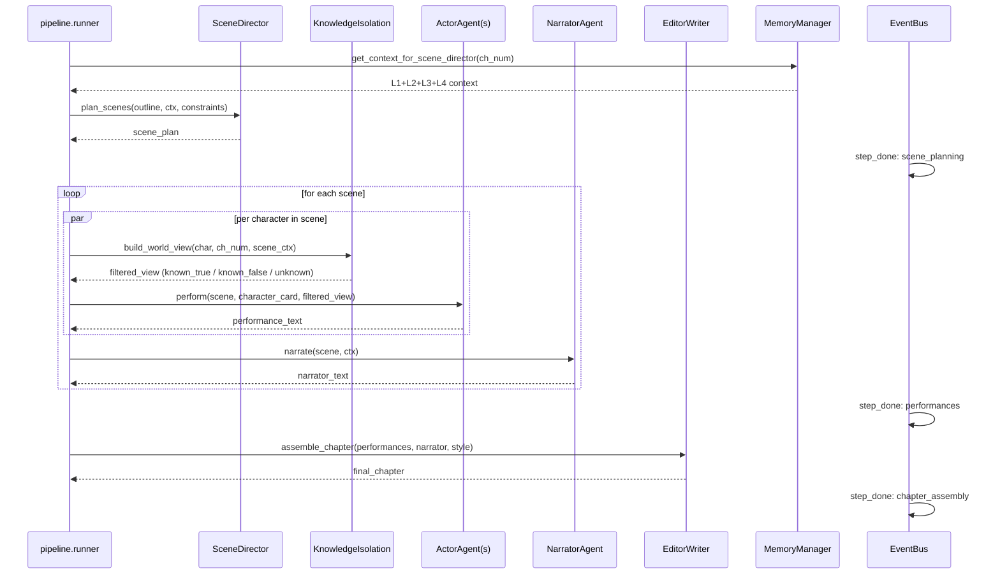

# Workflow: Chapter Production Pipeline

> The four-agent production line that turns a chapter outline into
> finished prose, modeled on a film crew: director → actors →
> narrator → editor.

## 1. Purpose

Single-agent generation can produce a chapter, but high-quality novel
prose needs separation of concerns:

- **SceneDirector** plans the chapter's beats — who's where, who knows
  what, what each character's secret goal is. Output is a structured
  scene plan, not prose.
- **ActorAgent** (one instance per character per scene) writes that
  character's behavior IN CHARACTER, with a knowledge-isolated view of
  the world (a character may not reference things they shouldn't know).
- **NarratorAgent** adds environmental description / mood / non-POV
  narration as a "camera" between the actors.
- **EditorWriter** assembles the actor + narrator output into final
  prose with style consistency, transitions, and a chapter-end hook.

Each agent is independently swappable / debuggable, and the
intermediate outputs (scene plan, performance records) are queryable
via the EventBus + log buffer.

## 2. Who triggers it

- **`POST /api/generation/start`** (cluster mode): kicks off the full
  production pipeline as a background task.
- **`pipeline/runner.run_chapter()`** (planned, post-phase-2.2): the
  internal entry point that callers — UI, CLI, tests — use to drive
  a production run without touching FastAPI.

## 3. Inputs / Outputs

| Stage | In | Out |
|---|---|---|
| SceneDirector | chapter_outline, memory_context, constraints, character_cards | `scene_plan = {scenes[], chapter_arc}` |
| ActorAgent | scene_plan, character_card, knowledge_view, constraints | `performance_text` (semi-structured action + dialogue + inner) |
| NarratorAgent | scene_plan, memory_context | `narrator_text` (descriptive prose between scenes) |
| EditorWriter | all performances + narrator_text + style_profile | `final_chapter_text` |

## 4. Sequence

## 5. Decision points

- **Knowledge isolation depth**: `KnowledgeIsolation.build_world_view`
  pulls 20 candidate memories then checks each against
  `information_events`. Whatever the character is marked
  `known_false` for shows up in their view as `{believed, truth}` —
  the actor sees both so they can play the misunderstanding correctly.
- **Manual mode**: `req.manual = True` pauses the pipeline before each
  agent and surfaces the prompt to the UI. The user runs the prompt in
  a web LLM, pastes the result back, and the pipeline continues. Used
  when running offline / on models without an API.
- **Targeted rewrite**: if the Evaluator (next stage) rejects the
  chapter, EditorWriter's `targeted_rewrite()` runs on just the affected
  passages, NOT the whole chapter. Driven by the Evaluator's `issues[]`
  with `severity=high`.
- **Style profile**: persisted per project; if absent, EditorWriter uses
  the calibration sliders from `data/calibration/<pid>.json`.

## 6. Error handling

- Each agent step wrapped in try/except by the pipeline runner. A
  failed step marks the session `error` and emits an `error` event so
  the UI shows it; downstream steps don't run.
- LLM errors propagate with `exc_info` (per GAP 2 + GAP 5 fixes) — no
  silent fallback.
- Manual mode timeouts after 30 minutes of waiting → session marked
  `error: timeout`.

## 7. Related code + tests

- Source: `agents/production/{scene_director,actor_agent,narrator_agent,
  editor_writer,scene_simulator}.py`
- Skills: `agents/production/skills/{scene_direct,actor_perform,
  editor_write}/`
- Tests: `tests/integration/test_agents_pipeline.py` (end-to-end with
  Mock provider)
- Related WORKFLOWs:
  - `agents/evaluation/WORKFLOW.md` — what runs AFTER assembly
  - `knowledge/memory/WORKFLOW.md` — the 4-layer context provided
  - `framework/observability/WORKFLOW.md` — how to trace a production run
