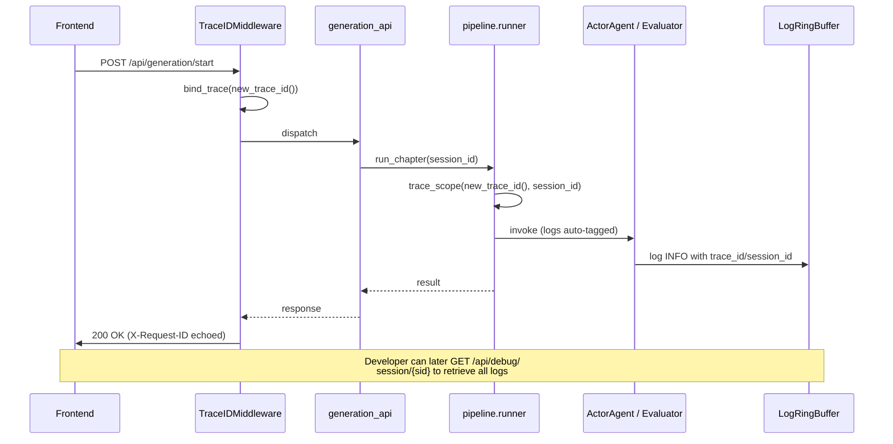

# Workflow: Observability

> Lightweight transparency for a single-user desktop app. No
> Prometheus / OpenTelemetry / Jaeger — just enough to answer "what
> is the app doing right now?" without restarting it or grep-ing
> log files.

## 1. Purpose

Provide the four things every long-running operation needs:

1. **Trace ID** — a 12-char hex ID that follows a request through every
   module and async task it spawns
2. **Session ID** — the higher-level grouping (e.g. one generation
   pipeline run) under which many traces can live
3. **Structured logging** — JSON-line output as an opt-in mode for
   machine parsing; human-readable file logs always on
4. **In-memory log buffer** — last 500 records held in memory so a
   `/api/debug/recent-logs` endpoint can stream them without
   tailing the log file

## 2. Who triggers it

- **`launcher.py` / `ui.backend.app.main`** — calls
  `framework.log_setup.setup_logging()` once at startup. That call
  installs the buffer, the trace filter, and (if `INKOCTO_LOG_JSON=1`)
  the JSON console formatter.
- **FastAPI middleware** — `TraceIDMiddleware` binds a fresh trace_id
  per HTTP request (or honors an inbound `X-Request-ID` header). Echos
  back via the same header in the response.
- **Pipeline runner** — `pipeline.runner.run_chapter()` uses
  `trace_scope(trace_id=new_trace_id(), session_id=sid)` so every log
  line emitted during a generation run carries both IDs.

## 3. Inputs / Outputs

| Boundary | In | Out |
|---|---|---|
| `setup_logging()` | log dir, levels, json_console flag | configured root logger; file at `outputs/logs/inkoctobot_*.log` |
| `trace_scope(...)` | trace_id, session_id | context-managed binding (auto-reset on exit) |
| `get_buffer().recent(...)` | filters | list of `{ts, level, logger, message, trace_id?, session_id?}` |
| `/api/debug/recent-logs` | query params: limit, level, logger_prefix, trace_id, session_id | `{count, records: [...]}` |
| `@traced(...)` | logger / level / op name | wraps function; logs `start` + `done (Xms)` or `fail (Xms)` |

## 4. Sequence (typical generation run)

## 5. Decision points

- **JSON vs. human format on console**: controlled by `INKOCTO_LOG_JSON`
  env var. File log is always human-readable.
- **Debug endpoints on/off**: gated by `WN_TEST_MODE=1` or
  `INKOCTO_DEBUG=1`. Returns 403 otherwise. (No auth — loopback only.)
- **Buffer capacity**: hardcoded 500 records. Tune via
  `LogRingBuffer(capacity=N)` if needed.
- **Trace propagation**: contextvars are copy-on-spawn so
  `asyncio.create_task(...)` inherits automatically. Threads do NOT
  inherit — if you spawn a thread, manually re-bind via `bind_trace`.

## 6. Error handling

- The buffer handler's `emit` catches all exceptions via
  `self.handleError(record)` — a broken record never crashes logging.
- Missing trace_id on a record (because the filter didn't run yet) is
  handled by the file formatter's `defaults={"trace_id": ""}`.
- JSON formatter skips any extra attribute that isn't JSON-serializable.

## 7. Related code + tests

- Source: `framework/observability/{trace_context,log_buffer,decorators,
  json_formatter,request_middleware}.py`
- Entry point: `framework/log_setup.setup_logging()`
- HTTP middleware: `framework/observability/request_middleware.py`
- Endpoint: `ui/backend/app/routers/debug_api.py`
- Tests: `tests/framework/test_observability.py` (14 tests covering
  trace_scope, buffer filtering, async propagation, @traced)
