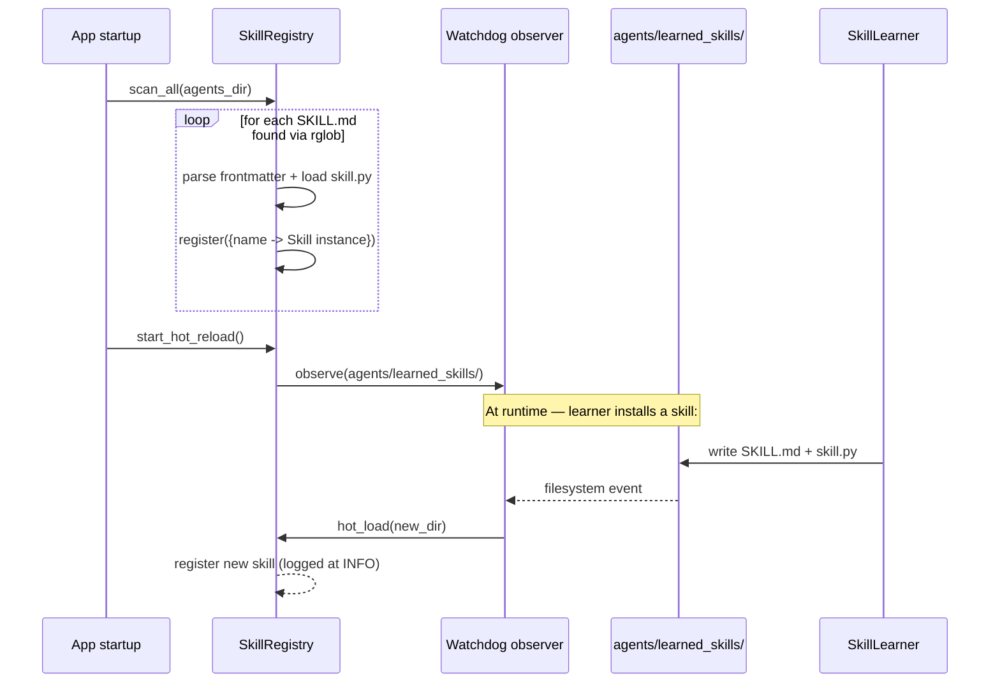
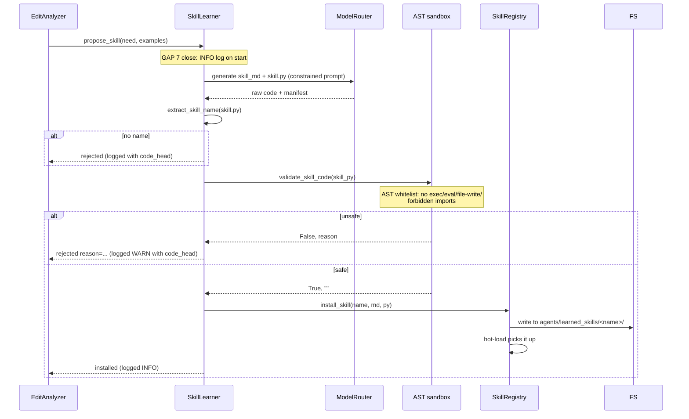

# Workflow: Skill Discovery + Hot-Reload + Self-Learning

> InkOctoBot's skill system is inspired by Claude Skills (SKILL.md). Each
> skill is a self-describing folder; the registry discovers them at
> startup and hot-reloads new ones; the learner generates new skills
> on demand from user feedback.

> Note: the implementation currently lives in `framework/skill_registry.py`
> and `framework/skill_learner.py` (not under a `framework/skills/` subdir
> yet — the rename is part of phase 1.x's framework subpackage cleanup).
> This document covers the discovery + hot-reload + learner trio as one
> coherent workflow.

## 1. Purpose

A skill bundles "how to do one thing well":

```
agents/<area>/skills/<skill_name>/
  SKILL.md   — manifest (YAML frontmatter + prose description)
  skill.py   — implementation: build_prompt + parse_output
```

The registry lets agents call skills by name (`call_skill("repetition_detect", inputs)`)
without knowing where the file lives. The learner watches user
behavior (repeated edits / repeated evaluation failures) and proposes
new skills, validated by an AST sandbox before installation.

## 2. Who triggers it

- **App startup** (`framework.skill_registry.SkillRegistry()`):
  `scan_all(agents_dir)` walks `agents/*/skills/` and registers every
  skill with a valid SKILL.md.
- **Watchdog observer** (`SkillRegistry._start_hot_reload`): monitors
  `agents/learned_skills/` for new directories. When the learner installs
  one, the registry picks it up within seconds — no restart needed.
- **`EditAnalyzer`** (in the evaluation pipeline): after detecting a
  repeated user-edit pattern, calls `SkillLearner.propose_skill(need_desc)`.
- **UI / CLI** (`POST /api/skills/propose`): manual one-off proposal.

## 3. Inputs / Outputs

| Method | In | Out |
|---|---|---|
| `SkillRegistry.scan_directory(path)` | dir with SKILL.md files | count of skills registered |
| `SkillRegistry.get(name)` | skill name | BaseSkill instance |
| `SkillRegistry.find_by_tags(tags)` | tag list | list of matching skills |
| `SkillLearner.propose_skill(need, examples)` | description + examples | `{name, installed, reason}` |

## 4. Sequence

### Discovery + hot-reload



### Self-learning



## 5. Decision points

- **Discovery scope**: only paths matching `agents/*/skills/*/SKILL.md`
  are scanned. `agents/learned_skills/<name>/` is ALSO scanned (note
  the different layout — one skill per top-level dir, no `skills/`
  middle layer).
- **Skill manifest parsing**: requires a `name:` field in the YAML
  frontmatter. Missing → skipped with a WARNING. Duplicate names →
  last-wins, also logged.
- **AST validator** (`_validate_skill_code`):
  - Blocks imports outside the allowlist (no `os`, `subprocess`,
    `eval`, `exec`, `__import__`, etc.)
  - Blocks `open(..., "w" / "a" / "x")` and `Path.write_*`
  - Requires `class Skill(BaseSkill)` at module level
- **Read-only directories**: skills can READ from `data/`,
  `config/prompts/`, and `knowledge/` (set by `ALLOWED_READ_PATHS`).
  This was updated post-Phase-1.2 to use the new package name.
- **Hot-reload latency**: watchdog → registry hand-off is sub-second,
  but the LLM that just generated the skill won't see it until its
  next `call_skill()` lookup. Acceptable for this use case.

## 6. Error handling

- A broken skill (bad SKILL.md, import error in skill.py) is logged
  with `exc_info` at WARNING level and skipped — does NOT crash the
  registry. The user can fix and the watchdog picks up the change.
- AST validation failures return `(False, reason)` — the proposed
  skill is NEVER written to disk, so a malicious LLM response can't
  leave a payload behind.
- Generation failures (LLM error during `propose_skill`) return
  `{installed: False, reason: <error>}` and are logged at WARN.

## 7. Related code + tests

- Source: `framework/skill_registry.py`, `framework/skill_learner.py`
- Skill base class: `agents/base_skill.py`
- Built-in skills: `agents/*/skills/` (planner / production / evaluation /
  reference_extractors)
- Learned skills: `agents/learned_skills/` (empty in fresh checkout)
- Tests: `tests/framework/test_skill_registry.py`,
  `tests/framework/test_skill_learner.py`
- API: `ui/backend/app/routers/skill_api.py`
- See also `framework/observability/WORKFLOW.md` — every skill proposal
  is logged with enough detail to debug rejections.
