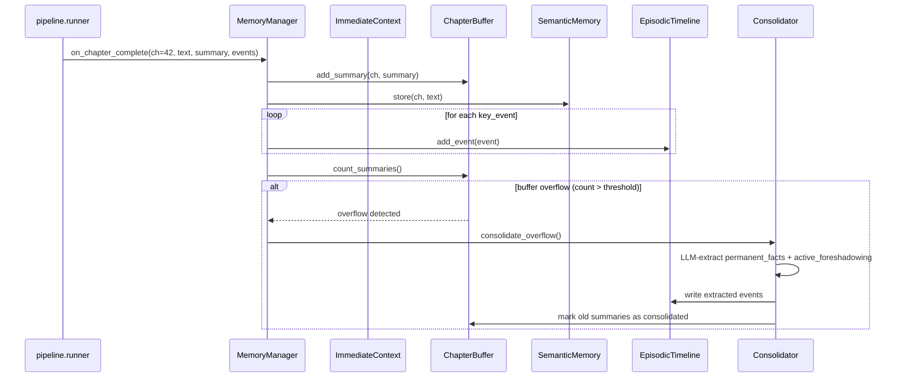

# Workflow: 4-Layer Memory System

> The project's tiered memory for cross-chapter consistency. Designed
> so the right kind of context is available at the right scope:
> immediate (this scene) → buffer (this volume) → semantic (whole
> book) → episodic (event graph + foreshadow status).

## 1. Purpose

A single chapter generation needs four kinds of historical context:

1. **The last scene we wrote** — exact text, for prose continuity
2. **The last N chapter summaries** — what happened recently
3. **Anything ever in this book that is semantically similar** to what's
   happening now (callbacks, foreshadowing payoffs)
4. **The graph of named events** with `planted / open / pressured /
   resolved` status — so the agent knows what hooks are pending

Hence four layers, each with a different write rate, scope and storage:

| # | Layer | Scope | Storage | Write |
|---|---|---|---|---|
| L1 | Immediate | scene (in-memory) | RAM dict | per scene |
| L2 | ChapterBuffer | last 5-15 chapters | SQLite `chapter_summaries` | per chapter |
| L3 | Semantic | whole project | ChromaDB | per chapter (full text) |
| L4 | Episodic | whole project | SQLite `episodic_events` | per event extracted |

## 2. Who triggers it

- **Writer pipeline** (`pipeline.steps.consolidate`) calls
  `MemoryManager.on_chapter_complete()` at the end of every chapter
  generation. The manager fans out to all four layers.
- **Scene Director** (`agents.production.scene_director`) calls
  `memory.get_context_for_scene_director()` to assemble context BEFORE
  planning a chapter.
- **Actor agents** (`agents.production.actor_agent`) call
  `memory.get_character_view()` to get the knowledge-isolated view of
  the world that THIS character would have at THIS moment.
- **Evaluator** (`agents.evaluation.cross_chapter_checker`) queries L4
  for unresolved foreshadowing → checks the new chapter against it.

## 3. Inputs / Outputs

| Method | In | Out |
|---|---|---|
| `set_project(project_id)` | project_id | (mutates state — all subsequent ops are scoped) |
| `on_chapter_complete(...)` | chapter_num, text, summary, key_events, character_states | (writes L2 + L3 + L4; triggers consolidator if buffer full) |
| `get_context_for_scene_director(ch_num)` | chapter_num | string (assembles L1 prev + full L2 + L3 query + L4 events) |
| `get_character_view(name, ch_num, ...)` | character, chapter | `FilteredWorldView` (only facts this character "knows") |

## 4. Sequence (chapter completion)

## 5. Decision points

- **When does L2 → L3+L4 consolidation fire?** When
  `ChapterBuffer.count_active_summaries() > threshold` (default 15 from
  `config/app_config.yaml`).
- **Knowledge isolation** (`knowledge_isolation.py`): when
  `get_character_view()` is called, the filter checks the
  `information_events` table — if a fact has `knowledge_state =
  known_false` for this character at this chapter, it's hidden from
  the view (prevents the character from referencing things they
  shouldn't know).
- **Foreshadowing pressure**: L4's `get_unresolved_foreshadowing()`
  returns items where `gap = current_chapter - planted_chapter > N`.
  N is hardcoded in evaluator (default 10).
- **Truth-File migration (phase 4)**: this workflow will gain a
  `truth_apply` step. `on_chapter_complete` will emit `TruthDeltas`
  alongside the existing writes; eventually L4's
  `foreshadow_status` column will be dropped in favor of
  `pending_hooks.status`.

## 6. Error handling

- All writes are wrapped in try/except — a broken consolidator never
  blocks the pipeline from advancing to the next chapter.
- Consolidator failures are logged at INFO level by
  `knowledge.memory.consolidator:68` (success) and
  `consolidator:70-71` (failure with exception).
- L3 (ChromaDB) failures degrade gracefully — semantic queries return
  empty lists rather than raising.

## 7. Related code + tests

- Source: `knowledge/memory/{manager,immediate,chapter_buffer,
  semantic_store,episodic_timeline,consolidator,knowledge_isolation}.py`
- Schema: `storage/project_schema.py` (chapter_summaries,
  episodic_events, permanent_facts, information_events)
- Vector store: `knowledge/vector_store.py` (ChromaDB wrapper)
- Tests: `tests/test_memory_system.py` (existing); will be reorganized
  into `tests/knowledge/memory/test_*.py` in phase 6
- See also: `knowledge/truth/` and `docs/truth_file_system.md` for the
  state-authority layer that overlaps with L4
