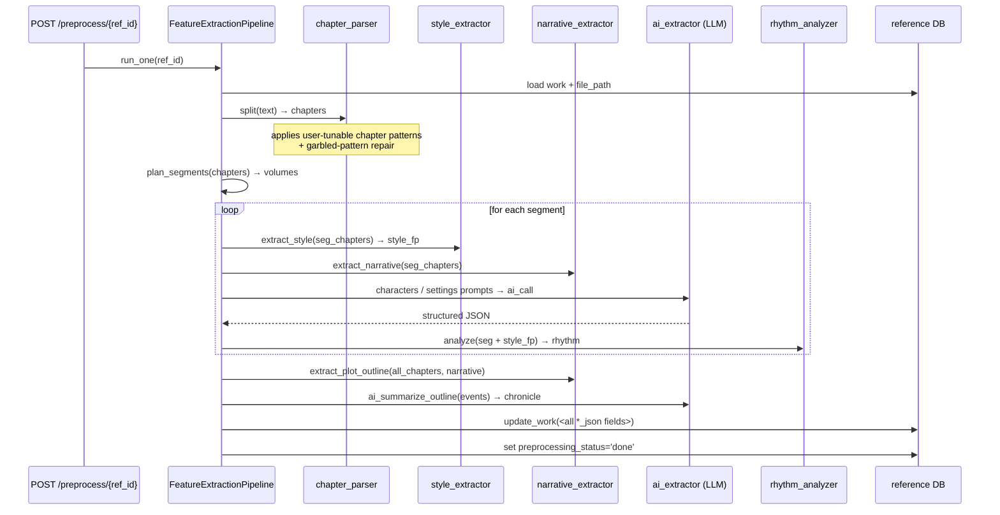

# Workflow: Reference Work Feature Extraction Pipeline

> Turns a user-uploaded novel (.txt) into a structured set of feature
> JSON blobs — style fingerprint, narrative structure, character roster,
> rhythm profile, plot outline — that the project's RAG layer can
> draw from.

## 1. Purpose

When a user adds a reference work, they want the AI to learn from it
on specific dimensions (style, characters, rhythm, plot). The pipeline
extracts each dimension into a separately-editable JSON column on
`reference_works`:

| Column | Source | What's in it |
|---|---|---|
| `style_fingerprint_json` | `style_extractor` | sentence-length stats, dialogue %, description density, vocabulary buckets |
| `narrative_structure_json` | `narrative_extractor.extract_narrative` | act structure, beat positions, pacing curve |
| `extracted_characters_json` | `ai_extractor` (characters task) | per-character: name, role, traits, intro snippet |
| `settings_json` | `ai_extractor` (settings task) | world-rule items, locations, items |
| `rhythm_json` | `rhythm_analyzer` (legacy) + `ai_extractor` | per-segment pacing, payoff density, hook density |
| `plot_outline_json` | `narrative_extractor.extract_plot_outline` | epochs → periods → events tree |

Each dimension can be re-extracted independently (cheap) or as part
of a full pipeline run (expensive). The user edits the result inline
in the Analysis tab; the pipeline never overwrites human edits unless
told to.

## 2. Who triggers it

- **`POST /api/references/preprocess/{ref_id}`** — full pipeline on one work
- **`POST /api/references/preprocess/batch`** — all pending works
- **Individual re-extract**:
  - `/works/{id}/plot_outline/extract` (cheap; reuses narrative)
  - `/works/{id}/segments/.../extract_characters`
  - `/works/{id}/segments/.../extract_settings`
  - `/works/{id}/segments/.../extract_style`
  - `/works/{id}/segments/.../extract_all`
- **CLI** — `ink extract run --phase <phase> --novels <name>`

## 3. Inputs / Outputs

| Stage | In | Out |
|---|---|---|
| `chapter_parser.split` | raw .txt text | `chapters: list[{title, content, idx}]` |
| `style_extractor` | chapters | `style_fingerprint` (~20 numeric features) |
| `narrative_extractor` | chapters | `narrative_structure`, `plot_outline` |
| `ai_extractor.characters` | chunked segment text + work ctx | character roster |
| `ai_extractor.settings` | same | world settings list |
| `rhythm_analyzer` | chapters + style_fp | rhythm + pacing profile |
| `ai_extractor.ai_summarize_outline` | accumulated events | chronological summary (epochs/periods) |

## 4. Sequence (full pipeline run)

## 5. Decision points

- **Segment planning**: `plan_segments` auto-detects volume boundaries
  (chapter count heuristics + `reference.volume_detect` prompt for
  ambiguous works). Users can override via the
  `PUT /works/{id}/segments/plan` endpoint.
- **Chunking for over-budget volumes**: when a segment's text exceeds
  the model context, `build_segment_text_chunks` splits it into
  ≤32K-char chunks. Only `reference.outline` runs per-chunk; characters
  / settings ideally see the full text.
- **AI vs heuristic**: every AI step has a heuristic fallback. If the
  LLM returns invalid JSON twice, the pipeline records a per-segment
  `needs_review` flag and the user fixes inline.
- **Pause / resume / cancel**: the long-running preprocess endpoint
  writes to `reference_pipeline.preprocess_jobs` so the UI can poll
  status and the run can be killed mid-segment. Resume picks up at the
  next un-done segment.
- **User-tunable patterns**: chapter detection regex, author-note
  keywords, garbled-text regex — all editable via
  `/api/references/{chapter_patterns,author_note_keywords,garbled_patterns}`.

## 6. Error handling

- LLM failures: each call retries once; on second failure the segment
  is marked `needs_review` and the pipeline continues with the
  remaining segments (a single bad chapter doesn't kill the run).
- File encoding: tries UTF-8 first, falls back to GB18030 (common for
  legacy Chinese .txt uploads). Other encodings → 400 with a clear
  error message at upload time.
- Garbled text: the chapter parser runs `repair_garbled` using both
  built-in regexes and user-defined patterns; what it can't repair is
  flagged in `diagnostics_json`.
- Concurrent runs: `preprocess_jobs.acquire(ref_id)` blocks a second
  trigger on the same work; batch mode serializes per-work.

## 7. Related code + tests

- Source: `reference_pipeline/{pipeline,chapter_parser,narrative_extractor,
  ai_extractor,rhetoric_classifier,shuangdian_templates,volume_detector,
  preprocess_jobs,prompts,nlp_stats,embedding_cluster,platform_profiles}.py`
- Routers: `ui/backend/app/routers/reference/{prompts,analysis_writer}.py`
  (the user-facing endpoints that drive the pipeline)
- Tests: `tests/reference_pipeline/test_advanced.py`
- Configuration: `config/app_config.yaml: reference_pipeline.*`,
  `config/slop_patterns.json`
- Sister workflow: `reference_ingest/WORKFLOW.md` (how the raw .txt
  gets cleaned + chaptered before this pipeline starts)
